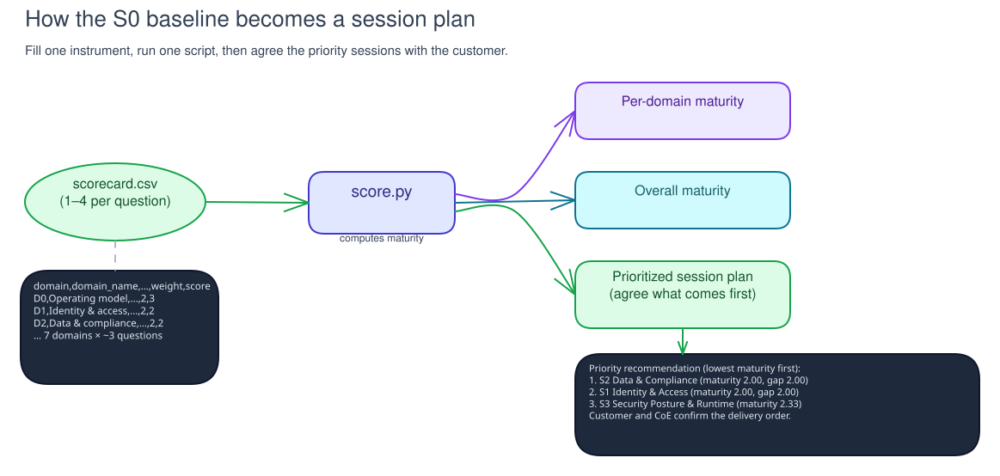

# Readiness Assessment

!!! info "Freshness"
    Last reviewed: 2026-07-06

Use the S0-S13 AI maturity assessment twice:

- **S0 - baseline.** Record the current state and create the prioritized session roadmap.
- **S13 - exit score.** Re-run the same assessment, compare it with the baseline, and record the remaining gaps.

## How it works

The assessment has fourteen domains. Each domain maps to one S0-S13 session and uses a 1-4 maturity scale. Blank answers stay visible and do not count toward weighted maturity until assessed.

| Level | Name | Meaning |
|-------|------|---------|
| 1 | Ad-hoc | No consistent control; reactive |
| 2 | Repeatable | Some controls exist but are manual or inconsistent |
| 3 | Defined | Documented, enforced, and owned |
| 4 | Optimized | Automated, measured, and continuously improved |

### Domains

| # | Domain (canonical session) |
|---|------------------------------|
| D0 | Governance baseline / operating model (S0) |
| D1 | Agent identity path (S1) |
| D2 | Data-path trace / control map (S2) |
| D3 | Platform route / trust boundaries (S3) |
| D4 | Agent build path / admission (S4) |
| D5 | Tool/API admission / withdrawal (S5) |
| D6 | Runtime path evidence / response (S6) |
| D7 | Evaluation evidence / release readiness (S7) |
| D8 | Authorized red teaming / retest (S8) |
| D9 | Control-plane reconciliation / lifecycle (S9) |
| D10 | In-process tool-call controls (S10) |
| D11 | Operating evidence / FinOps (S11) |
| D12 | LLMOps change control (S12) |
| D13 | Portfolio evidence / roadmap (S13) |

## Fillable scorecard

The scorecard and auto-scorer are in the shared lab helpers:

- `labs/helpers/maturity-assessment/scorecard.csv` - fill the `score` column (1-4) with accountable stakeholders.
- `labs/helpers/maturity-assessment/score.py` - computes per-domain and overall weighted maturity and ranks lower-scoring domains first; total question weight breaks ties.
- `labs/helpers/maturity-assessment/compare.py` - at S13, computes the weighted baseline-to-exit lift per domain and the residual-gap backlog.

```bash
python labs/helpers/maturity-assessment/score.py labs/helpers/maturity-assessment/scorecard.csv
```

## Reading the result



Session artifacts support reassessment. Change a score only when accountable stakeholders show the relevant control is in place and operating.
