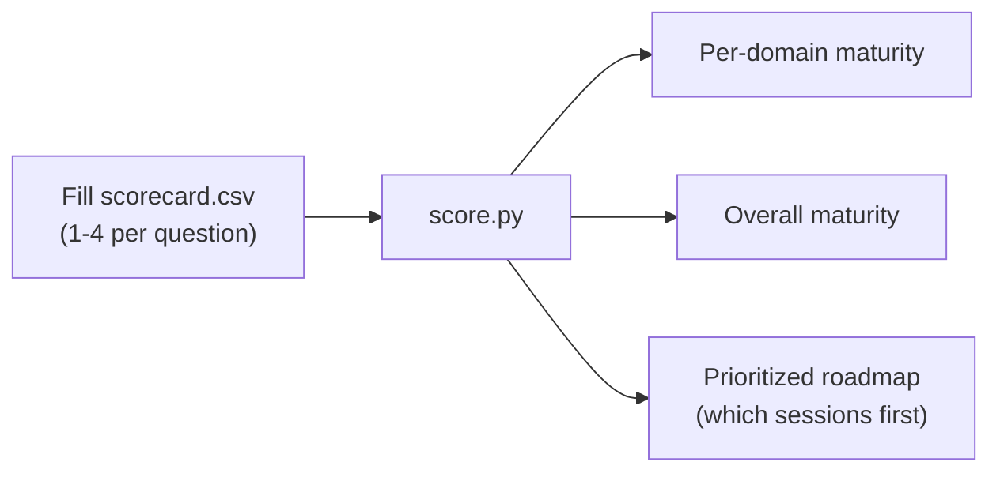

# Readiness Assessment

!!! info "Freshness"
    **Last reviewed:** 2026-07-06

A single, reusable **AI‑agent governance maturity assessment**. Run it **twice**:

- **S0 — baseline.** Establishes where the customer is today and produces a **prioritized session roadmap**.
- **S6 — exit score.** Re‑run the same instrument to show measurable lift (the "lasting" proof) and a residual‑gap backlog.

## How it works

Seven domains — one per session — each scored on a **1–4 maturity scale** aligned to the CAF‑for‑AI maturity model and NIST AI RMF (**Govern · Map · Measure · Manage**).

| Level | Name | Meaning |
|-------|------|---------|
| 1 | Ad‑hoc | No consistent control; reactive |
| 2 | Repeatable | Some controls exist but are manual / inconsistent |
| 3 | Defined | Documented, enforced, and owned |
| 4 | Optimized | Automated, measured, and continuously improved |

### Domains

| # | Domain (session) | NIST function focus |
|---|------------------|---------------------|
| D0 | Operating model & governance (S0) | Govern |
| D1 | Identity & access (S1) | Govern · Manage |
| D2 | Data & compliance (S2) | Map · Manage |
| D3 | Security posture & runtime (S3) | Measure · Manage |
| D4 | Quality & safety evaluation (S4) | Measure |
| D5 | Adversarial testing (S5) | Measure · Manage |
| D6 | Control plane & operationalization (S6) | Govern · Manage |

## Fillable scorecard

The scorecard and auto‑scorer live in the S0 takeaway kit:

- `labs/s0-foundations/assessment/scorecard.csv` — fill the `score` column (1–4) with the customer.
- `labs/s0-foundations/assessment/score.py` — computes per‑domain and overall maturity and prints a **prioritized roadmap** (lowest‑maturity, highest‑impact domains first).

```bash
python labs/s0-foundations/assessment/score.py labs/s0-foundations/assessment/scorecard.csv
```

## Reading the result



Each session's durable artifacts map back to specific assessment questions (see section 7 of each session page), so **completing a session provably moves the score**.
