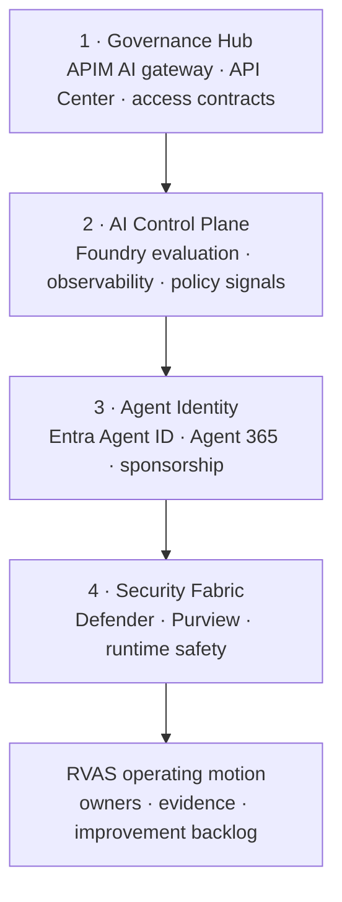

# Citadel + RVAS together

!!! info "Freshness"
    Last reviewed: 2026-07-14 · Citadel capability and accelerator details change. Use [Reference Architectures](reference/reference-architectures.md) and [Product Status](reference/product-status.md) before a customer delivery.

Citadel and RVAS solve different parts of the same problem. **Citadel** is the recommended technical foundation for the integrated path: it gives approved AI traffic a governed runtime path and produces platform evidence. **RVAS** is the operating model around that foundation: it assigns owners, tests controls, captures evidence, and turns unresolved risk into an accountable backlog.

Neither replaces the other. A platform without ownership and operating evidence becomes an underused set of controls. Governance without a trusted runtime path cannot reliably see or influence what the platform is doing.

## The simple model

| Citadel provides | RVAS provides |
|------------------|---------------|
| A governed AI runtime foundation: gateway, approved access paths, registry, runtime safety, identity enforcement, telemetry, and cost evidence. | A governance operating motion: sponsors, policy decisions, identity and data review, security evidence, evaluations, red-team learning, and lifecycle reconciliation. |
| The question: **Where do AI calls flow, and what platform controls are applied?** | The question: **Who owns the agents, what risk is accepted, and what evidence proves the controls work?** |

RVAS does not rebuild Citadel. It uses the platform’s evidence and connects it to the people, processes, and decisions needed to operate the estate responsibly.

## How Citadel works

The Foundry Citadel Platform describes four connected layers.[^citadel] The details live in the [technical reference](reference/reference-architectures.md); this is the sponsor and facilitator mental model.

### 1. Governance Hub — the approved runtime path

The Governance Hub uses components such as Azure API Management, API Center, Access Contracts, and Backend Contracts to provide a central entry point for approved AI calls. It can establish which applications or teams may consume which model or tool backends, and it creates a platform record of the exposed path.

**Why it matters to RVAS:** the gateway and registry give S6 evidence to reconcile with the agent and ownership records. They are platform assets, not separate RVAS deliverables.

### 2. AI Control Plane — observe and measure behavior

The AI Control Plane brings together Foundry evaluation, traces, observability, and policy signals. It is where teams can learn how an agent behaves, measure quality and safety, and use real operating evidence to improve future checks.

**Why it matters to RVAS:** S4 turns measurement into an owned evaluation and release discipline; S5 uses findings to drive remediation. RVAS does not replace the telemetry plumbing.

### 3. Agent Identity — make agents accountable

Entra Agent ID and Agent 365 make agents visible as first-class enterprise entities, with sponsorship, lifecycle, and access context. The aim is to distinguish an agent from an anonymous automation or a user-delegated action.

**Why it matters to RVAS:** S1 creates inventory and sponsorship evidence, while S6 reconciles identity and registry views so unmanaged or shadow agents become actionable findings.

### 4. Security Fabric — protect data and respond to risk

Defender, Purview, Entra, and runtime safety controls create the security and data-governance fabric: security posture, threat signals, information protection, data-loss prevention, and safety checks at the runtime path.

**Why it matters to RVAS:** S2 and S3 validate and evidence those controls with the people who own compliance and security response. A customer should not deploy duplicate protection paths just because it is running a governance workshop.

## The platform boundary

Citadel is recommended for the full integrated path, but it is not a reason to delay every governance decision. A customer may:

- connect an existing Citadel or equivalent platform foundation;
- run a platform workstream to deploy Citadel; or
- schedule readiness work while using S0 to establish sponsorship, a baseline, and a delivery backlog.

What must not happen is treating RVAS workshop artifacts as a substitute for a production runtime platform. Deployment, private networking, gateway configuration, telemetry plumbing, and platform resiliency remain platform-team responsibilities.

## Go deeper or continue

- Need the implementation detail? See [Reference Architectures](reference/reference-architectures.md) and the [Citadel + RVAS Playbook](reference/citadel-rvas-playbook.md).
- Need to choose a path and start the engagement? Continue to [Your journey](start/your-journey.md).

[^citadel]: Microsoft - [Foundry Citadel Platform](https://github.com/Azure-Samples/foundry-citadel-platform); [AI Hub Gateway / Citadel Governance Hub](https://aka.ms/ai-hub-gateway).
