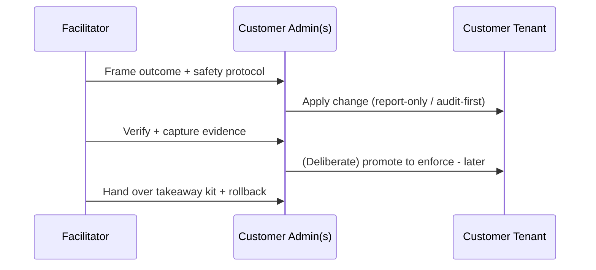

# How to Deliver

This page is the facilitator's operating manual. Read it before delivering any session.

!!! info "Freshness"
    Last reviewed: 2026-07-06

## Delivery model - done *with* you

Each session is **co-delivered**: one facilitator guides the customer's own admins, who hold the tenant privileges and perform the privileged steps. The facilitator drives the narrative, the customer drives the clicks. Nothing is done in a demo tenant - the whole point is that the configuration stays in the customer's environment.



## The five personas

Sessions and individual steps are tagged with the role that performs them.

| Persona | Typical Entra/admin roles | Primary sessions |
|---------|---------------------------|------------------|
| <span class="rvas-badge rvas-persona">Governance lead</span> | AI Administrator, Compliance Administrator | S0, S6 |
| <span class="rvas-badge rvas-persona">Identity admin</span> | Conditional Access Admin, Privileged Role Admin | S1 |
| <span class="rvas-badge rvas-persona">Security / SOC</span> | Security Administrator, Security Operator | S3, S5 |
| <span class="rvas-badge rvas-persona">Compliance / Data admin</span> | Compliance Data Administrator, Purview roles | S2 |
| <span class="rvas-badge rvas-persona">AI developer / maker</span> | Azure AI Developer, Copilot Studio maker | S4, S5, S6 |

## Prerequisites

Every session opens with a prerequisite checklist. If a required platform capability is missing, the answer is not a parallel RVAS fallback: capture the gap, assign an owner, and complete the prerequisite before running that part of the playbook.

The production path is explicit: deploy/connect Citadel, confirm tenant-plane prerequisites, run S0-S6, then operate the evidence and backlog.

## Phase 0 - Citadel platform foundation

For the full integrated path, deploy or connect to [AI Hub Gateway / Citadel Governance Hub](reference/citadel-rvas-playbook.md) before the governance sessions begin. This is the Azure-plane foundation: APIM gateway, API Center registry, Access Contracts, gateway Content Safety, PII masking, telemetry, and private networking. RVAS then governs what runs through that platform.

Phase 0 has three acceptable states:

1. **Existing hub** - capture the gateway URL, API Center / Access Contract export, Content Safety configuration, telemetry location, and platform owner.
2. **New hub** - the platform team pre-provisions the accelerator from `citadel-v1` before the live governance workshop, or runs it as a separate platform workstream.
3. **No hub yet** - stop the integrated delivery and deploy or schedule Citadel first. Do not present RVAS artifacts as a substitute platform.

Do not turn a governance session into an APIM deployment workshop. The hub is the platform substrate; S0-S6 are the governance operating motion around it. The default production sequence is: **deploy Citadel, build governance, prove evidence, then operate.**

## Safety protocol (applies to every session)

!!! warning "Report-only / audit-first by default"
    No session enforces a control on first run. Conditional Access is created **report-only**, DLP in test/notify mode, and evaluations and red-team scans target a non-production/test agent. Promoting to enforcement is a separate, deliberate step the customer takes after reviewing impact.

Pre-flight checklist (facilitator confirms before any change):

- [ ] A **break-glass** admin account exists and is excluded from any Conditional Access policy created today.
- [ ] A **change window** and named approver are agreed.
- [ ] The **SOC is notified** before any red-team / adversarial activity (S5).
- [ ] The relevant **rollback** (`labs/sNN-*/rollback.md`) is open and understood.

Every change has a documented rollback, and every session ends with a verification and evidence-capture step. The captured evidence (exports, logs, policy JSON) becomes the customer's governance record in the takeaway kit's `evidence/` folder.

## Anatomy of a session page

Each session follows the same 7-part spine:

1. **Outcome & durable artifact** - what stays in your tenant.
2. Prerequisites - required platform state, licenses, roles, regions.
3. Concepts - concise, cited, with Preview/GA caveats.
4. Co-delivery walkthrough - step-by-step, report-only first.
5. Verification and evidence capture.
6. Rollback.
7. Facilitator notes - timings, RACI, common blockers.

## Anatomy of a takeaway kit

Each session ships a kit under `labs/sNN-*/`. These kits are governance evidence and safety rails around the Citadel platform, not replacements for Citadel's platform IaC:

```
README.md      run order
scripts/       Graph / PowerShell / CLI / Python (idempotent)
policies/      Conditional Access / DLP / Azure Policy JSON exports
pipelines/     eval + red-team CI (runs against a mock target)
runbook.md     the click-path / run steps
rollback.md    how to revert every change
verify.md      how to confirm it worked + capture evidence
evidence/      templated placeholders for captured proof
```

!!! note "How lab assets are validated"
    Lab assets are statically validated in CI (PowerShell/Python/bash lint, JSON schema, mock-target pipeline runs) and carry a <span class="rvas-badge rvas-static">Verified: static-only</span> badge. Live execution is the customer's co-delivery step, not our test.
