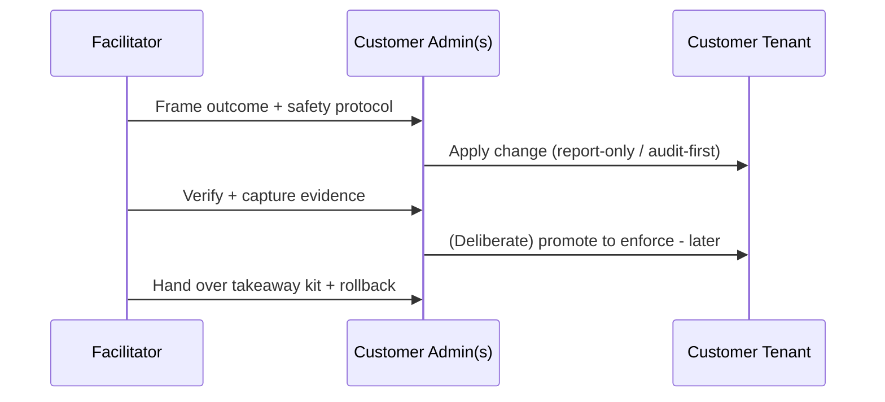

# How to Deliver

This page is the facilitator's operating manual. Read it before delivering any session.

!!! info "Freshness"
    **Last reviewed:** 2026-07-06

## Delivery model - done *with* you

Each session is **co-delivered**: one **facilitator** guides the customer's own admins, who hold the tenant privileges and perform the privileged steps. The facilitator drives the narrative, the customer drives the clicks. Nothing is done in a demo tenant - the whole point is that the configuration **stays** in the customer's environment.



## The five personas

Sessions and individual steps are tagged with the role that performs them.

| Persona | Typical Entra/admin roles | Primary sessions |
|---------|---------------------------|------------------|
| <span class="rvas-badge rvas-persona">Governance lead</span> | AI Administrator, Compliance Administrator | S0, S6 |
| <span class="rvas-badge rvas-persona">Identity admin</span> | Conditional Access Admin, Privileged Role Admin | S1 |
| <span class="rvas-badge rvas-persona">Security / SOC</span> | Security Administrator, Security Operator | S3, S5 |
| <span class="rvas-badge rvas-persona">Compliance / Data admin</span> | Compliance Data Administrator, Purview roles | S2 |
| <span class="rvas-badge rvas-persona">AI developer / maker</span> | Azure AI Developer, Copilot Studio maker | S4, S5, S6 |

## Prerequisite tiers

Every session opens with a prerequisite checklist in two tiers:

- <span class="rvas-badge rvas-tierA">Tier A</span> **Full production** - the customer has the licenses (M365 E5→E7, Entra P1/P2, an Azure subscription with Microsoft Foundry) to implement the lasting production configuration.
- <span class="rvas-badge rvas-tierB">Tier B</span> **Baseline / simulation** - when a license or preview feature is missing, the session still produces a durable artifact (policy authored in report-only mode, IaC deployed to a sandbox subscription, a scan run against a customer-owned test endpoint) plus a "what changes at Tier A" note.

## Safety protocol (applies to every session)

!!! warning "Report-only / audit-first by default"
    No session enforces a control on first run. Conditional Access is created **report-only**, DLP in **test/notify** mode, evaluations and red-team scans target a **non-production / test agent**. Promoting to enforcement is a separate, deliberate step the customer takes after reviewing impact.

Pre-flight checklist (facilitator confirms before any change):

- [ ] A **break-glass** admin account exists and is **excluded** from any Conditional Access policy created today.
- [ ] A **change window** and named **approver** are agreed.
- [ ] The **SOC is notified** before any red-team / adversarial activity (S5).
- [ ] The relevant **rollback** (`labs/sNN-*/rollback.md`) is open and understood.

Every change has a documented rollback, and every session ends with a **verification + evidence-capture** step. The captured evidence (exports, logs, policy JSON) becomes the customer's governance record in the takeaway kit's `evidence/` folder.

## Anatomy of a session page

Each session follows the same 8-part spine:

1. **Outcome & durable artifact** - what stays in your tenant.
2. **Prerequisites** - Tier A / Tier B, licenses, roles, regions.
3. **Concepts** - concise, cited, with Preview/GA caveats.
4. **Co-delivery walkthrough** - step-by-step, report-only first.
5. **Verification & evidence capture.**
6. **Rollback.**
7. **Governance mapping** - NIST AI RMF / ISO 42001 / EU AI Act line items satisfied.
8. **Facilitator notes** - timings, RACI, common blockers.

## Anatomy of a takeaway kit

Each session ships a kit under `labs/sNN-*/`:

```
README.md      run order
infra/         Bicep + azd (Azure-plane resources)
scripts/       Graph / PowerShell / CLI / Python (idempotent)
policies/      Conditional Access / DLP / Azure Policy JSON exports
pipelines/     eval + red-team CI (runs against a mock target)
runbook.md     the click-path / run steps
rollback.md    how to revert every change
verify.md      how to confirm it worked + capture evidence
evidence/      templated placeholders for captured proof
```

!!! note "How lab assets are validated"
    Lab assets are **statically validated** in CI (Bicep build/lint, PowerShell/Python/bash lint, JSON schema, mock-target pipeline runs) and carry a <span class="rvas-badge rvas-static">Verified: static-only</span> badge. Live execution is the customer's co-delivery step, not our test.
