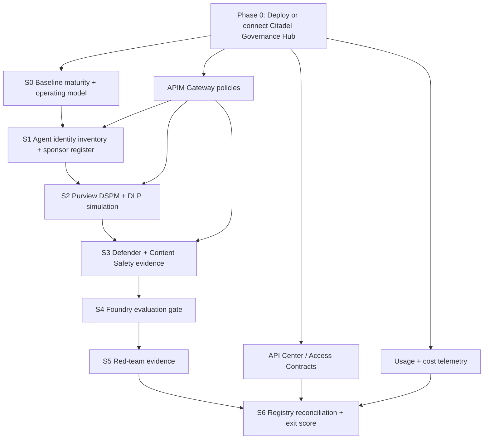

# Citadel + RVAS Governance Playbook

!!! info "Freshness"
    **Last reviewed:** 2026-07-13 · This page explains how RVAS and the AI Hub Gateway / Citadel Governance Hub (`citadel-v1`) work together. Re-verify the accelerator branch and product status before a customer delivery.

## Executive positioning

**Citadel Governance Hub is the Azure-plane platform. RVAS is the governance playbook that makes that platform adopted, evidenced, and operated.** In the full RVAS path, the customer either deploys or connects to [AI Hub Gateway / Citadel Governance Hub (`citadel-v1`)](https://aka.ms/ai-hub-gateway) as the platform foundation, then runs RVAS sessions to put identity, data, security, evaluation, red-team, and lifecycle governance around it.[^citadel]

Citadel answers: **"What platform do AI calls flow through?"** RVAS answers: **"How do we govern the agents, people, data, policies, evidence, and operating model around that platform?"**

!!! note "Recommended full-path stance"
    For a full production engagement, treat Citadel Governance Hub as **Phase 0 - platform foundation**: deploy it in a sandbox or production landing-zone subscription, or connect to an existing deployment. Then run S0-S6 to govern what the hub exposes and what agents do through it. If the hub is not available, the next step is to deploy or schedule Citadel - not to build a parallel platform from RVAS assets.

## What Citadel provides

AI Hub Gateway / Citadel Governance Hub (`citadel-v1`) is the deployable **Layer 1 - Governance Hub** accelerator in the Foundry Citadel architecture.[^citadel] It provides the runtime control plane in front of AI services:

| Citadel capability | What it provides | RVAS touchpoint |
|--------------------|------------------|-----------------|
| **APIM AI gateway** | A central runtime enforcement point for AI calls, policy-as-code, throttling, routing, and governance headers | S6 uses the gateway/API Center view as Layer 1 registry evidence |
| **API Center AI Registry** | A catalog of exposed AI APIs, models, tools, and agent-facing endpoints | S6 reconciles registry evidence with Agent 365 / Entra Agent ID |
| **Access Contracts + Backend Contracts** | Version-controlled onboarding for who can consume which models/backends and under what policies | S6 treats contracts as platform intent; RVAS turns gaps into governance findings |
| **Gateway-level Content Safety** | Prompt Shields and runtime safety before requests reach model backends | S3 verifies gateway Prompt Shields; RVAS does not deploy Content Safety |
| **PII masking at the gateway** | APIM/Language-Service masking before sensitive values reach model backends | S2 pairs this with Purview/DLP as an additive data-control plane |
| **Entra/JWT gateway auth** | Runtime identity validation, app-role authorization, and per-product access enforcement at APIM | S1 keeps Agent ID governance separate, but links identity teams to the gateway auth pattern |
| **Telemetry and FinOps** | Event Hub, Application Insights, Cosmos DB, Logic Apps, and Power BI usage/cost evidence | S6 can include usage/cost telemetry as operational governance evidence |
| **Private networking and resiliency** | Hub/spoke networking, private endpoints, backend pools, failover, throttling handling | RVAS references these as platform-team responsibilities, not session deliverables |

## What RVAS adds

RVAS does not compete with Citadel. It adds the **governance operating system** around Citadel:

| RVAS layer | What RVAS adds beyond the platform |
|------------|------------------------------------|
| **S0 - Foundations** | Baseline maturity assessment, roles, operating model, prioritized roadmap, governance board backlog |
| **S1 - Identity** | Entra Agent ID inventory, sponsor register, report-only Conditional Access posture |
| **S2 - Data** | Purview DSPM for AI review, DLP simulation, audit/eDiscovery/IRM evidence |
| **S3 - Security** | Defender AI-SPM export, AI Threat Protection status, Prompt Shield evidence and SOC triage |
| **S4 - Evaluation** | Foundry evaluation suite, CI/CD quality gate, trace/evaluation evidence |
| **S5 - Red Teaming** | PyRIT / AI Red Teaming Agent evidence, adversarial findings, SOC-safe test plan |
| **S6 - Control Plane** | Agent 365/API Center/Entra reconciliation, lifecycle state, ownership gaps, exit maturity score |

The value is the **playbook and evidence trail**: who signs off, what is report-only, what is test-only, what gets captured, how findings become backlog items, and how maturity improves from S0 to S6.

## Where they overlap

Overlap is expected. The point is to make the overlap explicit so facilitators do not duplicate work.

| Area | Citadel side | RVAS side | Rule |
|------|--------------|-----------|------|
| **Content Safety** | Gateway-level Prompt Shields and safety controls | S3 evidence capture | Test through the Citadel gateway; RVAS does not deploy duplicate safety |
| **PII protection** | APIM-layer masking/anonymization before model calls | S2 Purview/DLP, DSPM, audit and compliance review | Use both: gateway masks runtime traffic, Purview governs tenant data exposure and compliance |
| **Identity** | APIM JWT validation and app-role access at the gateway | S1 Agent ID inventory, sponsor register, Conditional Access | Use both: gateway auth controls access to the platform, Agent ID governs the agent lifecycle |
| **Registry** | API Center / Access Contracts define platform exposure and intent | S6 reconciles Agent 365, Entra Agent ID, maker inputs, and registry evidence | Treat Citadel registry/contracts as Layer 1 evidence feeding S6 |
| **Telemetry** | Usage, cost, backend routing, gateway logs | S6 evidence, risk backlog, operating cadence | RVAS consumes telemetry outputs; Citadel owns telemetry plumbing |
| **Policy** | APIM policy fragments, Access Contracts, backend pools | Governance policy decisions, approvals, ownership, residual-risk backlog | Platform team implements runtime policy; governance team owns intent and exceptions |

## Recommended cooperation model

### Phase 0 - platform foundation

Before or alongside S0, decide whether the customer will use:

1. **Existing Citadel Governance Hub** - collect gateway URL, API Center/Access Contract export, Content Safety configuration, telemetry location, and platform owner.
2. **New Citadel Governance Hub deployment** - platform team deploys or pre-provisions the accelerator from `citadel-v1`; RVAS does not turn the workshop into an APIM deployment exercise.
3. **No hub yet** - deploy or schedule Citadel first. Do not use RVAS assets as a substitute platform.

### S0-S6 - governance operating motion

Once the platform foundation is known, RVAS runs as the operating motion:

- S0 sets accountability and target maturity.
- S1 governs agent identity and sponsorship.
- S2 governs data exposure and DLP.
- S3 governs security posture and runtime safety evidence.
- S4 measures quality and safety.
- S5 tests adversarial behavior safely.
- S6 reconciles the control plane and proves maturity lift.

## What not to duplicate

Do **not** rebuild Citadel inside RVAS:

- APIM deployment, private networking, backend pool design, and multi-cloud routing remain platform-team responsibilities.
- Access Contract and Backend Contract authoring belongs to the platform pipeline; RVAS can reference the outputs as evidence.
- Power BI dashboard deployment and telemetry plumbing remain Citadel/platform responsibilities; RVAS consumes the reports.
- `azd up` should be a pre-provisioning or platform workstream step, not a live governance-session requirement.

## Practical delivery modes

| Mode | When to use | What RVAS does |
|------|-------------|----------------|
| **Full integrated path** | Customer is ready to deploy or already has Citadel Governance Hub | Treat Citadel as Phase 0, then run S0-S6 with gateway/API Center evidence feeding S1/S2/S3/S6 |
| **Platform remediation path** | Customer deployed Citadel but lacks governance process | Use RVAS to add sponsorship, DLP, Defender evidence, eval/red-team gates, registry reconciliation, and maturity tracking |

## Bottom line

Use **Citadel** to establish the governed AI runtime platform. Use **RVAS** to make that platform governable in the customer organization: identity-owned, data-aware, security-monitored, evaluated, red-teamed, reconciled, and evidenced.

[^citadel]: Microsoft - [Foundry Citadel Platform](https://github.com/Azure-Samples/foundry-citadel-platform) (aka.ms/foundry-citadel); [AI Hub Gateway / Citadel Governance Hub](https://aka.ms/ai-hub-gateway); [Azure AI Landing Zones](https://github.com/Azure/AI-Landing-Zones); [Agent Governance Toolkit](https://github.com/microsoft/agent-governance-toolkit). See also [Reference Architectures](reference-architectures.md) and [Product Status](product-status.md).
