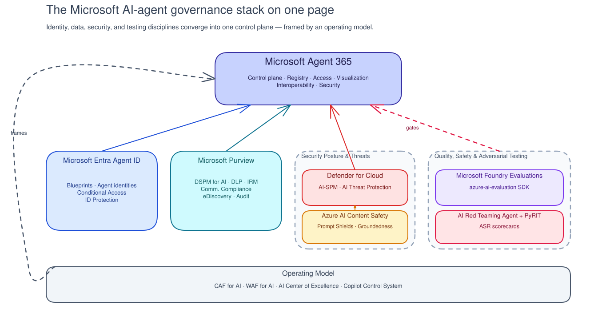

# Reference - The Microsoft AI-Agent Governance Landscape

!!! info "Freshness"
    **Last reviewed:** 2026-07-06 · This section is the curriculum's internal source-of-truth. Sessions link here rather than repeating claims. Capabilities marked Preview change frequently - see [Product Status](product-status.md).

Microsoft ships a **first-party control plane for governing AI agents end to end**, with most pieces reaching general availability in the first half of 2026. "Agent governance" here means **extending the identity, security, compliance, and lifecycle controls you already run for humans and apps to non-human agents - plus new AI-specific safety and evaluation disciplines.**

## The stack on one page

## The pillars in brief

- **Microsoft Agent 365** - the enterprise control plane. Five pillars: **Registry, Access Control, Visualization, Interoperability, Security**. Microsoft Learn also uses an **Observe / Govern / Secure** framing. GA May 1, 2026; ~$15/user/mo (publicly announced - verify current).[^a365]
- **Microsoft Entra Agent ID** - agents as first-class identities via four object types (blueprint, blueprint principal, agent identity, agent's user account); every agent has a **human sponsor**; governed by Conditional Access, ID Protection, and access packages. GA April 2026.[^entra]
- **Microsoft Purview** - data security & compliance for AI: DSPM for AI, DLP for AI, Insider Risk Management, Communication Compliance, eDiscovery/audit.[^purview]
- **Microsoft Defender for Cloud** - AI Security Posture Management (AI-SPM) + AI Threat Protection; works with Content Safety Prompt Shields; alerts in Defender XDR.[^defender]
- **Azure AI Content Safety** - runtime safety floor: Prompt Shields (direct + indirect injection), groundedness detection, protected-material detection, harm filters.[^contentsafety]
- **Microsoft Foundry Evaluations** - the `azure-ai-evaluation` SDK: quality, risk/safety, and agent-specific evaluators; continuous evaluation; OpenTelemetry tracing; CI/CD gate via the `ai-agent-evals` GitHub Action.[^foundry]
- **AI Red Teaming** - **PyRIT** (open-source framework) + the **AI Red Teaming Agent** (managed, preview) with Attack Success Rate (ASR) scorecards.[^redteam]
- **Operating model** - Cloud Adoption Framework (CAF) for AI (Strategy → Plan → Ready → Govern → Secure → Manage), Well-Architected Framework for AI, and the **AI Center of Excellence** model, aligned to **NIST AI RMF / ISO 42001 / EU AI Act**.[^caf]

## Framing notes to teach honestly

- **Five pillars, not six.** Entra Agent ID is the identity technology *under* Access Control and Security - not a separate Agent 365 pillar.[^a365]
- **Monitoring ≠ control.** Agents that **execute as the user (OBO)** without their own Entra Agent ID may be *visible but not fully controllable*.[^a365]
- **Tenant-plane ≠ IaC.** Entra, Purview, and M365/Copilot config are **not** deployable via Bicep/ARM - they use Microsoft Graph / PowerShell / exported JSON.

[^a365]: Microsoft 365 Blog - *Microsoft Agent 365: the control plane for AI agents* (2025-11-18); Microsoft Learn - [Agent 365 Overview](https://learn.microsoft.com/en-us/microsoft-agent-365/overview); Microsoft Security Blog - *Agent 365 now generally available* (2026-05-01).
[^entra]: Microsoft Learn - [What is Microsoft Entra Agent ID?](https://learn.microsoft.com/en-us/entra/agent-id/what-is-microsoft-entra-agent-id); [Agent ID governance overview](https://learn.microsoft.com/en-us/entra/id-governance/agent-id-governance-overview).
[^purview]: Microsoft Learn - [Microsoft Purview for AI](https://learn.microsoft.com/en-us/purview/ai-microsoft-purview); [DSPM](https://learn.microsoft.com/en-us/purview/data-security-posture-management-learn-about).
[^defender]: Microsoft Learn - [AI security posture management](https://learn.microsoft.com/en-us/azure/defender-for-cloud/ai-security-posture); [AI threat protection](https://learn.microsoft.com/en-us/azure/defender-for-cloud/ai-threat-protection).
[^contentsafety]: Microsoft Learn - [Prompt Shields](https://learn.microsoft.com/en-us/azure/ai-services/content-safety/concepts/jailbreak-detection).
[^foundry]: Microsoft Learn - [Foundry Observability](https://learn.microsoft.com/en-us/azure/ai-foundry/concepts/observability); [azure-ai-evaluation](https://github.com/Azure/azure-sdk-for-python/blob/main/sdk/evaluation/azure-ai-evaluation/README.md).
[^redteam]: Microsoft Learn - [AI Red Teaming Agent](https://learn.microsoft.com/en-us/azure/ai-foundry/concepts/ai-red-teaming-agent); [github.com/Azure/PyRIT](https://github.com/Azure/PyRIT).
[^caf]: Microsoft Learn - [CAF for AI](https://learn.microsoft.com/en-us/azure/cloud-adoption-framework/ai/strategy); [AI Center of Excellence](https://learn.microsoft.com/en-us/azure/cloud-adoption-framework/ai/center-of-excellence).
