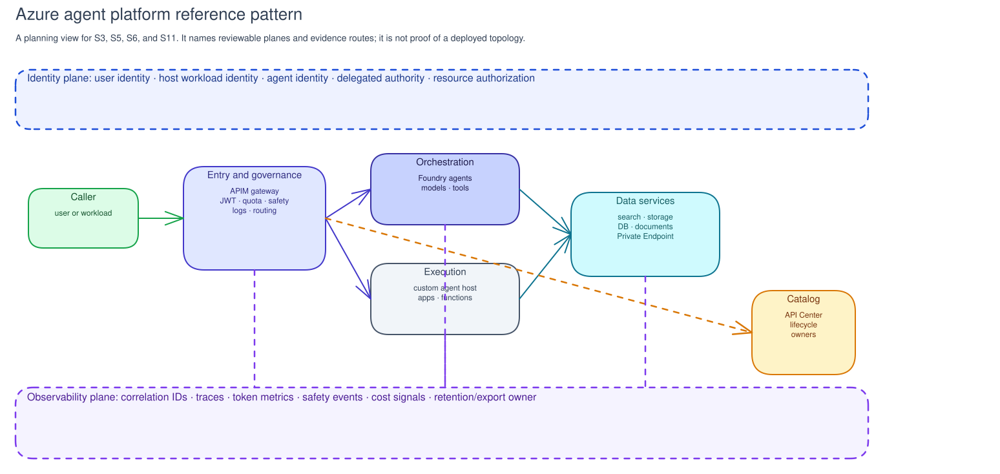

# Platform technical guide

Use this guide with the customer platform team to establish the technical
foundation for an integrated AI Governance engagement. By the end, the team
should have named the platform route, owners, evidence locations, and readiness
gaps needed for the next decision.

The guide records customer references and ownership. It is not a deployment
blueprint, a reachability test, or evidence that a customer environment is
configured in a particular way.

## Microsoft reference architecture context

The [Foundry Citadel Platform](https://github.com/Azure-Samples/foundry-citadel-platform)
is one Microsoft reference architecture for enterprise AI security, compliance,
and scale. It describes four connected layers and links to deployable
accelerators. Use it as context when it fits the customer's platform direction,
not as the starting point for every engagement.

| Layer | Platform purpose | Typical technologies |
|---|---|---|
| Governance Hub | Route approved AI calls and apply shared gateway controls. | Azure API Management, Azure API Center, access and backend contracts. |
| AI Control Plane | Observe, trace, and evaluate AI behavior. | Microsoft Foundry, evaluation and observability services. |
| Agent Identity | Link agents to sponsors, lifecycle, and access context. | Microsoft Entra Agent ID, Microsoft Agent 365. |
| Security Fabric | Protect data and respond to security and runtime-safety risk. | Microsoft Defender, Microsoft Purview, Microsoft Entra, Content Safety. |

## Azure agent platform reference pattern

An Azure agent platform can be reviewed through seven planes. The pattern helps
the customer ask where evidence and ownership belong; it is not a prescribed
topology.

| Plane | Purpose | Typical Azure records to identify |
|---|---|---|
| Entry and governance | Route caller, agent, model, and tool traffic through an accountable policy boundary. | Azure API Management API, product, policy, and backend; gateway owner; access contract. |
| Orchestration | Host or coordinate model and agent execution. | Microsoft Foundry project, model deployment, agent record, tool configuration, observability settings. |
| Execution | Run custom or external agent logic outside the managed orchestration surface. | App Service, Application Service Environment, Functions, Container Apps, AKS, workload identity, deployment owner. |
| Data | Provide retrieval, storage, search, and document-processing dependencies. | Cosmos DB, Azure AI Search, Storage, Document Intelligence, Private Endpoint, data owner, classification record. |
| Identity | Distinguish user, host workload, agent, delegated, gateway, and resource identities. | Entra Agent ID, Agent 365, managed identity, workload identity federation, app registration, RBAC, API permissions. |
| Catalog | Record approved APIs, tools, ownership, versions, and withdrawal routes. | Azure API Center record, API Management product or backend, owner, lifecycle status, access contract. |
| Observability | Preserve request, policy, tool, data, cost, and safety signals with correlation and retention. | Azure Monitor, Application Insights, Log Analytics, diagnostic settings, trace or correlation method, export owner. |

For a private or high-sensitivity route, also identify network segmentation:
VNet and subnet ownership, private endpoint placement, private DNS zones, NSGs,
route tables or firewalls, peering or hybrid-connectivity conditions, and known
public-endpoint exceptions.

For operations, identify how a reviewer connects a gateway request,
orchestration trace, execution-host dependency call, data or tool record, safety
event, token metric, and cost view. If telemetry is exported to a SIEM or
external observability platform, record the approved export path and data
handling boundary before relying on it.

## Where governance uses platform evidence

| Platform evidence | Governance decision it supports |
|---|---|
| Foundry project, model, agent, tool, identity, observability, and publication records | Select an implementation path and identify its configuration backlog. |
| API Center and access-contract records | Review publication, exposure, ownership, and lifecycle. |
| Gateway authentication, safety, and data-protection configuration | Review the matching identity, runtime-safety, and data-control evidence. |
| Traces, evaluations, usage, and cost telemetry | Review evaluation, remediation, reconciliation, operating, and cost decisions. |

The platform team retains ownership of deployment, identity, network and gateway
setup, telemetry, and production readiness through approved engineering and
change processes.

## Technical handoff checklist

Before a workshop needs platform evidence, record:

1. the platform owner and expected deployment or connection path;
2. the gateway, catalog, and access-contract locations, if available;
3. the safety configuration and telemetry location;
4. the current platform readiness gaps, owners, and next review point.

For accelerator deployment, use the [AI Hub Gateway deployment guidance](https://github.com/Azure-Samples/ai-hub-gateway-solution-accelerator/tree/citadel-v1/guides)
and the [Azure AI Landing Zones](https://github.com/Azure/AI-Landing-Zones)
documentation. Confirm the selected branch, prerequisites, and product status
before customer delivery.
