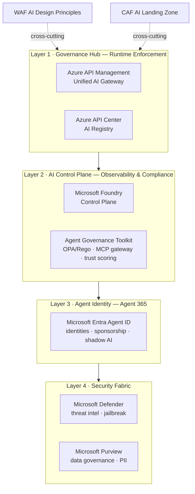
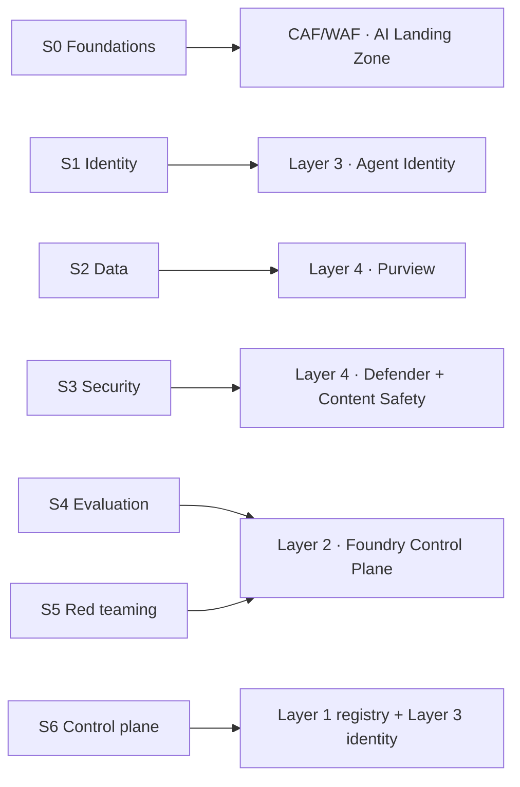

# Reference - Azure AI Foundry Reference Architectures

!!! info "Freshness"
    Last reviewed: 2026-07-09 · This page anchors the RVAS curriculum to Microsoft's published reference architecture for AI Foundry governance. Preview/branch content changes frequently - see [Product Status](product-status.md).

RVAS is the done-with-you operationalization of Microsoft AI-agent governance. The **Foundry Citadel Platform** is the matching reference architecture - the opinionated target design that Microsoft Cloud Solution Architects (CSAs) point to when they talk about "AI Foundry Governance." This page maps every RVAS session to the Citadel layer it implements, and links the deployable accelerators.

!!! note "How to use this page"
    Citadel describes what the target architecture is and ships one-click accelerators to deploy it. RVAS describes how you operationalize each layer inside a customer tenant, session by session, leaving durable artifacts. They are complementary - reference this page when a customer asks "how does what we're doing map to the Microsoft reference architecture?"

## The Foundry Citadel Platform

The [Foundry Citadel Platform](https://github.com/Azure-Samples/foundry-citadel-platform) is a documentation-first reference architecture (MIT-licensed) for enterprise AI security, compliance, and scale. It is not IaC itself - it defines a four-layer governance stack and points to two deployable accelerators that implement it.[^citadel]

| Layer | Purpose | Microsoft technologies |
|-------|---------|------------------------|
| 1 - Governance Hub | Runtime enforcement plane - a single control point for every AI call | Azure API Management (Unified AI Gateway), Azure API Center (AI Registry) |
| 2 - AI Control Plane | Observability & compliance - evaluate agent behavior, trace end to end | Microsoft Foundry Control Plane, Agent Governance Toolkit, ISV policy partners |
| 3 - Agent Identity | Agents as first-class identities with human sponsors | Microsoft Entra Agent ID / Agent 365 |
| 4 - Security Fabric | Threat protection and data governance | Microsoft Defender, Microsoft Purview, Microsoft Entra |

Citadel aligns to the Cloud Adoption Framework and the Well-Architected Framework for AI, and frames itself as a *supplemental AI landing zone* deployable alongside a customer's existing platform landing zone.[^citadel]

## RVAS sessions mapped to Citadel layers

RVAS teaches the same Microsoft stack Citadel is built on. Each session operationalizes a specific layer.

| RVAS session | Citadel layer / component | What RVAS adds |
|--------------|---------------------------|----------------|
| [S0 · Foundations & Operating Model](../s0-foundations/index.md) | Cross-cutting CAF/WAF + "supplemental AI landing zone" framing | The operating model that *governs* the reference architecture; the maturity baseline |
| [S1 · Identity & Access](../s1-identity/index.md) | Layer 3 - Agent Identity (Agent 365) | Hands-on Entra Agent ID inventory, sponsorship register, report-only Conditional Access |
| [S2 · Data & Compliance](../s2-data-compliance/index.md) | Layer 4 - Purview | DSPM/DLP for AI configured in the customer tenant |
| [S3 · Security Posture & Runtime](../s3-security-runtime/index.md) | Layer 4 - Defender + Content Safety | Defender AI-SPM + Prompt Shields staged audit-first |
| [S4 · Quality & Safety Evaluation](../s4-evaluation/index.md) | Layer 2 - Foundry Control Plane evaluations | The `azure-ai-evaluation` suite + a CI/CD quality gate |
| [S5 · Adversarial Testing](../s5-red-teaming/index.md) | Layer 2 red-teaming (+ AGT for OWASP Agentic Top 10) | PyRIT / AI Red Teaming Agent scan + ASR scorecard |
| [S6 · Control Plane & Operationalization](../s6-control-plane/index.md) | Layer 1 - API Center registry + Agent 365 | Registry reconciliation, shadow-agent findings, capstone re-score |

## Deployable accelerators

Citadel points to two Microsoft accelerators that turn the reference architecture into running Azure infrastructure.

| Resource | Citadel role | What it deploys | Link |
|----------|--------------|-----------------|------|
| **AI Hub Gateway / Citadel Governance Hub (`citadel-v1`)** | Layer 1 - Governance Hub | APIM AI gateway, API Center AI Registry, Access Contracts + Backend Contracts, multi-region Azure OpenAI / Foundry routing, gateway-level Content Safety + PII masking, Entra/JWT auth, Event Hub + Cosmos DB usage pipeline, Power BI FinOps dashboard, Managed Identity, private networking, resiliency | [aka.ms/ai-hub-gateway](https://aka.ms/ai-hub-gateway)[^ailz] |
| **Azure AI Landing Zones** | Citadel Agent Spoke (per business unit) | AI Foundry + project, Zero-Trust networking (private endpoints, NSGs, Firewall, Bastion), Container Apps, Key Vault, monitoring - Bicep/Terraform via Azure Verified Modules | [Azure/AI-Landing-Zones](https://github.com/Azure/AI-Landing-Zones)[^ailz] |
| **Agent Governance Toolkit (AGT)** | Layer 2/4 - in-process enforcement | Open-source policy engine (OPA/Rego + Cedar), MCP security gateway, cryptographic agent identity, tamper-evident audit; SDKs for Python/TypeScript/.NET/Go/Rust; covers 10/10 OWASP Agentic Top 10 | [microsoft/agent-governance-toolkit](https://github.com/microsoft/agent-governance-toolkit)[^agt] |

!!! note "Where Citadel goes beyond RVAS scope"
    Citadel Governance Hub is the Azure-plane platform; RVAS is the tenant-plane operating model. Citadel introduces topics RVAS deliberately does not teach as sessions: the APIM AI Gateway as a runtime enforcement/cost-attribution plane (Layer 1), and deployable landing-zone IaC with private networking and hub-spoke. Treat these as adjacent reference architecture a customer deploys alongside RVAS - not as new RVAS sessions - so the curriculum stays focused on tenant-plane governance.

    Relevant `citadel-v1` guides:

    - **Deploy:** [Quick Deployment Guide](https://github.com/Azure-Samples/ai-hub-gateway-solution-accelerator/blob/citadel-v1/guides/quick-deployment-guide.md), [Full Deployment Guide](https://github.com/Azure-Samples/ai-hub-gateway-solution-accelerator/blob/citadel-v1/guides/full-deployment-guide.md), [Network Approach](https://github.com/Azure-Samples/ai-hub-gateway-solution-accelerator/blob/citadel-v1/guides/network-approach.md)
    - **Identity:** [Entra ID auth validation](https://github.com/Azure-Samples/ai-hub-gateway-solution-accelerator/blob/citadel-v1/guides/entraid-auth-validation.md), [JWT client identity & permissions](https://github.com/Azure-Samples/ai-hub-gateway-solution-accelerator/blob/citadel-v1/guides/jwt-client-identity-permissions.md)
    - **Data and runtime safety:** [PII masking at the gateway](https://github.com/Azure-Samples/ai-hub-gateway-solution-accelerator/blob/citadel-v1/guides/pii-masking-apim.md), [Resiliency Guide](https://github.com/Azure-Samples/ai-hub-gateway-solution-accelerator/blob/citadel-v1/guides/resiliency-guide.md), [Throttling events handling](https://github.com/Azure-Samples/ai-hub-gateway-solution-accelerator/blob/citadel-v1/guides/throttling-events-handling.md)
    - **Policy and operations:** [Agent Governance Toolkit integration](https://github.com/Azure-Samples/ai-hub-gateway-solution-accelerator/blob/citadel-v1/guides/agent-governance-toolkit-integration.md), [Power BI dashboard](https://github.com/Azure-Samples/ai-hub-gateway-solution-accelerator/blob/citadel-v1/guides/power-bi-dashboard.md), [LLM access guide](https://github.com/Azure-Samples/ai-hub-gateway-solution-accelerator/blob/citadel-v1/guides/llm-access-guide.md)

## Key Microsoft documentation

- [APIM GenAI gateway capabilities](https://learn.microsoft.com/en-us/azure/api-management/genai-gateway-capabilities) - Layer 1
- [Foundry Control Plane overview](https://learn.microsoft.com/en-us/azure/ai-foundry/control-plane/overview) - Layer 2
- [Entra Agent ID governance](https://learn.microsoft.com/en-us/entra/id-governance/agent-id-governance-overview) - Layer 3
- [WAF AI Design Principles](https://learn.microsoft.com/en-us/azure/well-architected/ai/design-principles) - cross-cutting
- [CAF AI scenario / landing zone](https://learn.microsoft.com/en-us/azure/cloud-adoption-framework/scenarios/ai/) - foundation

[^citadel]: Microsoft - [Foundry Citadel Platform](https://github.com/Azure-Samples/foundry-citadel-platform) (canonical short-link [aka.ms/foundry-citadel](https://aka.ms/foundry-citadel)); [CITADEL Technical Guide](https://github.com/Azure-Samples/foundry-citadel-platform/blob/main/CITADEL-TECHNICAL-GUIDE.md); [Citadel WAF Alignment](https://github.com/Azure-Samples/foundry-citadel-platform/blob/main/Citadel-WAF-Alignment.md). Documentation-only reference architecture (MIT); four-layer governance stack; no IaC in-repo.
[^ailz]: Microsoft - [Azure AI Landing Zones](https://github.com/Azure/AI-Landing-Zones) (GA 2025-11-17; Bicep/Terraform via Azure Verified Modules; CAF application landing zone = "Citadel Agent Spoke"); [AI Hub Gateway solution accelerator](https://aka.ms/ai-hub-gateway) (branded "AI Citadel Governance Hub v1" on the `citadel-v1` branch = Layer 1).
[^agt]: Microsoft - [Agent Governance Toolkit](https://github.com/microsoft/agent-governance-toolkit) (MIT, Public Preview) - OPA/Rego + Cedar policy engine, MCP Security Gateway, SPIFFE/DID identity, tamper-evident audit; [OWASP Agentic Top 10 mapping](https://github.com/microsoft/agent-governance-toolkit/blob/main/docs/compliance/owasp-agentic-top10-architecture.md).
