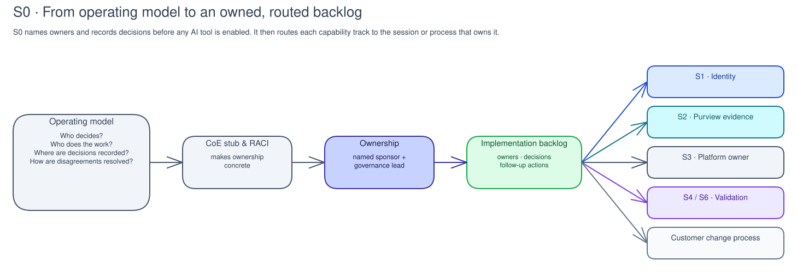

# S0 · Foundations & Operating Model

**Facilitator deck**

Governance lead · Executive sponsor · 90-minute offline baseline working session

Note:
This is an **offline baseline** session: no tenant changes or queries. Timebox:
90 minutes. Roles: facilitator, governance lead, executive sponsor, evidence
owner, and domain reviewers.

---

## The outcome

By the end, the customer has:

- A scored **AI-agent governance maturity baseline**
- A prioritized governance roadmap
- Named owners for follow-on work
- References saved in approved customer records

Note:
The result is a baseline and roadmap decision, not deployed controls. Customer
records stay in the approved system; this repository has blank templates and an
offline scorer.

---

## Why this matters

- Don't enable AI controls before knowing **who owns the decisions**.
- S0 gives the starting point: named owners, scored baseline, and roadmap.
- The customer scores what exists today and decides which gap matters first.

Note:
Set the stakes. Technical controls are useful only when ownership, decision paths, evidence locations, and escalation routes are clear. S0 is the place where the customer makes those operating-model choices explicit.

---

## Operating model before technology

An operating model answers:

- Who decides · who does the work · where decisions are recorded · how disagreements are resolved.

Note:
Walk the diagram left to right, but land the point quickly: ownership comes before tooling. An agent can reach data, call tools, and act with delegated authority. A technical control without an owner becomes an unmanaged exception.

---

## The baseline becomes a work list

- S0 should end with a recommended **foundation path**.
- Sequence the needed identity, data, platform, admission, or customer-process
  work based on gaps and dependencies.
- Use Microsoft capability names only when they route ownership.
- S0 names the track, owner, evidence source, or customer process.

Note:
The score is not the deliverable. Name the next track, owner, evidence gap,
assumptions, and follow-up process. S0 configures none of the named services.

---

## Govern before you build

- NIST AI RMF's **Govern** function sets culture, roles, accountability, and inventory.
- It supports later **Map**, **Measure**, and **Manage** work.
- S0 creates the conditions for later controls to be useful.

Note:
Use this slide to justify why the executive sponsor and governance lead are required, not optional paperwork. The customer decides who owns an agent, who accepts risk, where evidence lives, and what happens when a use case misses the bar.

---

## Maturity is a baseline, not a pass/fail test

- The assessment uses four levels: **Ad-hoc, Repeatable, Defined, Optimized**.
- The discussion behind the score matters more than the number.
- A high score should have proof behind it.
- S13 repeats the same assessment later.

Note:
Reinforce that the baseline is a prioritization tool, not an audit verdict. A low score can show a missing owner, missing evidence, or untested control. A high score is not a deployed control; it is evidence of an assessment and prioritization decision.

---

## Why agents change the governance problem

- Agents can use non-human identities.
- They can retrieve enterprise data.
- They can call downstream tools.
- They can act on behalf of a user.
- Older app inventories may miss those gaps.

Note:
S0 makes these gaps visible before technical sessions begin. The use-case intake and risk-classification stub should capture intended capability, data exposure, human oversight, accountable sponsor, and product name.

---

## The target architecture gives the model somewhere to land

- Foundry Citadel Platform organizes governance into platform layers.
- The operating model defines the **people and decisions** across those components.
- S0 does not require that platform to be deployed.
- It decides who will own platform evidence and exceptions once the platform exists.

Note:
Use the target architecture only as context. A reference architecture does not replace customer ownership, evidence, or change process. S0 helps the customer decide who will own platform evidence and exceptions later.

---

## Policy, control, visibility, and proof

S0 frames the operating model through four questions:

- What does policy define?
- Which later controls can enforce it?
- What visibility will show what happened?
- Which customer record can support the decision?

Note:
This lens keeps the discussion grounded. It is not a maturity claim; it is a way to make sure a use-case decision has an owner and an evidence route before technical work starts.

---

## The activity: how we'll work

- **Timebox:** 90 minutes · **five steps**
- **To start:** sponsor, governance lead, approved evidence location, bounded pilot question.
- Missing sponsor, owner, or records location? **Stop that part and assign the blocker.**
- Do not create a substitute record in Git.

Note:
Confirm the preconditions before continuing. The governance lead scores the baseline with customer participants, then the sponsor chooses the next owned governance work. Introduce the five steps: set the room, create the customer copy, score, generate/read the roadmap, decide and hand off.

---

## Step 1: Set the room and question · 10 min

> **"Which governance capability must we prioritize for this pilot, and who can decide?"**

Confirm the offline setup, decision owner, evidence location, and stop condition.

Note:
A useful start has named roles and an approved record location. If there is no sponsor, owner, or records location, mark that area blocked. Record the working agreement reference.

---

## Step 2: Create the customer copy · 10 min

The governance lead copies the scorecard, operating-model stub, and RACI to the approved customer system.

> **"Which evidence would justify a 1 instead of a 4?"**
> **"Who resolves a disagreement?"**

Note:
A completed customer copy is evidence. A facilitator-held template is not. If the customer cannot retain the copy safely, mark the activity blocked and assign the records-location owner.

---

## Step 3: Customer scores the baseline · 35 min

Customer participants score the **39 questions** and record rationale and dissent in their copy.

> **"What current practice supports this score?"**
> **"What is the real gap, not the aspiration?"**
> **"Which owner can change it?"**

Note:
A useful result is a score or an explicitly unanswered item with rationale. If evidence cannot support a score, record what was checked, the scope, and the reviewer. If a required owner or source is missing, stop that domain and continue only with independent domains.

---

## Step 4: Generate and read the roadmap · 20 min

The customer runs the offline scorer against its copy.

> **"Which option from the Technical decisions menus does this ranking support, and which alternative is rejected or deferred?"**
> **"Which prerequisite must be owned before S1 or S2 can start?"**

Note:
The scorer ranks lower scores first and breaks ties by total question weight. It recommends a roadmap; it does not make the decision. If the tool cannot run, keep the completed baseline reference, record the blocker, and assign remediation. Do not invent a score by hand.

---

## Step 5: Decide and hand off · 15 min

The decision owner chooses:

- Next session
- Deferral with a date
- Accepted stated gap

Read back the control state, next owner, date, backlog item, and S1/S2 dependency.

Note:
The decision uses maturity evidence, business risk, accountable ownership, and prerequisites. If the decision owner is missing, mark the decision deferred with an owner and review date. Capture the reference to `templates/technical-decision-record.template.md`.

---

## Verification & evidence

- [ ] The customer scorecard has all 39 questions scored or explicitly marked unanswered.
- [ ] The offline scorer produces an overall maturity score and prioritized roadmap.
- [ ] The customer record names the governance owner, sponsor, decision, and next review date.
- [ ] The evidence register contains references only.
- [ ] Any unsupported or blocked domain has scope, owner, evidence reference, and review date.

Note:
Register the customer baseline reference and retention/classification metadata in `04-operate/evidence-register.json`. Register the roadmap decision in `04-operate/decision-register.json` in the generated delivery workspace. Do not copy the baseline, roadmap, operating model, or RACI into this repository.

---

## Change boundary & hand-off

- S0 makes **no tenant changes**.
- Capability, licensing, ownership, and delivery gaps go to the customer backlog.
- Later changes use the customer's approved process.
- The roadmap sets the order for **S1-S13**.

Note:
If ownership or evidence is missing, assign follow-up or record the gap; do not
raise the score. S13 compares the same customer-held assessment later.
