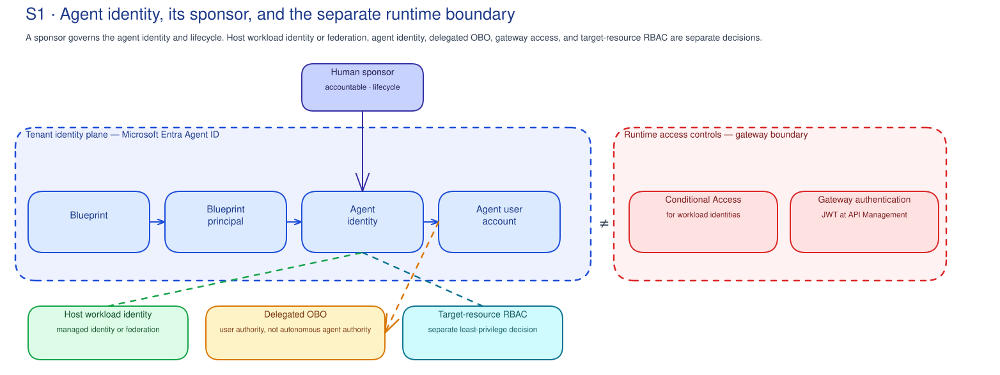

# S1 · Agent Identity Path Concepts

!!! info "Freshness"
    Last reviewed: 2026-07-06 · Check Agent ID and Conditional Access availability in the [Governance capability guide](../reference/governance-capability-guide.md).

This page explains why S1 starts with a trusted list, an accountable sponsor, and
a clear authority boundary for every agent or agent-like workload. Go back to
[S1 Prepare](index.md) for the run order.

## Every agent needs an identity path you can trace

**Microsoft Entra Agent ID** gives an agent a real identity in the tenant, built
from a few connected objects (a blueprint, a blueprint principal, an agent
identity, and an agent user account). The object model isn't the point. The
point is simple: **every agent needs a human sponsor who is accountable for what
it does and how long it lives.**[^entra]

That's why the session starts by tracing one pilot identity path, not by filling
in a generic owner column. If something goes wrong, you can't respond well unless
you can say what your list covers, which identity is which agent, which host can
request tokens, who owns the credential or federation path, what delegated
authority it can use, which actions are denied, which resource scope limits it,
and how the customer disables and audits it.

An agent identity is more than an app registration: its sponsor and lifecycle
belong in the governance record.

The implementation path may include a blueprint, blueprint principal, agent
identity, managed identity, federated credential, app registration, gateway
record, audit/sign-in log, and target-resource RBAC. S1 keeps those pieces
separate. A host credential can prove a workload can request a token; it does
not prove the agent has a sponsor, lifecycle state, delegated authority boundary,
least-privilege resource access, denied-action policy, or emergency disable
route.

## The practical control map

Use this map when the conversation starts drifting back to abstract ownership.

| Control question | Microsoft surface to inspect | What S1 records |
|---|---|---|
| Who is accountable for purpose and lifecycle? | Entra Agent ID, Agent 365, customer control register | Sponsor, lifecycle owner, current state, review trigger, retirement condition. |
| Which actor is the agent? | Agent identity, app/service principal, customer inventory record | Agent identity reference, coverage limit, authority mode, source status. |
| Which host can mint or exchange tokens? | Managed identity, federated credential, app registration, service principal | Host identity, issuer/subject or credential owner, revocation route. |
| Is the agent app-only, OBO, or mixed? | OBO flow records, app permissions, delegated scopes, sign-in/audit logs | Runtime mode, user intent trigger, app-only purpose, prohibited actions. |
| What can the agent reach? | Azure RBAC, Graph/API permissions, connector permissions, gateway products/routes | Minimum scopes, broad or unknown permissions, denied actions, narrowing backlog. |
| Can the customer stop and investigate it? | Agent ID state, Conditional Access, RBAC removal, gateway suspension, sign-in/audit/gateway/app logs | Disable owner, incident path, audit correlation evidence, retention owner. |

## Common patterns S1 records

S1 does not assume every agent has the same identity shape. The review records
the pattern that is actually present and the question that remains open:

- **Agent identity available:** an Agent ID or Agent 365 record can support the
  agent-to-sponsor relationship where those capabilities are available for the
  workload. Record the source, sponsor, lifecycle state, and coverage limit.
- **Directory or app identity only:** a service principal, app registration, or
  managed identity may prove that code can authenticate, but it does not by
  itself prove the agent, sponsor, purpose, or lifecycle decision. Record the
  credential owner, rotation or federation review, and the missing agent-governance
  evidence.
- **Delegated or OBO authority:** an agent may act for a user or workflow. Record
  where consent, OBO, sign-in, or audit telemetry will be reviewed, and treat that
  telemetry as authority evidence, not as the agent inventory.
- **Autonomous or app-only authority:** an agent may run without a user context.
  Record the sponsor, non-secret credential or federation path, app-only scopes,
  denied actions, and the disable route. Do not reuse a delegated-user decision
  as app-only approval.
- **Gateway-mediated access:** a gateway or API Management policy may validate a
  token and limit runtime API access. Record the boundary and gateway owner, but
  keep it separate from tenant identity sponsorship.
- **No trusted identity record:** if the source cannot prove the identity,
  sponsor, credential owner, or boundary, S1 records a gap and routes the item to
  review or block; it does not infer missing identity data.

## Concrete failure modes

The workshop should call out unsafe designs plainly:

- **Shared app registration across unrelated agents:** action attribution and
  lifecycle decisions collapse.
- **Unmanaged stored secret:** credential rotation, revocation, and incident
  containment depend on manual hygiene.
- **Broad Graph/API permission:** app-only authority can exceed the agent's
  bounded purpose.
- **OBO without correlation:** logs cannot distinguish user intent, app behavior,
  and agent action.
- **Gateway-authenticated but ownerless:** runtime JWT validation exists, but
  the tenant has no accountable agent sponsor or lifecycle record.
- **No disable route:** the customer cannot say whether to disable an agent
  identity, host credential, gateway route, RBAC assignment, or backend access.

## Findings turn into a short backlog

Keep findings separate from follow-up. A reviewed identity path can support a
sponsor decision, lifecycle review, Agent ID or Agent 365 coverage
investigation, managed identity or federation recertification, RBAC/API/OBO
follow-up, access review, audit-correlation fix, provisioning automation backlog,
or blocker. Identity creation, access grants, Conditional Access setup, Graph
consent, and production approval stay in the customer's implementation process.

The backlog names the sponsor, credential or federation owner, identity/OBO
review, access-control owner, gateway-authentication dependency, audit/disable
owner, review trigger, and control-plane reconciliation.

The decision path is intentionally small:

- **Keep** when source coverage, sponsor, credential ownership, authority, and
  access boundary are clear enough for the customer's process.
- **Review** when the item needs sponsor confirmation, credential recertification,
  OBO analysis, or boundary clarification.
- **Retire** when the agent, credential, or app identity no longer has a valid
  purpose or sponsor.
- **Block** when the authority path, owner, or boundary is unclear enough that
  dependent work should pause.

## The list is your first control

Agents get identities as makers build them in supported tools. So agents can
show up through normal development, not through a tidy governance onboarding
step.[^entra] A list is only useful evidence when it says which source it came
from and which workload it covers.

S1 does not export or guess at identity data. Service-principal,
managed-identity, app, or OBO views can support a record but cannot prove an
agent identity or complete coverage. Agent ID and Agent 365 records, directory
or app records, OBO telemetry, and gateway-authentication logs answer different
questions; none is a universal inventory. Record the trusted source, its limits,
sponsor, credential owner, access boundary, lifecycle, and decision.

## Conditional Access is a separate change the customer owns

Setting up Conditional Access for workload identities depends on the tenant,
licensing, which workloads support it, scope, exclusions, and the customer's
change process. A generic policy or break-glass template can't stand in for that.

**In the practical workshop:** S1 finds owner and coverage gaps. Identity controls proceed
through the customer's identity-change process.

## Seeing an agent isn't the same as controlling it

An agent acting for a user (OBO) can show up in telemetry without having its own
Agent ID you can govern on its own. S1 records these as authority evidence and
coverage gaps, not as "handled."[^a365]

Gateway authentication is a related but separate control. The gateway's
JWT validation at the API Management layer guards runtime access to the gateway;
Entra Agent ID and sponsorship govern the identity plane in the tenant. You
often need both, and neither replaces the other.[^citadel]

## Lifecycle review is deeper than ownership

Naming a sponsor is the start, not the end. The sponsor confirms the business
purpose and accountable team. The credential or federation owner confirms who
maintains secrets, certificates, managed identity assignments, or workload
federation. The access-control owner confirms which RBAC, API, data, or gateway
boundary limits the agent.

S1 records the next review trigger: scheduled recertification, credential
rotation, sponsor change, product retirement, environment promotion, new data
scope, OBO consent change, incident, or failed evidence check. That trigger
drives the keep/review/retire/block path and keeps the review from becoming a
static spreadsheet.

[^entra]: Microsoft Learn - [What is Microsoft Entra Agent ID?](https://learn.microsoft.com/en-us/entra/agent-id/what-is-microsoft-entra-agent-id); [Agent ID governance overview](https://learn.microsoft.com/en-us/entra/id-governance/agent-id-governance-overview).
[^a365]: Microsoft Learn - [Agent 365 Overview](https://learn.microsoft.com/en-us/microsoft-agent-365/overview).
[^citadel]: Microsoft - [Foundry Citadel Platform](https://github.com/Azure-Samples/foundry-citadel-platform); [AI Hub Gateway](https://aka.ms/ai-hub-gateway).

## Related official references

See the [Microsoft AI governance reference map](../reference/ai-governance-reference-map.md)
for Entra, RBAC, Conditional Access, and agent-governance sources.
