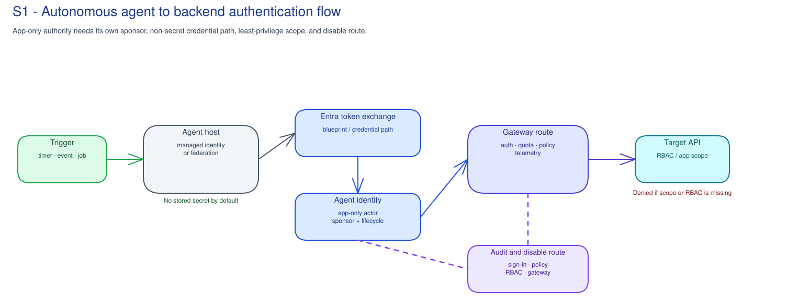
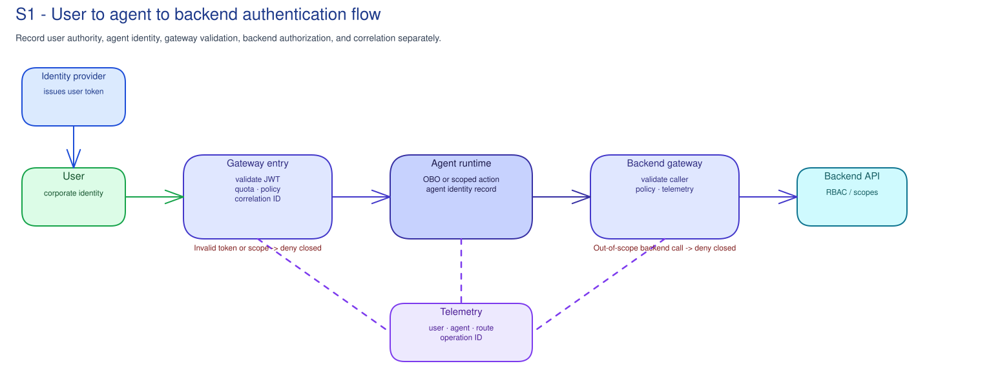

# S1 · Agent Identity Path

**Facilitator deck**

Microsoft default: **Microsoft Entra Agent ID, Entra workload identities,
Managed Identity, workload identity federation, Conditional Access, Azure RBAC,
APIM/gateway JWT boundaries, and Agent 365 where available**.

Concrete decision: **Can this pilot agent run under an owned, auditable,
least-privilege identity path for the bounded scope?**

---

## Why agents need their own identity

- A shared service principal or stored secret can authenticate code, but it does
  not explain which agent acted, who sponsors it, how long it should live, or
  how to stop it.
- A useful review separates the human sponsor, agent identity, host workload
  identity, delegated user context, gateway boundary, and target resource.
- The goal is not "find an owner." The goal is a traceable identity path.

Note:
Set the tone: S1 is practical architecture review, not spreadsheet ownership.

---

## The control map

- **Sponsor:** accountable for purpose, lifecycle, and recheck condition.
- **Agent identity:** accountable runtime actor where supported.
- **Host identity:** managed identity, federated credential, app registration, or
  service principal that can request or exchange tokens.
- **Resource authorization:** RBAC, API/Graph scope, connector permission,
  gateway product, or data boundary.

Note:
Keep these separate. One row in one admin portal rarely answers every question.

---

## Object model to inspect

- **Agent identity blueprint:** governance container or template for agent
  identity creation and policy where supported.
- **Blueprint principal:** tenant service principal or equivalent object that
  represents the blueprint path.
- **Agent identity:** the runtime actor tied to sponsor, purpose, authority mode,
  lifecycle, and retirement.
- **Host workload identity:** compute or automation identity that can obtain or
  exchange tokens.
- **Target authorization:** the resource-side permission that actually allows or
  denies the action.

Note:
The blueprint and host identity are not the same as the agent. Resource
authorization is a separate decision again.

---

## App-only runtime flow

- Use for scheduled, event-driven, or service-to-service work.
- Inspect the host identity, issuer/subject constraints, token exchange, agent
  actor, app roles/RBAC/API scopes, denied actions, and disable route.
- Reject shared accounts, unmanaged secrets, tenant-wide permissions without
  review, and paths that cannot be disabled or audited.

Note:
Ask: "Which object do we disable first if this agent misbehaves?"

---

## OBO runtime flow

- Use when the agent acts in a signed-in user's context.
- Inspect user intent trigger, delegated scopes, consent owner, token exchange,
  prohibited actions, fallback behavior, and audit correlation.
- Do not let OBO justify autonomous production changes or privilege elevation
  outside the user's approved scope.

Note:
Ask: "Can investigation distinguish the user, the app, the agent, the gateway,
and the backend?"

---

## What the customer inspects

| Question | Microsoft record |
|---|---|
| Is the agent represented and sponsored? | Entra Agent ID, Agent 365, customer control register |
| Which host can request tokens? | Managed identity, federated credential, app registration, service principal |
| Which authority mode is allowed? | App permissions, delegated scopes, OBO records, consent route |
| What can it reach? | Azure RBAC, Graph/API permissions, connector permissions, gateway route |
| Can we stop and investigate it? | Agent state, Conditional Access, RBAC removal, gateway suspension, sign-in/audit/gateway/app logs |

Note:
Keep all real identifiers, logs, tokens, and access assignments in customer
systems.

---

## Failure modes and hard stops

- Missing sponsor or lifecycle owner.
- Agent hidden behind a shared app registration.
- Stored secret or certificate without owner, rotation, or retirement trigger.
- Broad Graph/API permission or RBAC scope without narrowing owner.
- OBO path without audit correlation or user intent.
- Gateway authentication present but no agent identity record.
- No known disable route.

Note:
Defer with a named owner and target event when fixable. Reject production
onboarding when unaudited access, unmanaged credentials, or unbounded privilege
remain.

---

## Workshop artifact

The record must capture:

- Pilot scope and business purpose.
- Sponsor, lifecycle owner, identity owner, security reviewer, operations owner.
- Agent identity, host workload identity, runtime mode, and token path.
- Minimum authorization boundary and denied actions.
- Audit route and disable route.
- Decision: approve, defer, reject, or route with owner, accepted-when condition,
  target event, and recheck condition.

Note:
Close with the artifact, not a generic meeting summary. S1 changes nothing in
the tenant; customer change processes own provisioning, grants, policy changes,
and production approval.
