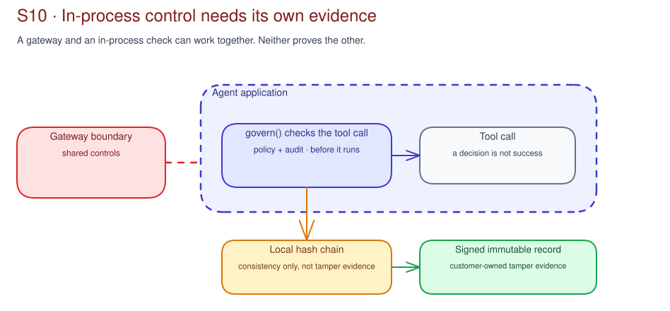

# S10 · In-Process Agent Governance Concepts

!!! info "Freshness"
    Last reviewed: 2026-07-15 · This page describes AGT from pinned primary sources at [commit `b680c49`](https://github.com/microsoft/agent-governance-toolkit/tree/b680c49cc956727c5249771ddba7ee21a635a676). AGT is Public Preview.

S10 asks one practical question: does this agent have a real in-process
tool-call boundary where policy must decide before the tool runs? If the answer
is no, S10 is not applicable. Use the [S10 Prepare](index.md) chapter for the
offline workshop. Use this page to explain why that check is different from
gateway, data, identity, and outcome controls.

## A different enforcement point

Citadel's Governance Hub can apply shared controls at the network and API
gateway boundary. An in-process governance library can check the requested tool
action inside the agent application before the tool runs, but only when the
agent has a local delegated-authority decision that the gateway cannot make.

AGT's documented `govern()` pattern wraps a tool call with policy evaluation and
audit logging. The offline S10 simulator models that policy-and-audit idea only.
AGT is one implementation candidate for a future engineering assessment; it is
not the identity of S10. S10 does not import, test, or certify AGT.[^agt-readme]

## When S10 is not applicable

Skip S10 when the agent has no local tool-call decision point, no delegated
authority to constrain, or when gateway, identity, data, evaluation, or runtime
controls already make the meaningful decision. Record **not applicable**, cite
the alternate control path or backlog item, and continue with S11/S13 or the
customer backlog.

Do not create an AGT investigation just because the session exists. A future AGT
assessment is justified only by a specific pre-tool allow, deny, approval, or
route decision that needs in-process context.

## Hash-chain consistency is not tamper evidence

The local simulator links each record to the previous record. It then checks that
the supplied hashes are internally consistent.

That is useful for the workshop. It is not enough for tamper evidence. A person
who can replace the local record can also recalculate the hash chain.

If the customer needs tamper evidence, the customer must retain a signed record
in immutable external storage. The customer owns that storage, access control,
and retention. S10 does not configure, validate, or certify it.

## Decision evidence is not outcome evidence

A policy-and-audit record can show which policy version checked an attempted
action. It can show whether the action was allowed, denied, or sent for
approval.

It records the in-process decision, not downstream success. For example,
allowing a notification tool is accepted only as an in-process allow decision, not delivery evidence.[^agt-limitations]

## A policy records a governance decision

An allow list, deny default, and approval requirement encode choices about
delegated authority. The policy owner must decide which tools and actions are
allowed, what needs approval, how policies change, and how records are retained.

The sample policy is intentionally generic. Do not copy it into a customer
application without separate engineering, security, and change review.

## Applicability becomes a conditional backlog

The S10 recommendation should say whether to keep gateway-only, investigate an
in-process implementation such as AGT, use both controls, defer, reject, or mark
the boundary not applicable. Typical backlog rows, when S10 is applicable,
include:

- AGT release, API, and limitation assessment;
- language and runtime fit;
- policy owner and approval route;
- delegated authority decision;
- signed immutable audit-retention route;
- gateway, identity, data, and runtime dependencies;
- S5 tool boundary, S6 runtime dependency, and S9 catalog record; and
- rollback, verification, and the customer SDLC change process.

The backlog does not authorize installation, code change, policy deployment,
endpoint access, or production use.

AGT limitations note that an evaluator with no policies loaded can allow actions
by default. Strict deny-by-default is a production design question; S10 models
it but does not validate an AGT configuration.[^agt-limitations]

## Preview and offline boundary

At the pinned source revision, AGT is Public Preview and may change before GA.
Its documented limitations, the customer's language and runtime fit, and its
relationship to existing platform controls are decision inputs. They are not
claims of compliance or certification.

Keep two source tracks during delivery. Pinned-source claims explain what this
curriculum illustrates at a known AGT revision. Current-source research checks
whether AGT status, APIs, limits, language support, or audit behavior have
changed before the customer authorizes future engineering work. Do not merge
those tracks into an unstated product claim.

[^agt-readme]: [AGT README at `b680c49`](https://github.com/microsoft/agent-governance-toolkit/blob/b680c49cc956727c5249771ddba7ee21a635a676/README.md), Public Preview notice, `govern()` example, and audit architecture.
[^agt-limitations]: [AGT known limitations at `b680c49`](https://github.com/microsoft/agent-governance-toolkit/blob/b680c49cc956727c5249771ddba7ee21a635a676/docs/LIMITATIONS.md), especially audit outcomes, knowledge governance, policy initialization, and feature boundaries.

## Portable control specifications need a pinned assessment

The Agent Control Specification describes portable, declarative checkpoints for
policy evaluation across an agent workflow. It is useful vocabulary for a future
engineering assessment. S10's offline boundary still applies.

Before a customer relies on an open-source implementation, capture the reviewed
version or commit, supported runtime, limitations, and ownership decision in the
customer change process.

See the [Microsoft AI governance reference map](../reference/ai-governance-reference-map.md)
for the Agent Control Specification and the distinction between canonical
orientation material and S10's pinned, reviewed AGT source.
