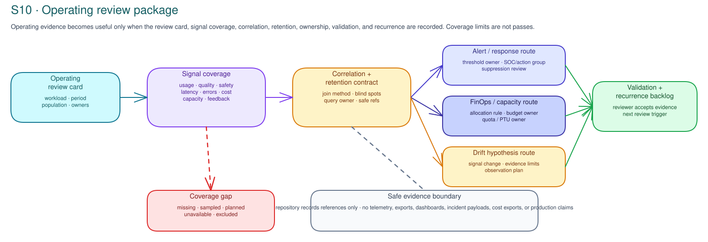
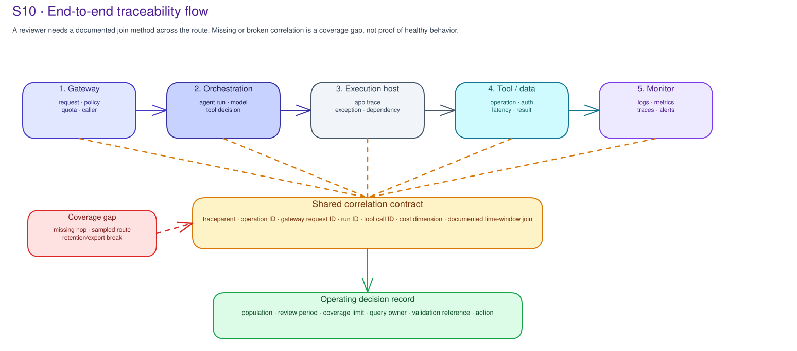

# S10 · Operating Evidence & FinOps: Technical decisions

!!! info "Freshness"
    Last reviewed: 2026-07-29 · Foundry observability, Azure Monitor, Application Insights, Log Analytics, Azure Cost Management, FinOps Toolkit, PTU/committed capacity, alerts, exports, and pricing vary by tenant, region, SKU, and configuration. Verify official docs and customer status before delivery.

## Microsoft default

Default to Microsoft Foundry observability for Foundry agents/models, Azure Monitor and Application Insights/Log Analytics for application and platform telemetry, Azure Cost Management plus FinOps Toolkit for cost analysis, and customer operations/SOC routes for alerts and drift response.



## Workshop decision route

1. **Choose workload and review period.** Select one pilot, agent, model route, application, API/tool path, or portfolio slice.
2. **Define the operating review.** Identify the population, excluded paths, decision use, owners, evidence location, and cadence.
3. **Map signal coverage.** Identify the source, population, sampling, time window, retention, exclusions, query owner, interpretation owner, and threshold owner.
4. **Define correlation method.** Trace join keys across gateway, orchestration/model/agent, execution host, tool/data dependency, monitor/log store, cost allocation, and the decision.
5. **Define retention and evidence handling.** Set the retention owner, export owner, sensitive-data boundary, deletion/legal-hold route, and safe-reference location.
6. **Define alert and response ownership.** Set the threshold owner, severity, action group or SOC route, suppression review, tuning cadence, escalation, and validation method.
7. **Define FinOps and capacity allocation.** Identify billing source, tags/dimensions, committed capacity or quota allocation, budget/anomaly owner, and review cadence.
8. **Classify drift hypotheses.** Identify the changed signal, possible causes, evidence limits, owner, observation/test plan, and action route.
9. **Define remediation validation and exceptions.** Set the validation reference, reviewer, recurrence check, exception owner, expiry, remaining risk, and next recheck condition.
10. **Decide.** Adopt, defer, reject, route, or block the operating action.

## Operating review card

| Field | Required record |
|---|---|
| Workload and route | Workload, agent/model/app/API/tool path, environment, and production/non-production boundary. |
| Review period | Start/end time, cadence, business cycle, and time-zone assumption. |
| Population | Included users, requests, channels, model deployments, tools/APIs, data sources, and excluded paths. |
| Decision use | Operating review, incident/problem route, product review, cost action, drift investigation, exception review, or portfolio visibility. |
| Owners | Decision owner, service operations owner, telemetry owner, FinOps owner, product owner, escalation owner, evidence owner. |
| Approved records location | Customer system that retains telemetry references, query notes, cost review, alert records, validation notes, and decisions. |

## Map signal coverage

| Signal family | Example sources | Required interpretation fields |
|---|---|---|
| Usage | requests, sessions, users, channels, tool calls, active agents | population, time window, exclusions, owner |
| Quality | Foundry evaluation signal, feedback, manual review, business-quality metric | scenario or rubric reference, interpretation owner, limitation |
| Safety | blocked prompt, content safety, prompt shield, policy decision, safety review | category, threshold owner, escalation route |
| Latency | first-token latency, end-to-end p50/p95/p99, dependency latency | population, percentiles, sampling, capacity context |
| Errors | gateway errors, app exceptions, model errors, dependency failures | source, severity, owner, incident/problem route |
| Tool/API behavior | tool count, tool decision, operation outcome, unsafe route signal | approved route, operation boundary, owner |
| Identity/security | auth failures, unexpected sign-in, unauthorized route, egress signal | identity owner, SOC route, investigation reference |
| Cost | token usage, inference cost, training cost, PTU/committed capacity, shared cost | allocation rule, budget owner, anomaly route |
| Capacity | quota pressure, saturation, throttling, fallback, model availability | quota/capacity owner, action rule |
| Feedback/outcome | user feedback, support tickets, business outcome, adoption metric | population, owner, decision use |
| Control coverage | monitoring coverage, alert coverage, export coverage, retention coverage | coverage limit, validation owner, recurrence check |

Status values: populated, missing, sampled, planned, unavailable, blocked, or diagnostic-only. Treat every non-populated status as a coverage limit until a customer owner accepts otherwise.

## End-to-end traceability model

For an Azure agent platform, S10 should record which signals let an operating review follow one request across the route. The flow below is illustrative and must be mapped to the customer's actual platform records.



| Hop | Signal to identify | Operating question |
|---|---|---|
| Gateway | Request ID, caller identity, API/product/backend, policy decisions, quota and token metrics, latency, error code. | Did the approved entry route receive and handle the request within the expected policy boundary? |
| Orchestration | Agent or run ID, model deployment, prompt/context reference, tool decisions, token usage, safety/evaluation signals. | Did the AI runtime behave within the reviewed route and emit usable trace references? |
| Execution host | App trace, dependency call, exception, tool parameters, tool response summary, managed identity. | Did custom or external code perform expected work and preserve correlation? |
| Data or tool service | Query/dependency trace, data classification boundary, authorization result, latency, failure. | Which dependency was used, and are data/tool records within the approved scope? |
| Monitor or log store | Operation/trace ID, time window, retained events, sampling, retention/export rule, reviewer query. | Can an owner reconstruct the bounded path without copying raw customer evidence into the repo? |

The common correlation key may be W3C `traceparent`, an Application Insights `operation_Id`, a gateway request ID, a run ID, a tool call ID, a deployment alias, a cost allocation tag/dimension, or a documented join method. S10 records the join method and blind spots; it does not run live queries or declare an uninstrumented path healthy.

## Correlation contract

| Field | Required record |
|---|---|
| Join method | Trace context, operation ID, gateway request ID, run ID, tool call ID, cost dimension, or time-window join. |
| Propagation points | Where the join appears: gateway, app, model/agent, execution host, tool/API, data source, monitor, cost view. |
| Break points | Missing hop, sampled hop, transformed field, export loss, or unsupported source. |
| Query owner | Person or role who can query the customer system. |
| Validation reference | Customer-owned reference that proves the join method was reviewed. |
| Blind spots | Excluded routes, sampling, retention window, privacy boundary, unsupported service, or cost allocation caveat. |

## Alert and operating-review taxonomy

Alerts are useful only when they have an owner, threshold, population, action, suppression rule, validation method, and review cadence.

| Area | Example signal | Decision route |
|---|---|---|
| Entry layer | Gateway 5xx rate, latency, throttling, policy block, quota breach. | Service/platform owner, runtime and operating evidence route, FinOps owner where cost-related. |
| Agent or orchestration | Execution failure, high latency, unexpected tool count, quality/safety score drop, anomalous token usage. | Agent owner, drift hypothesis, operating review. |
| Execution host | App errors, dependency failures, CPU/memory saturation, instance restart, managed identity failure. | Engineering/SRE owner, incident or remediation backlog. |
| Identity and security | Repeated authentication failure, unauthorized access, unexpected agent sign-in, non-approved model or tool route. | Identity/security/SOC owner, runtime and catalog-control handoff. |
| Model and FinOps | High token consumption, capacity saturation, backend failover, inference errors, slow model response. | Model/platform owner, capacity owner, FinOps route. |
| Data and compliance | Unexpected data dependency, failed private endpoint/DNS path, retention/export gap, sensitive-data alert. | Data/compliance owner, platform and operating handoff. |

## Allocate FinOps and capacity

| Field | Required record |
|---|---|
| Billing source | Cost Management view/export, invoice line, FinOps Toolkit report, or approved finance record. |
| Workload attribution | Tags, resource group, project, model deployment, agent/run ID, API/product, cost center, or allocation rule. |
| Shared-cost assumption | Subscription, PTU/committed capacity, shared endpoint, shared gateway, shared telemetry, or shared support cost. |
| Cost boundary | Inference, training/fine-tuning, evaluation, storage, telemetry, export, gateway, or support cost. |
| Budget/anomaly route | Budget owner, anomaly owner, action trigger, exception route, and review cadence. |
| Capacity owner | Quota/PTU/committed-capacity owner, saturation action, fallback owner, and target event. |

## Classify drift hypotheses

| Field | Required record |
|---|---|
| Changed signal | Quality, safety, latency, error, cost, usage, capacity, feedback, or business-outcome signal. |
| Population and period | Workload slice, time window, sampling, exclusions, and baseline reference if applicable. |
| Possible causes | Workload mix, configuration, model version, prompt/tool change, quota pressure, dependency issue, data change, evidence coverage. |
| Evidence limits | Missing signal, sampled signal, correlation gap, retention gap, cost allocation caveat, or manual-review limitation. |
| Owner and test plan | Owner, observation/test plan, validation reference, target event, and next review. |
| Action route | Product backlog, evaluation review, incident/problem route, capacity action, FinOps action, exception review, or portfolio visibility. |

## Validate remediation and route exceptions

| Field | Required record |
|---|---|
| Finding/action | Alert, drift hypothesis, cost action, coverage gap, export gap, incident/problem item, or exception. |
| Owner and target event | Accountable owner and accepted completion date. |
| Validation reference | Customer-owned query, alert record, review note, cost review, incident/problem record, or change record. |
| Reviewer | Person or role that accepts validation. |
| Recurrence check | When the finding is checked again and what reopens it. |
| Remaining risk | Accepted risk, compensating action, expiry, suppression rule, or route to escalation. |

## Export and SIEM route

If telemetry must leave the Azure monitoring estate, record the export path before relying on it for operations:

| Export element | Record |
|---|---|
| Source | Log Analytics workspace, Application Insights, Azure Monitor diagnostic settings, Foundry export, or security tool. |
| Buffer or stream | Event Hub namespace, consumer group, checkpoint store, retention, throughput owner. |
| Collector or function | OTel Collector, Azure Function, SIEM connector, transformation owner, failure/retry behavior. |
| Destination | Customer SIEM, SOC platform, data lake, or external observability platform, with retention and access owner. |
| Governance limit | Fields excluded, prompt/output handling boundary, PII/sensitive data treatment, deletion or legal-hold route. |

### Kusto correlation reference

This query is a shape for customer-owned Log Analytics/Application Insights records. Replace table names, dimensions, and filters with the customer's approved schema and do not copy raw telemetry into this repository.

```kusto
union AppRequests, AppDependencies, AppTraces
| where TimeGenerated > ago(24h)
| where tostring(Properties["agentId"]) == "agent-id-placeholder"
| project
    TimeGenerated,
    OperationId,
    Name,
    Success,
    DurationMs,
    Caller = tostring(Properties["callerId"]),
    Agent = tostring(Properties["agentId"]),
    Tool = tostring(Properties["toolName"]),
    Policy = tostring(Properties["policyDecision"])
| order by TimeGenerated asc
```

### OpenTelemetry instrumentation reference

For pro-code agents, record expected span and metric names before S10 relies on them. This is illustrative only.

```python
from opentelemetry import trace

tracer = trace.get_tracer("agent-runtime")

with tracer.start_as_current_span("tool_call") as span:
    span.set_attribute("agent.id", "agent-id-placeholder")
    span.set_attribute("tool.name", "approved-tool-name")
    span.set_attribute("tool.decision", "allowed")
    span.set_attribute("correlation.id", "operation-id-placeholder")
    # Invoke the tool through the approved route.
```

Recommended attributes for operating review:

| Attribute | Why it matters |
|---|---|
| `agent.id` | Ties runtime telemetry to the identity and catalog/control-plane record. |
| `operation.id` or W3C trace context | Joins gateway, app, model, tool, and data records. |
| `model.deployment` | Supports quality, latency, quota, and cost attribution. |
| `tool.name` and `tool.decision` | Supports tool/API and in-process governance review. |
| `token.input` and `token.output` | Supports FinOps and anomaly review. |
| `guardrail.decision` | Supports runtime safety placement and operating alert review. |

### OTel Collector export reference

If Event Hub is the buffer between Azure monitoring and an external destination, record receiver, checkpoint, processor, exporter, and owner for each part. Do not store customer connection strings or destination details in this repository.

```yaml
receivers:
  azureeventhub/appinsights:
    connection: ${EVENT_HUB_CONNECTION}
    group: operating-review-consumer
    blob_checkpoint_store:
      container_name: checkpoints

processors:
  memory_limiter:
    limit_mib: 1024
  batch:
    send_batch_size: 512
  resource:
    attributes:
      - key: platform
        value: agent-platform
        action: upsert

exporters:
  otlp_http/customer_observability:
    logs_endpoint: https://observability.example/v1/logs
    encoding: json

service:
  pipelines:
    logs:
      receivers: [azureeventhub/appinsights]
      processors: [memory_limiter, batch, resource]
      exporters: [otlp_http/customer_observability]
```

The export design must say what happens when the collector falls behind, the destination rejects data, a field is sensitive, or a retention/legal-hold rule conflicts with operational needs.

## Platform checks

| Check | Microsoft product/control record |
|---|---|
| Traces and metrics | Foundry trace/evaluation records, Application Insights traces/requests/dependencies, Azure Monitor metrics, gateway token metrics. |
| Logs and retention | Log Analytics workspace, diagnostic settings, retention/sampling policy, privacy review. |
| Alerts | Azure Monitor alert rule/action group, SOC ticket/playbook, on-call route, suppression rule. |
| Export route | Event Hub export, OTel Collector or function, SIEM connector, destination owner, data-handling boundary. |
| Cost | Azure Cost Management export/view, tags, budget, PTU/committed-capacity record, FinOps Toolkit report. |
| Drift review | Evaluation/performance baseline reference, production population, hypothesis, test/observation plan, next review date. |

## Acceptance tests

| Work item | Accepted when... | Handoff |
|---|---|---|
| Operating review card | workload, population, period, excluded paths, decision use, owners, evidence location, and cadence are recorded. | Operations owner |
| Signal coverage | signal, population, exclusions, status, correlation key, retention, interpretation owner, and decision route are recorded. | Telemetry owner |
| Correlation contract | join method, propagation points, break points, query owner, validation reference, and blind spots are recorded. | Platform monitoring owner |
| Cost model | source billing record, allocation rule, tag/capacity owner, shared-cost assumption, action route, and review cadence are recorded. | FinOps owner |
| Alert route | threshold owner, action group/SOC route, acknowledgement expectation, suppression rule, validation method, and review cadence are recorded. | Service/SOC owner |
| Drift response | production variance has hypothesis, alternatives, evidence limits, test plan, owner, and action route. | Operating review owner |
| Remediation closure | validation reference, reviewer, remaining risk, recurrence check, and next recheck condition are recorded. | Receiving owner |

## Boundary note

S10 records operating decisions and owners; it creates no dashboard, alert, budget, telemetry export, threshold, live query, runtime change, enforcement claim, or production change.

## Related references

- [Evaluation technical decisions](../s7-evaluation/technical.md): evaluation baseline and release-readiness evidence.
- [Portfolio governance technical decisions](../s12-portfolio-governance/technical.md): portfolio prioritization.
- [Quality, cost, latency, and rollout guide](../reference/quality-cost-latency-guide.md).
- [Agent performance-testing guide](../reference/performance-testing-guide.md).
- [Microsoft platform governance playbook](../reference/microsoft-platform-governance-playbook.md).
