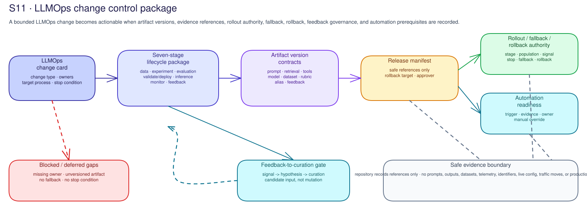

# S11 · LLMOps Change Control Concepts

!!! info "Freshness"
    Last reviewed: 2026-07-24. Confirm current Azure service capabilities,
    availability, region, quota, pricing, and customer standards before
    adoption.

[Microsoft's LLMOps guidance](https://learn.microsoft.com/en-us/ai/playbook/technology-guidance/generative-ai/mlops-in-openai/)
defines LLMOps as the collection of tools and processes that manages the
end-to-end development, deployment, and maintenance of LLM-based applications.
In this curriculum, S11 turns that lifecycle into a customer-owned change
control package. It is not a model inventory, prompt repository, dashboard, or
generic approval gate.

## The change package is the unit of control

Start with one bounded change:

- prompt or instruction update;
- retrieval source, index, filter, ranking, or refresh change;
- tool/API schema or authority change;
- candidate model, provider, region, deployment, or fine-tuning proposal;
- evaluation dataset, rubric, scorer, or threshold change;
- deployment alias, canary, fallback, rollback, or retirement change;
- monitoring signal or feedback-to-curation change; or
- automation of test, rollout, switching, fallback, feedback, or retirement.

The change package names the affected artifacts, safe references, owners,
intended lifecycle stage, evidence limits, stop conditions, and receiving
customer process. Without that package, teams argue about "LLMOps maturity"
instead of deciding whether a specific change can safely move.

## The inner and outer loops

The inner loop improves a candidate solution before release reliance:

1. **Data curation:** understand, transform, and enrich data used for
   grounding, examples, evaluation, or fine-tuning.
2. **Experimentation:** test candidate approaches such as prompt engineering,
   retrieval optimization, model selection, fine-tuning, tool behavior, and
   application changes.
3. **Evaluation:** compare candidates against versioned scenarios, rubrics,
   thresholds, and known limits.

The outer loop operates and changes the approved solution:

4. **Validate and deploy:** prepare a release manifest and submit the candidate
   to the customer change process.
5. **Inference:** serve the approved route with known identity, gateway/API,
   model, capacity, fallback, and support boundaries.
6. **Monitor:** observe health, usage, quality, safety, capacity, cost, drift,
   feedback, and control coverage.
7. **Feedback and data collection:** collect governed feedback and operating
   learning as candidate inputs for the next inner-loop iteration.

The feedback stage closes the loop only when it is gated. Production learning
becomes a hypothesis, curated dataset candidate, or evaluation scenario. It is
not an unreviewed production prompt, retrieval, model, or tool mutation.

## A governance decision at every stage

| LLMOps stage | Decision the team must make | Minimum record |
|---|---|---|
| Data curation | Is the data permitted, representative, retained correctly, and traceable for this candidate? | Source reference, transformation, purpose, owner, quality/privacy limit, and data/privacy route. |
| Experimentation | Which hypothesis and candidate artifact are being tested, and what can the result prove? | Candidate/version reference, experiment owner, population, parameters or prompt-change reference, cost/capacity assumption, and limits. |
| Evaluation | What measures, pass/fail criteria, and human judgment determine suitability? | Scenario or dataset reference, scorer/rubric version, threshold owner, baseline/candidate comparison, unsupported slices, and interpretation owner. |
| Validate/deploy | Can the candidate move to the customer's next release or change process? | Release manifest, environment, alias target, approver/change authority, excluded population, rollback target, and hold/continue decision. |
| Inference | Is the route reliable and governed for its authority, dependencies, fallback, and demand? | Deployment/service route, identity and gateway/API boundary, quota/capacity owner, cost owner, support path, and fallback trigger. |
| Monitor | Which signal triggers review, rollback, fallback, escalation, or investigation? | Signal definition, population, retention/coverage limit, query owner, interpretation owner, alert route, and operating reference. |
| Feedback and collection | Which feedback can enter learning, and under what quality, privacy, consent, and retention rules? | Collection purpose, feedback queue reference, sampling/quality rule, privacy route, curation owner, mutation gate, and next candidate owner. |

## Artifact references are the release manifest

The release manifest is not a dump of prompts, datasets, outputs, policies, or
telemetry. It is a safe join record that points to customer-approved artifact
locations. A useful manifest can reconstruct which prompt, retrieval config,
tool schema, model alias, evaluation record, runtime-control reference,
telemetry reference, rollback target, and change authority belonged to the
candidate.

If an artifact cannot be referenced safely, it is not ready for a controlled
release discussion. If a manifest names only a model version but not the prompt,
retrieval, tool schema, evaluation, and rollback target, it cannot explain what
actually changed.

## Model alias is an authority boundary

Deployment aliases and gateway routes are operating authority, not just
configuration labels. Moving an alias, changing a fallback target, or switching
traffic changes which model or release receives work. S11 records who can
approve testing, canary or phased rollout, alias movement, fallback activation,
rollback, retirement, and automation enablement.

Fallback is also a governed route. A fallback target needs a known owner,
evaluation and operating assumptions, trigger, monitoring signal, customer
process, and rollback or recovery target. "Use the old model" is not a fallback
plan unless dependencies, compatibility, capacity, and support are reviewed.

## Learning artifacts have lifecycles

Treat prompts, retrieval configuration, tool schemas, datasets, evaluation
rubrics, deployment aliases, feedback queues, and rollout plans as controlled
learning artifacts. Each needs an owner, safe reference, provenance, intended
use, version or release ID, review trigger, material-change rule, and retirement
route.

The lifecycle state is separate from the identifier. A model or prompt can be
candidate, approved baseline, fallback, deprecated, retired, or blocked. The
state tells the team how it may be used; the identifier only tells the team what
object is being discussed.

## Automation follows evidence, not optimism

Automation is allowed only after manual ownership and evidence prerequisites
are explicit. Regression tests, scenario comparison, canary rollout, alias
switching, fallback routing, feedback-to-curation, and retirement workflows
need:

- trigger and owner;
- evidence references and accepted-when condition;
- threshold or stop condition;
- rollback or manual override owner;
- exception route; and
- validation reference.

Automating an unclear lifecycle does not make it controlled; it makes the
mistake repeat faster.

## Failure modes to call out

| Failure mode | Why it breaks the lifecycle |
|---|---|
| Unversioned prompt or retrieval change | The candidate cannot be reconstructed or compared to baseline. |
| Model alias moved without switch authority | Traffic changes outside the approved release/change boundary. |
| Canary without stop condition | The rollout has no defined moment to hold, roll back, or fall back. |
| Fallback target not reviewed | Incident response may shift users to an unsupported or unsafe route. |
| Evaluation threshold changed without owner | A score becomes a moving target instead of a customer risk decision. |
| Feedback mutates prompts or data directly | Production observations bypass privacy, quality, evaluation, and release gates. |
| Monitoring signal cannot inform rollback | Operations can observe a problem but cannot execute a controlled decision. |
| Retirement lacks dependency check | Removing an artifact may break hidden consumers or rollback paths. |
| Automation enabled before manual evidence exists | The pipeline executes policy that no owner has accepted. |

## Handoffs preserve accountability

- **Data/privacy owner** accepts data use, retention, and feedback curation.
- **Engineering/experiment owner** accepts candidate artifact lineage.
- **Evaluation baseline owner** accepts scenario, rubric, threshold, and
  comparison records.
- **Platform/change owner** accepts release manifest, environment, alias, and
  rollout authority.
- **Operations owner** accepts monitoring, alert, fallback, rollback, and
  support routes.
- **LLMOps owner** connects the lifecycle, stage gates, artifact ownership, and
  automation prerequisites.
- **Governance owner** records exception, review trigger, and unresolved risk.

A handoff is useful only when the receiving owner accepts a specific work item
with an acceptance test, target date, evidence location, and review trigger.
