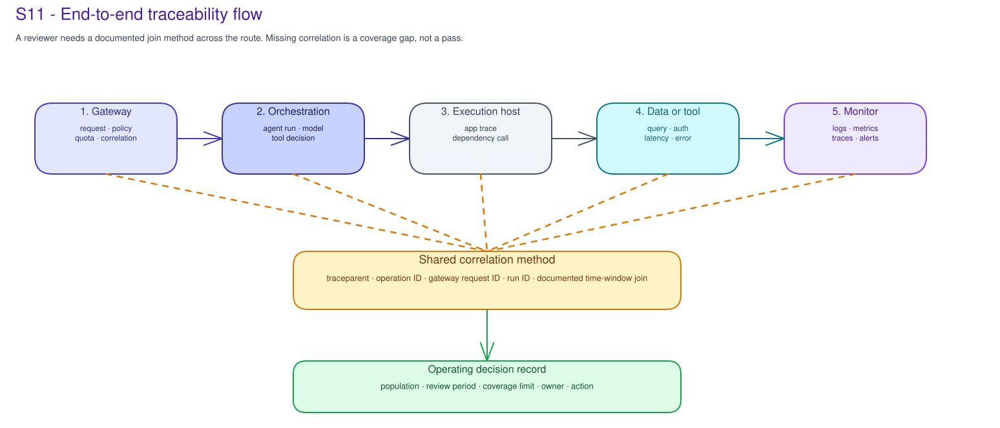

# S11 · Operate, Monitor & FinOps Concepts

!!! info "Freshness"
    Last reviewed: 2026-07-29 · Validate current Microsoft service capabilities and customer configuration before delivery.

## An operating review turns evidence into a decision

An operating review is not a dashboard tour. It defines the workload, review period, population, coverage limit, accountable owner, evidence location, and decision for each selected question.

The review card is the unit of operating accountability. Without a review card, the team may have telemetry, but it does not have a repeatable governance review.

## Coverage comes before a result

Reliability, risk, quality, safety, latency, error, dependency, cost, adoption, and business-outcome observations must say which population and time period they cover. An unavailable, uninstrumented, sampled, planned, or excluded population is a coverage limit. It is not a zero result or a pass.

A question without trusted evidence or an accountable owner is blocked or deferred. Aggregate metrics should not hide excluded routes, missing tool/API telemetry, or missing cost allocation.

## Correlation is a contract

For an end-to-end agent route, the useful review path often crosses gateway, orchestration, execution host, tool or data service, and monitoring records.

The review should name the common correlation method: W3C `traceparent`, Application Insights `operation_Id`, gateway request identifier, run identifier, tool call identifier, deployment alias, cost allocation tag/dimension, or documented time-window join. If the join method is missing or breaks at a hop, the result is a coverage gap, not an operating conclusion.

## Foundry observability supplies operating signals

For Foundry-based workloads, Microsoft Foundry observability can provide traces, token usage, latency, and evaluation scores where the customer enables tracing. Record the project, model deployment, agent or run identifier where available, review period, sampling, retention, evaluator type and version, and interpretation owner.

A production evaluation score is an operating signal. It is not sign-off to ship and is accepted only for the signal, scope, and time period it records.

## Production performance telemetry is a distinct operating signal

Operating review also covers how fast the agent responds under real traffic. OpenTelemetry, Application Insights, and Foundry traces can supply first-token latency, end-to-end percentiles, throughput, and error/saturation signals where the customer enables instrumentation.

For a streaming agent, first-token latency is a separate signal from end-to-end p95 and should be recorded on its own. Every performance number carries sampling, retention, and population limits. Reconcile production percentiles against an accepted evaluation or performance baseline as a drift hypothesis: workload mix, configuration, model version, quota pressure, or evidence coverage, not confirmed root cause.

## FinOps is operating accountability

Cost review asks who owns the spend decision, which service or workload is in scope, what allocation limits apply, and which decision the evidence can support. The customer sets each metric, target, chargeback/showback method, budget route, anomaly route, and threshold.

FinOps evidence should travel with an owner and a limit. A subscription total, model bill, token count, trace sample, committed capacity view, or allocation view helps only when workload scope, shared-cost assumptions, latency, exclusions, and decision owner are recorded.

For Foundry workloads, cost evidence should identify the project, model deployment, agent or run identifier where available, review-period token counts, and shared-subscription assumptions. Subscription billing and project-level attribution can have different scopes. Fine-tuning training cost is separate from inference cost, so both owners and review periods need to be recorded when a fine-tuned model is in scope.

## Alerts need ownership, not just thresholds

A blocked prompt, quota breach, high token count, dependency error, failed identity exchange, unexpected egress signal, safety signal, quality regression, cost anomaly, or telemetry ingestion failure is actionable only when the record names population, threshold owner, action group or SOC route, suppression rule, validation method, and tuning cadence.

An alert without an owner is noise. A suppression rule without review is hidden risk. A threshold without a tuning owner is a future false-positive or false-negative backlog item.

## Drift is a hypothesis to test

A change in reliability, risk, quality, cost, adoption, or outcome can suggest drift. The cause might be behavior, workload mix, configuration, usage, model version, quota pressure, evidence coverage, or an external condition.

Record the hypothesis, evidence limits, owner, test or observation plan, action route, and next review. Do not call drift confirmed without a clear review basis.

## Escalation and closure preserve accountability

Every finding needs an owner, target date, validation reference, recurrence check, exception or escalation route, and next review.

Remediation is not closed because someone reports the work complete. Closure requires a reviewer to check validation and remaining exceptions. S11 records this operating method. Live queries, fixes, and configuration changes stay in the customer's systems.

## Export and SIEM paths are operating dependencies

If the customer exports telemetry to a SIEM or external observability platform, record the source workspace, Event Hub or export mechanism, collector/function, destination owner, retry/failure behavior, retention, access owner, and sensitive-data handling boundary. An export design is not evidence that every event arrived.

If the collector falls behind, the destination rejects data, fields are filtered, or retention/legal-hold rules conflict with operating needs, record an operating gap with owner and validation method.

## Operating review becomes a work list

The S11 recommendation should turn the review design into owned operating work. Typical work-list rows include telemetry coverage, correlation propagation, Foundry observability, alert route, remediation validation, recurrence check, operating cadence, FinOps/cost owner, allocation limit, exception escalation, portfolio visibility, support route, and change-process handoff.

The backlog does not create a dashboard, query live data, set a threshold, change a control, or close a finding without validation.

## Failure modes to prevent

- Reviewing a dashboard without a bounded population and review period.
- Treating an aggregate metric as full coverage when paths are excluded.
- Missing correlation key between gateway, app, model, tool, and monitor records.
- Trace context reaches the app but not the tool/API dependency.
- Sampled telemetry is treated as full coverage.
- Alert threshold has no owner or suppression review.
- Budget exists but no action rule or FinOps owner is named.
- Shared cost or committed capacity is allocated without a documented rule.
- Export pipeline drops events or loses checkpoint ownership.
- Remediation closes without validation reference and reviewer acceptance.

## Related official references

| Reference | What it can inform |
|---|---|
| [Microsoft Foundry observability](https://learn.microsoft.com/en-us/azure/foundry/concepts/observability) | Trace, token, latency, and evaluation-score coverage planning. |
| [Azure Monitor overview](https://learn.microsoft.com/en-us/azure/azure-monitor/fundamentals/overview) | Operating signal and alert-route backlog. |
| [Application Insights overview](https://learn.microsoft.com/en-us/azure/azure-monitor/app/app-insights-overview) | Trace and telemetry correlation planning. |
| [Azure Cost Management](https://learn.microsoft.com/en-us/azure/cost-management-billing/costs/overview-cost-management) | Subscription-level attribution starting point. |
| [Fine-tune Microsoft Foundry models](https://learn.microsoft.com/en-us/azure/foundry/how-to/fine-tune-models) | Training versus inference-cost boundary; verify availability. |

See the [Microsoft AI governance reference map](../reference/ai-governance-reference-map.md) for Azure Monitor, Application Insights, Log Analytics, Purview Audit, and Foundry observability sources that can inform an operating-review backlog.
