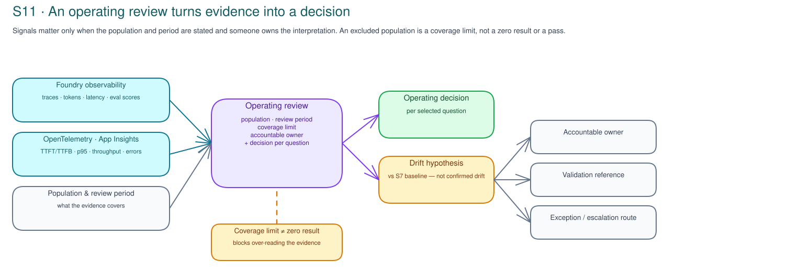

# S11 · Operate, Monitor & FinOps: Technical decisions

!!! info "Freshness"
    Last reviewed: 2026-07-17 · Observability, cost-management, Foundry,
    Azure Monitor, Application Insights, OpenTelemetry, PTU, committed-capacity,
    alerting, and FinOps capabilities can change by region, tenant, licensing,
    and configuration; verify current status, availability, quota, and pricing
    before delivery. See the [agent performance-testing guide](../reference/performance-testing-guide.md).

Choose operating signals, cost attribution, and alert or drift routing. S11
records owners and limits; it neither creates a dashboard nor changes production.

## Decision 1: Observability stack

Choose against where the agent runs, who owns instrumentation, what needs to be
correlated, and what telemetry volume, sampling, and retention the customer is
willing to govern.

| Option | When it fits | Trade-off / limitation | Governance implication |
|---|---|---|---|
| **OpenTelemetry + Application Insights / Azure Monitor** | Customer-owned app or service paths need spans, metrics, logs, alerts, and cross-component correlation after current availability is verified | Requires instrumentation ownership, sampling and retention choices, and cost control; does not automatically cover Foundry-only signals | Record instrumentation owner, correlation keys, sampling, retention, alert route, and evidence limits |
| **Foundry observability** | Foundry project, agent, model, trace, token, latency, or evaluation signals are the primary operating evidence and the feature is available for the workload | Project-gated and configuration-dependent; may not cover the full app path or external dependencies | Record project/deployment scope, trace coverage, evaluator/version context, retention, and interpretation owner |
| **Both, correlated** | Production review needs end-to-end app telemetry plus Foundry traces for latency, quality, token, and run-level context | Two evidence systems to correlate, retain, and pay for; gaps can appear in either view | Strongest review setup; record correlation method, source of record per question, and unresolved coverage gaps |
| **Sampling and retention policy first** | Telemetry cost, privacy, or volume is the gating decision before tool selection | Does not create observability by itself; overly narrow sampling can hide rare failures | Record minimum population, excluded paths, retention owner, and what a sample can and cannot support |

For every selected question, record the population, exclusions, source,
correlation or attribution limit, retention/privacy constraint, interpretation
owner, decision route, validation, recurrence check, and exception expiry.
Address missing coverage or ownership before defining alerts; compare S7
synthetic and production evidence only when their populations and limits match.

## Decision 2: Cost attribution / FinOps model

Choose against shared versus dedicated deployments, chargeback or showback needs,
and whether the workload uses pay-as-you-go, PTU, or committed-capacity models.

| Option | When it fits | Trade-off / limitation | Governance implication |
|---|---|---|---|
| **Azure Cost Management by subscription/resource** | Spend is governed at subscription, resource group, or service level and current billing coverage is verified | May not identify a specific agent, prompt path, model deployment, or shared workload | Record cost owner, subscription/resource scope, allocation limits, and what the view cannot attribute |
| **Foundry project/model attribution** | Foundry project, deployment, model, token, or run-level context is needed and available for the workload | Configuration-dependent; project totals may not match subscription or business-owner boundaries | Record project/model owner, review period, shared-cost assumptions, and inference versus training-cost boundary |
| **Tagging plus PTU / committed-capacity allocation** | Dedicated deployments, PTU, reservations, or committed capacity need showback or chargeback across owners | Allocation rules are customer policy, not a product truth; idle capacity and shared usage need explicit assumptions | Record allocation method, tag owner, capacity owner, pay-as-you-go comparison, and exception route |
| **FinOps Toolkit-assisted analysis** | The customer wants a repeatable FinOps view after verifying the toolkit and data-source fit | Adds another analysis layer; does not replace source billing records or owner judgment | Record the analysis owner, source records, refresh cadence, and decision the view is allowed to support |

## Decision 3: Alerting and drift response

Choose against operating cadence, who acts on a signal, signal-to-noise tolerance,
and how a drift hypothesis versus the S7 synthetic baseline is raised and tested.

| Option | When it fits | Trade-off / limitation | Governance implication |
|---|---|---|---|
| **Operations-owned alert route** | Reliability, latency, error, saturation, or dependency signals need service-owner triage and current alerting capability is verified | Can become noisy if thresholds lack population, sampling, and ownership context | Record threshold owner, route, acknowledgement expectation, suppression rule, and review cadence |
| **Risk / governance review route** | Evaluation regressions, policy exceptions, unresolved findings, or human-review signals need governance interpretation | Slower than incident response; not suitable for urgent service degradation alone | Record decision owner, escalation trigger, exception owner, and evidence needed before action |
| **Drift hypothesis against S7 baseline** | Production latency, quality, cost, or error patterns diverge from the pre-production synthetic evidence | A difference is not confirmed drift; workload mix, model version, quota pressure, or coverage may explain it | Record hypothesis, alternative explanations, test or observation plan, owner, and next review |
| **Backlog-only coverage gap** | No trusted signal, owner, or approved record exists for the desired alert or drift question | No alert can be claimed; the risk remains unresolved until instrumented or governed | Record the gap, owner, target date, S13 portfolio route, and customer change process |

## Decisions made & adoption progress

S11 reconciles the production counterpart of S7's pre-production evidence,
advances the operate-and-measure part of the S0 maturity baseline, and feeds S13 portfolio
prioritization with owned operating decisions.

| Adoption stage | What "done" looks like at S11 |
|---|---|
| **Decided** | Observability, cost-attribution, and alerting/drift options are selected, rejected, or deferred with owners, evidence limits, and verified-status caveats recorded |
| **Backlogged** | Instrumentation, retention, alert routing, allocation, drift-test, exception, or S13 portfolio work is routed to the customer operating/change process with owners |
| **In adoption** | Customer teams implement or tune telemetry, FinOps allocation, alerting, or drift response outside this session and bring evidence back to the operating review |

Capture the choice, alternatives, rationale, owners, and adoption stage in the
technical decision record (`labs/s11-operate-measure/templates/technical-decision-record.template.md`).

## Related references

- [S11 Concepts](concepts.md): operating review, Foundry observability, FinOps, drift, escalation, and closure boundaries.
- [Quality, cost, latency, and rollout guide](../reference/quality-cost-latency-guide.md): quality, latency, token cost, model, and rollout governance criteria.
- [Agent performance-testing guide](../reference/performance-testing-guide.md): S7 synthetic baseline and S11 production telemetry reconciliation.
