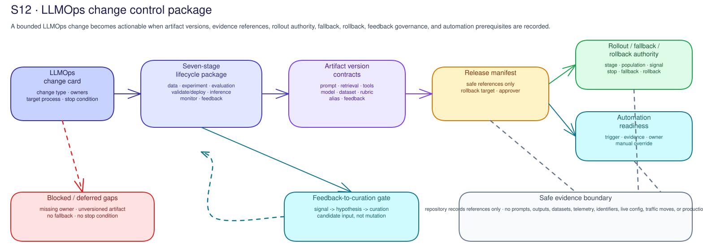

# S12 · LLMOps

**Facilitator deck**

Workshop decision: **Can this bounded LLMOps change move to the next customer
process with safe artifact references, owners, stop conditions, fallback,
rollback, feedback governance, and automation prerequisites?**

Boundary: S12 prepares a lifecycle handoff. It does not select a model, move
traffic, switch aliases, activate fallback, retire a deployment, enable
automation, configure resources, or approve production.

---

## LLMOps change package, not lifecycle theater

- Start with one change, not a maturity speech.
- Possible changes: prompt, retrieval, tool schema, model, dataset, rubric,
  deployment alias, fallback, feedback, retirement, or automation.
- The artifact is a customer-owned change control package.
- Decision: ready for next process, defer, reject, route, or block.

Note:
Keep the room focused on one candidate change. If people cannot name the
affected artifact, owner, and target process, they are not ready for an LLMOps
decision.

---

## Inner loop and outer loop

- Inner loop: data curation, experimentation, evaluation.
- Outer loop: validate/deploy, inference, monitor, feedback/data collection.
- Feedback closes the loop only when it becomes governed candidate input.
- Production observations must not directly mutate prompts, data, retrieval,
  tools, or model aliases.

Note:
The inner loop creates candidates. The outer loop operates and controls change.
S12 connects them with safe references and ownership.

---

## Change card

- Workload or capability.
- Change type and lifecycle question.
- Environment and target customer process.
- Affected artifact references.
- Decision owner and artifact owners.
- Evidence limits and stop condition.
- Approved records location.

Note:
The change card is the unit of control. It prevents a broad LLMOps conversation
from drifting away from the actual change.

---

## Seven stages and stage gates

| Stage | Gate question |
|---|---|
| Data curation | Is the input permitted, useful, retained correctly, and traceable? |
| Experimentation | Which candidate and hypothesis are being tested? |
| Evaluation | What comparison, threshold, and limitation determine suitability? |
| Validate/deploy | Can the release manifest enter the customer change process? |
| Inference | Is the route governed for demand, identity, dependencies, and fallback? |
| Monitor | Which signal triggers review, rollback, fallback, or investigation? |
| Feedback/data collection | Which feedback can become candidate input under privacy and quality rules? |

Note:
Each stage needs owner, input reference, output reference, accepted-when
condition, blocker, and receiving handoff.

---

## Release manifest and version contracts

- The manifest joins safe references; it does not copy artifacts.
- Include prompt/instruction, retrieval config, tool schema, model aliases,
  evaluation, runtime control, telemetry, stop condition, rollback target, and
  change authority.
- Version contracts name owner, provenance, intended use, reapproval trigger,
  and retirement route.

Note:
A model version alone is not a release. The manifest explains what actually
changed and how the team can reconstruct the candidate safely.

---

## Model/deployment lifecycle states

- Approved baseline.
- Candidate.
- Fallback.
- Deprecated.
- Retired.
- Blocked.

Note:
Ask who owns each state, what evidence is required, what support and capacity
assumptions apply, and what retirement or rollback route exists.

---

## Alias, fallback, and rollback authority

- Who can approve testing?
- Who can start canary or phased rollout?
- Who can move traffic or switch an alias?
- Who can activate fallback?
- Who can roll back?
- Who can retire or remove a version?
- Who can enable automation?

Note:
Aliases and gateway routes are authority boundaries. If authority is unclear,
the safe answer is defer or block.

---

## Rollout stage plan and stop conditions

- Stages: DEV, PRE, limited preview, expanded preview, production-change
  readiness, or customer equivalent.
- For each stage: entry conditions, traffic population, excluded users,
  monitoring signal, stop condition, fallback trigger, rollback target, review
  date, and authority.
- S12 may say "ready for separate change review"; it may not approve production.

Note:
Canary without a stop condition is not a controlled rollout plan.

---

## Feedback-to-curation gate

- Signal or feedback source.
- Hypothesis and affected population.
- Privacy, consent, retention, and legal-hold route.
- Curation rule and owner.
- Candidate dataset, scenario, prompt, retrieval, model, or tool reference.
- Evaluation route and mutation gate.

Note:
Feedback is learning fuel only after it passes through data/privacy, curation,
evaluation, and change gates.

---

## Automation readiness

- Regression testing.
- Scenario comparison.
- Canary rollout.
- Alias switching.
- Fallback routing.
- Feedback-to-curation.
- Retirement/removal.

Note:
Each automation path needs trigger, prerequisite evidence, owner, stop
condition, validation reference, exception path, and manual override owner.
Automation follows evidence; it does not replace it.

---

## Failure modes and hard stops

- No approved records location.
- Unversioned prompt or retrieval change.
- Model alias moved without authority.
- Fallback target not reviewed.
- Canary has no stop condition.
- Evaluation threshold changed without owner.
- Feedback mutates production directly.
- Monitoring cannot inform rollback or fallback.
- Retirement has no dependency check.
- Automation enabled before manual prerequisites are accepted.

Note:
Translate every failure into defer, route, block, or backlog with owner,
acceptance test, target date, evidence location, and review trigger.

---

## Workshop artifact and handoff

- LLMOps change card.
- Seven-stage lifecycle package.
- Release manifest and version contracts.
- Model/deployment lifecycle state.
- Rollout, fallback, rollback, and retirement authority.
- Feedback-to-curation gate.
- Automation readiness package.
- Decision and backlog.

Note:
Close with the customer-owned record and the receiving owner. Keep raw evidence
in customer-approved systems only.
