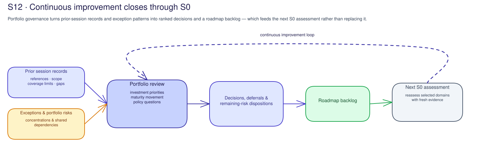

# S12 · Portfolio Evidence & Roadmap Concepts

## The portfolio review card is the unit of accountability

Portfolio governance starts with one bounded review card: portfolio slice,
population, review period, decision question, included scope, excluded scope,
decision forum, owners, and approved records location. Without that card, a
"portfolio view" becomes a dashboard tour with no decision boundary.

The review card also names who can interpret the rollup: portfolio owner, risk
owner, evidence owner, roadmap owner, control-plane steward, operating review
owner, finance or capacity owner where relevant, and baseline owner.

## A portfolio is a decision view, not a data lake

Portfolio governance connects decisions across agents and scopes. It uses safe
references, scope statements, freshness dates, coverage limits, and owners so
leaders can see patterns without copying operational records into one place.

The default is the customer-approved records system, supplemented by verified
Microsoft governance, operating, or cost references where applicable. A
different source is an exception only when its scope, freshness, owner, and
limits are recorded. A source reference is not proof of product configuration or
fleet coverage beyond the population it describes.

## Lineage travels with every metric

Every scorecard field or trend needs a source reference, source owner,
freshness date, refresh cadence, population, excluded scope, coverage limit,
interpretation owner, and action implication. The same rule applies to cost,
assurance, exceptions, operating health, maturity movement, and dependency
views.

Missing, stale, sampled, unsupported, or unavailable evidence is a coverage
limit. It is not a zero, a pass, or proof that the issue does not exist.

## Scorecards are decision aids

A portfolio scorecard can summarize coverage, residual risk, assurance,
operating health, cost/capacity, maturity, exception age, dependencies, roadmap
status, owner readiness, and confidence. It should make trade-offs visible; it
should not hide uncertainty behind one aggregate number.

The scorecard does not certify compliance, prove operating effectiveness,
approve funding, or prove production readiness. It supports a customer forum
that still owns the decision.

## Exceptions expose concentrations and dependencies

An exception is not automatically a portfolio risk. It matters to the portfolio
when its population, recurrence, shared dependency, residual risk, or decision
consequence is clear. Unknown impact, ownership, or scope remains unresolved
and needs review or escalation.

Useful views include:

- exception by owner;
- exception by control domain;
- exception by platform, identity, model, gateway, data, tool/API, or telemetry
  dependency;
- exception by age, severity, expiry, or recurrence;
- accepted-risk items nearing or past review date; and
- unowned blockers repeated across multiple roadmap items.

Each view needs population, affected items, repeated pattern, owner, escalation
route, and closure criterion.

## Dependency clusters drive sequence, not blame

Dependencies show which items should be sequenced together. A shared identity
gap, model deployment dependency, gateway route, telemetry blind spot, or
control-plane record conflict may block many teams. The portfolio decision
should name the sequence owner and unblock path rather than rank each dependent
item separately and pretend they can move alone.

## Weights are governance decisions

Prioritization should state the criteria: risk reduction, business value,
cost/capacity impact, coverage improvement, dependency leverage, maturity
movement, urgency, confidence, and effort or complexity. Weights are allowed
only when the governance forum owns them.

The ranked list informs authorized decision-makers. It is not a promise of
benefit, funding approval, or risk reduction. Record rejected alternatives,
sensitivity or uncertainty, and the forum that accepted the weighting method.

Model capability investments, including fine-tuning, follow the same rules:
capability gap, data governance, evaluation comparison, training and inference
cost impact, model/deployment lifecycle owner, release-readiness path, and
operating signal. Without those references, the item remains a proposal with an
explicit gap.

## Roadmap item without owner is not a roadmap

Each roadmap action needs action type, accountable owner, implementation owner,
evidence owner, funding/capacity owner where relevant, dependency owner, target
date, acceptance test, evidence reference, exception status, next review
trigger, and escalation forum.

If no owner can act, the item is deferred or blocked. Ranking an unowned item
creates noise, not progress.

## Baseline feedback proposes questions

Portfolio review feeds the next foundation baseline by proposing questions:
decision rights, evidence-system expectations, risk appetite, funding model,
forum cadence, ownership model, policy ambiguity, or roadmap sequencing. It
does not change the baseline or policy by itself.

This keeps the improvement loop honest: observe, interpret, decide, act through
approved processes, then reassess selected baseline questions with fresh
customer-held evidence.

## Framework mapping is not certification

Framework references such as NIST AI RMF, ISO/IEC 42001, the EU AI Act, and
Microsoft Responsible AI principles can structure questions. They do not turn
portfolio aggregation into a conformity conclusion. S12 records which
customer-owned references can support the next governance decision and which
assurance activity remains separate.

## Failure modes to call out

| Failure mode | Why it breaks portfolio governance |
|---|---|
| Dashboard-only review | Leaders see charts but no decision question, population, owner, or action. |
| Stale inventory treated as complete fleet | Gaps become invisible because missing records look like zero findings. |
| Aggregate score hides excluded high-risk workload | Portfolio decision appears safer than the covered scope supports. |
| Cost total has no allocation owner | Spend cannot drive action, chargeback, showback, or capacity planning. |
| Accepted-risk item past expiry | Residual risk continues without the promised review trigger. |
| Dependency cluster has no sequence owner | Many roadmap items remain blocked while each team waits for another. |
| Funding item has no capacity basis | Investment request cannot connect to service demand or constraints. |
| Maturity movement claimed from activity completion | Completing workshops or templates is mistaken for operating capability. |
| Framework table treated as compliance proof | Mapping replaces evidence, assurance, and accountable decisions. |

## Related official references

| Reference | What it can inform |
|---|---|
| [Microsoft Foundry observability](https://learn.microsoft.com/en-us/azure/foundry/concepts/observability) | Portfolio-level quality, health, and cost signal planning. |
| [Azure Cost Management](https://learn.microsoft.com/en-us/azure/cost-management-billing/costs/overview-cost-management) | Cost aggregation, allocation, and FinOps starting point. |
| [Fine-tune Microsoft Foundry models](https://learn.microsoft.com/en-us/azure/foundry/how-to/fine-tune-models) | Model capability investment input; verify availability and governance requirements. |
| [NIST AI RMF](https://www.nist.gov/itl/ai-risk-management-framework) | Portfolio roadmap framing, not certification. |

See the [Microsoft AI governance reference map](../reference/ai-governance-reference-map.md)
for sources that can support portfolio learning without turning aggregation into
a compliance conclusion.
