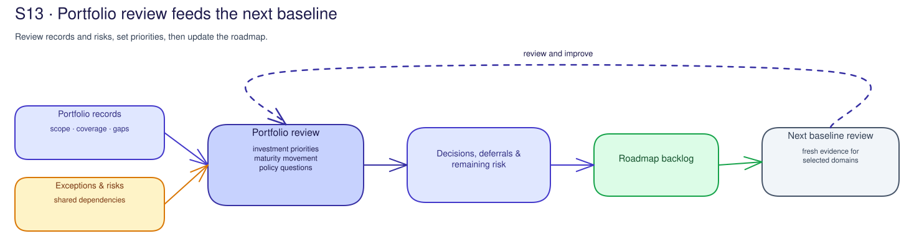

# S13 · Portfolio Governance & Continuous Improvement Concepts

## A portfolio is a decision view, not a data lake

Portfolio governance connects decisions across agents and scopes. It uses
references, scope statements, and limits so leaders can see dependencies without
copying operational records into one place.

The default is the customer-approved records system, supplemented by verified
Azure/Microsoft governance or cost references where applicable. A different
source is an exception only when its scope, freshness, owner, and limits are
recorded; it is not proof of a product configuration or portfolio coverage.

## Evidence keeps its limits when aggregated

An Azure, Entra, Purview, Foundry, Monitor, or Agent 365 record supports only the observation and scope it describes.
Freshness, exclusions, collection limits, and interpretation ownership must stay
with it.

Combining partial references is accepted only for the covered scope; operating
effectiveness, or a portfolio-wide conclusion.

## Exceptions expose concentrations and dependencies

An exception is not automatically a portfolio risk. It matters to the portfolio
when its effect, recurrence, shared dependency, or decision consequence is clear.
Unknown impact, ownership, or scope remains unresolved and needs review or
escalation.

Useful exception views include repeated ownership gaps, recurring evidence
coverage limits, shared platform or identity dependencies, repeated policy
waivers, unresolved high-impact findings, and risks that block more than one
session outcome. Each view still needs a population and owner.

## Investment priority is a transparent trade-off

Prioritization should state the decision criteria: risk, dependency, evidence
strength, expected benefit, effort, timing, and accountable owner. The
ranked list informs authorized decision-makers. It is not a promise of benefit
or approval to spend.

Model capability investments, including fine-tuning, need the same clear
criteria: capability gap, pre/post evaluation reference, training and inference
cost impact, training-data governance, model-version lifecycle owner, and release
assurance dependency. Without those customer-held references, the item remains a
proposal with an explicit gap. S13 does not approve training or deployment.

## Maturity movement describes supported change

A maturity comparison is useful only against the same question, scope, and scale,
or against a clearly changed one. Evidence can support movement, no movement, or
an unresolved assessment.

Activity completion and filled-in templates do not prove a new capability.

## Policy evolution needs a separate decision

Portfolio review can identify a policy question: a gap, conflict, old assumption,
or need for clarification. Capture the proposal, reason, affected scope, owner,
and review route.

Identifying the question does not approve new policy or change existing policy.

## Continuous improvement closes through S0

The portfolio roadmap feeds the next S0 assessment. S0
reassesses selected domains with customer-held evidence and a fresh decision.

This keeps the improvement loop honest: observe, interpret, decide, act through
approved processes, then reassess.

## Portfolio decisions become roadmap backlog

The S13 recommendation should turn the review into a dated governance roadmap.
Typical backlog rows include recurring exception pressure, cross-session
dependency, investment priority, policy question, budget or funding gate, owner
readiness, model-version governance, fine-tuning evaluation dependency, Foundry
project cost-accountability gap, maturity reassessment evidence, S0 feedback,
and governance cadence.

The roadmap routes decisions to the appropriate customer governance, budget,
risk, policy, assurance, or change process.

Framework references such as NIST AI RMF, ISO/IEC 42001, and the EU AI Act can
help structure questions. S13 does not issue a conformity conclusion. It records
which customer-owned references can support the next governance decision and
which assurance activity remains separate.

## Report-only boundaries preserve decision integrity

This session does not create a dashboard, access live data, deploy a change, or
provide compliance certification. Those activities need their own authorization,
technical validation, and assurance evidence.

S13 records what the current references can support and what remains unknown.

## Related official references

| Reference | What it can inform |
|---|---|
| [Microsoft Foundry observability](https://learn.microsoft.com/en-us/azure/foundry/concepts/observability) | Portfolio-level quality and cost signal planning. |
| [Azure Cost Management](https://learn.microsoft.com/en-us/azure/cost-management-billing/costs/overview-cost-management) | Portfolio cost aggregation starting point. |
| [Fine-tune Microsoft Foundry models](https://learn.microsoft.com/en-us/azure/foundry/how-to/fine-tune-models) | Model capability investment input; verify availability. |
| [NIST AI RMF](https://www.nist.gov/itl/ai-risk-management-framework) | Portfolio roadmap framing. |

## Proof improves policy through a new decision

Portfolio learning is the feedback step in the Policy-Control-Visibility-Proof
loop. It can identify repeated evidence gaps, exception patterns, or a policy
question that needs an owner.

Policy changes still need scope,
reason, approval, implementation, and a later evidence review.

See the [Microsoft AI governance reference map](../reference/ai-governance-reference-map.md)
for the Policy-Control-Visibility-Proof lens and sources that support portfolio
learning without turning aggregation into a compliance conclusion.
