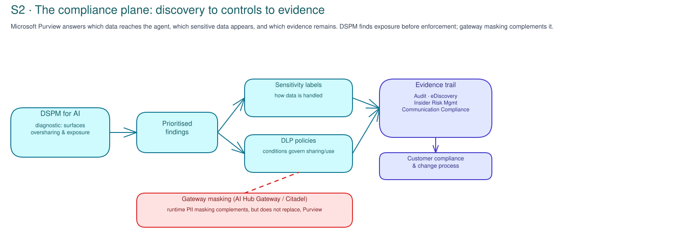

# S2 · Data & Compliance Concepts

!!! info "Freshness"
    Last reviewed: 2026-07-06 · Confirm tenant licensing and product availability in the [Governance capability guide](../reference/governance-capability-guide.md).

This page explains the Purview data-and-compliance controls used in S2. [S2 Prepare](index.md) starts the safe delivery sequence.

## Data raises its own governance question

Governance has to answer more than "is this agent allowed to run?" It also has to answer which data reaches the agent, which sensitive data can show up in prompts or responses, and what evidence is left after an interaction.

Microsoft Purview brings data security and compliance to AI workloads and connected apps.[^purview] S2 uses Purview for data classification, discovery, policy review, investigation, and Purview records. Gateway work stays in the platform/runtime sessions.

## Findings turn into a work list the customer owns

S2 ends with a recommended next step and its assumptions and owners: close DSPM
or classification gaps, review a report-only DLP change, confirm investigation
or retention, resolve gateway dependencies, or record `accepted_risk`/`blocked`.
Policy rollout remains in the customer's compliance and change process.

## Data Security Posture Management finds exposure before enforcement

Microsoft Purview Data Security Posture Management helps you spot
oversharing, exposed sensitive data, risky access, and likely ways data could
leak.[^dspm] `DSPM for AI` is the classic product label; use the current
product path unless the customer has a reason to retain the classic experience.

It finds likely data-risk areas before a policy blocks or warns users.

**In the practical workshop:** an empty result is still evidence. It can mean no in-scope workload was found, nothing turned up in the scope you checked, or a prerequisite is missing. Record which one the customer can stand behind.

## Labels and DLP turn classification into controls

Sensitivity labels say how data should be handled. DLP policies use those labels (or sensitive-information types) to catch data that is shared or used in ways it should not be.[^purview]

For AI, that can mean spotting protected information in a prompt, a response, or a connected workflow. The customer has to confirm which workloads, locations, and conditions Purview supports in its tenant.

The Practical activity starts in simulation or test mode, then reviews matches
and false positives before enforcement.

## Investigation needs an evidence trail

Audit, eDiscovery, Insider Risk Management, and Communication Compliance each cover a different investigation need.[^purview] Together, where they are supported, they route worrying activity into the customer's normal compliance process.

A DLP policy alone is not an evidence plan; the customer needs the applicable
logs, review queues, retention rules, and owners.

## Gateway masking helps, but does not replace, compliance

Purview governs how data is used and what evidence is kept in the tenant. A gateway such as AI Hub Gateway or Citadel Governance Hub can add a runtime step: for example, masking PII before a request reaches the model.[^citadel]

These controls work together. Gateway masking does not replace data classification, DLP review, or audit retention. And a Purview policy does not stand up a runtime gateway.

[^purview]: Microsoft Learn - [Microsoft Purview for AI](https://learn.microsoft.com/en-us/purview/ai-microsoft-purview).
[^dspm]: Microsoft Learn - [Data Security Posture Management](https://learn.microsoft.com/en-us/purview/data-security-posture-management-learn-about).
[^citadel]: Microsoft - [AI Hub Gateway / Citadel Governance Hub](https://aka.ms/ai-hub-gateway); [PII masking guide](https://github.com/Azure-Samples/ai-hub-gateway-solution-accelerator/blob/citadel-v1/guides/pii-masking-apim.md).

## Related official references

See the [Microsoft AI governance reference map](../reference/ai-governance-reference-map.md) for Purview, DSPM, DLP, sensitivity, audit, eDiscovery, and compliance sources.
