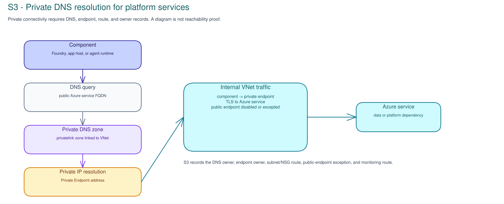

# S3 · Platform Route & Trust Boundaries

**Facilitator deck**

Microsoft default: **Azure landing zones, Microsoft Foundry, Azure API
Management AI Gateway or customer-approved gateway, private networking where
risk requires it, Azure Monitor/Application Insights, and Azure API Center where
applicable**.

Concrete decision: **Can this pilot route be used as a named platform path for
later runtime, evaluation, and control-plane work without pretending it is
deployed, private, observable, or production-ready?**

---

## Start with one platform route

- Pick one caller-to-backend route, not a generic platform posture.
- Trace caller -> app/orchestrator -> gateway -> model/tool/data ->
  telemetry/catalog.
- Every segment needs an owner, route record, assumption, limitation, and next
  evidence request.

Note:
Open by preventing the workshop from becoming a cloud-governance checklist.

---

## The route is the artifact

Record references for:

- landing zone and hosting pattern;
- Foundry project, app host, or SaaS boundary;
- APIM/gateway ingress and model/API/tool egress;
- private route, DNS, VNet, firewall, and public-endpoint exception;
- identity boundaries;
- telemetry, correlation, retention/export;
- API Center/catalog entry and downstream assurance questions.

Note:
Keep customer architecture diagrams, endpoints, network details, resource IDs,
telemetry, and configuration in customer systems.

---

## Landing zone and hosting pattern

- **Foundry-hosted:** project/workspace, model deployment, agent/tool record,
  network mode, observability setting, owner.
- **Azure app-hosted:** App Service, Functions, Container Apps, AKS, ASE, host
  identity, route owner.
- **Managed SaaS:** tenant boundary, support boundary, audit/export fields,
  retention owner, blind spots.
- **Hybrid or non-Azure:** boundary owner, route owner, log/export route,
  exception status.

Note:
Product availability depends on tenant, region, SKU, license, and workload.

---

## Gateway is a trust boundary

- APIM/gateway can mediate caller access, model routes, tool/API calls, quotas,
  auth, policies, and logs.
- It is not magic enforcement: direct app, admin, background job, connector, and
  hybrid routes may bypass it.
- Record API/product/policy/backend, auth owner, log owner, policy-change owner,
  bypasses, and correlation field.

Note:
Ask: "Which route must use the gateway, and which route can avoid it?"

---

## Private route and DNS checks

- Private means more than "private endpoint exists."
- Record Private Link, VNet/subnet, private DNS zone, public-network setting,
  firewall/NSG, route table, peering/hybrid route, and flow-log owner.
- If the customer cannot name termination point, DNS owner, route owner, and
  fallback behavior, defer the private-route assumption.

Note:
Ask where the route starts, where it terminates, and how public fallback is
prevented or exception-owned.

---

## Identity boundaries

- Human caller, workload identity, managed identity, app registration,
  delegated/OBO authority, gateway identity, tool/API identity, and resource
  authorization are separate.
- A platform record does not approve access.
- Shared identity, broad tenant permission, missing sponsor, missing lifecycle
  owner, or unsupported identity path routes to identity/security ownership.

Note:
Connect S3 to S1 without saying S1 must decide first: this is an identity-owner
handoff when the platform route changes authority.

---

## Telemetry and correlation

- Record where trace/request/session IDs originate, propagate, and land.
- Connect gateway logs, app traces, model/agent events, tool/API records, data
  access logs, and security/operations workspaces.
- Empty logs are not proof without query scope, time window, route coverage,
  diagnostic status, sampling, and reviewer.
- Name retention/export owner and approved evidence route.

Note:
If no correlation path exists, later runtime or evaluation work cannot rely on
execution evidence from this route.

---

## API Center and catalog handoff

- Register API, tool, model endpoint, gateway route, backend, version, lifecycle
  state, and owner where the customer governs them.
- Record whether the route is APIM/gateway, direct, or exception-owned.
- Capture access contract expectations: identity, auth, rate limit, data class,
  support owner, and deprecation route.

Note:
Control-plane records are not paperwork. They are how platform routes stay
reviewable after the workshop.

---

## Failure modes and hard stops

- Gateway exists, but tool egress or background jobs bypass it.
- "Private" is asserted without DNS, termination, route, or public-endpoint
  evidence owner.
- Foundry project exists, but app host, identity, or network route is unmanaged.
- SaaS component has limited telemetry and no export/retention owner.
- Logs exist without correlation.
- API/tool/model route is not registered.
- Unsupported region, SKU, license, tenant, or workload is treated as available.

Note:
Defer when a fixable route gap has an owner and accepted-when condition. Block
when the route cannot be reviewed safely.

---

## Workshop artifact and decision

The record must capture:

- platform-route trace card;
- segment route map;
- gateway/APIM boundary and bypasses;
- private route/DNS/firewall outcome;
- identity-boundary map;
- telemetry/correlation and retention/export route;
- API Center/catalog handoff;
- decision: proceed with assumptions, defer, route, reject, or blocked with
  owner, target date, release impact, and review trigger.

Note:
Close with the route artifact, not a meeting summary. S3 deploys nothing, tests
no network, exports no telemetry, proves no runtime enforcement, and approves no
production use.
