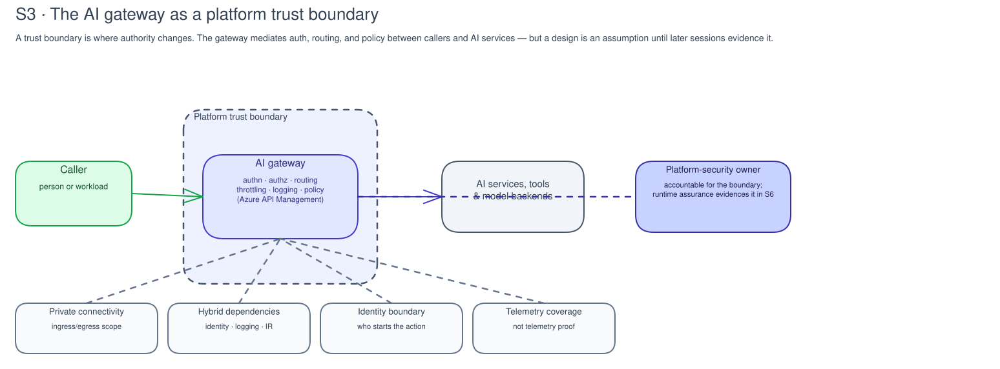

# S3 · Enterprise Platform & Trust Boundaries

**Facilitator deck**

Platform owner · Security owner · 90-minute evidence-first boundary review

Note:
This **evidence-first, report-only** session makes no deployment, live
integration, environment access, network test, or configuration change. Timebox:
90 minutes. Roles: facilitator, platform owner, security owner, evidence owner,
and decision owner; include specialists when needed.

---

## The outcome

By the end, the customer has a **platform boundary review** for an AI workload and a handoff to runtime assurance.

They keep boundary owners, evidence expectations, coverage limits, a readiness decision, open gaps, stop conditions, and evidence references.

Note:
The customer keeps records in its approved system. `labs/s3-platform-foundation/` contains blank offline templates only; it does not hold workload data, credentials, network details, event records, or completed evidence.

---

## Why this matters

- AI workloads cross platform boundaries.
- Requests can move through users, apps, an AI gateway, model services, tools, data sources, and logs.
- Each crossing needs an owner and evidence expectation.
- No follow-up work should rely on an unevidenced path.

Note:
S3 names the accountable platform owner, evidence expectations, and gaps to
close before runtime assurance relies on the path.

---

## Trust boundaries make authority visible

A trust boundary is where authority changes:

- Person to application caller
- Workload to service
- Request across networks
- Administrator to privileged action

Note:
The boundary review makes these transitions explicit so an owner can say which evidence would support a claim. A boundary diagram alone is not evidence. It can show an intended design, but it cannot prove that routes, identities, or controls exist or operate.

---

## The AI gateway is a platform trust boundary

The gateway helps state where authentication, authorization, routing, throttling, logging, or policy checks are expected.

Note:
Walk the diagram through the caller, gateway, AI services, tools, and model backends. In Azure architectures, Azure API Management can provide that gateway boundary for APIs and AI workloads. S3 records what the gateway should mediate and which owner is accountable. It does not prove runtime behavior.

---

## Private connectivity and hybrid dependencies

- Private connectivity is an assumption until evidenced.
- Ingress and egress both need explicit scope.
- Hybrid dependencies widen the review boundary.
- Accountability can change across operational environments or external services.

Note:
S3 records assumed route, boundary, owner, and evidence needed to support the assumption. It does not test reachability, inspect configuration, or declare a route private. For hybrid dependencies, identify where accountability changes and what evidence would bridge the boundary.

---

## Identity and telemetry boundaries

- Identity review asks who starts an action and which authority is delegated.
- An identity in a record is not proof that permissions are appropriate.
- Telemetry needs coverage and interpretation.
- A planned log or dashboard is not proof of emitted events.

Note:
Keep expected coverage separate from observed operation. Telemetry coverage includes event classes, boundaries, time window, correlation method, retention decision, and blind spots. Interpretation asks whether an authorized reviewer can connect a bounded event to the question and explain limits.

---

## Platform security and runtime assurance

- Platform security ownership separates boundary, workload use, and risk acceptance.
- One role may hold several responsibilities: each still needs a record.
- Runtime assurance later uses authorized, safe observation.
- S3 defines the question and handoff; it does not prove operation.

Note:
Runtime assurance can reject the handoff, identify a coverage gap, or require a change through the approved process. The S3 review does not prove a reference architecture is operating.

---

## Platform review becomes a work list

Typical work-list rows:

- Landing-zone readiness
- Private connectivity
- Azure API Management or AI gateway route
- API Center or access-contract record
- Identity boundary and telemetry coverage
- Platform-security owner and S6 prerequisite

Note:
For Foundry-hosted workloads, the review may also need a network-isolation question: public, managed VNet, bring-your-own VNet, or hybrid path, with an accountable platform owner. These rows do not deploy an accelerator, configure a gateway, test networking, or prove telemetry operation.

---

## The activity: how we'll work

- **Timebox:** 90 minutes · **six steps**
- **To start:** bounded workload, approved record location, decision owner, stop condition.
- Stop any topic lacking an owner, record location, or bounded evidence claim.
- This review maps what should be evidenced.

Note:
Confirm the boundary and records setup before continuing. The platform owner maps the enterprise platform and AI gateway boundary, then the decision owner records what is ready, missing, or blocked. Introduce the six steps from review contract through runtime-assurance handoff.

---

## Step 1: Set the review contract · 10 min

State the workload, decision, boundaries, approved records location, and stop condition.

> **"What can this review state, and what remains unverified?"**

Note:
A missing owner or records location blocks the affected topic. Keep the claim bounded: this session maps what should be evidenced, not what has been tested or proven in the environment.

---

## Step 2: Map trust, connectivity, and gateway boundaries · 20 min

Identify workload, operator, identity, network, data, service, administration, and AI gateway boundaries.

> **"Where does authority or data handling change?"**
> **"Which topology, network-isolation, or gateway option fits this scope, and what evidence would support that choice later?"**

Note:
Record expected private-connectivity controls, ingress points, egress destinations, and hybrid dependencies. For the gateway, name Azure API Management when it is the customer route and record what API or model access it is expected to mediate.

---

## Step 3: Review identity and dependency boundaries · 15 min

Record expected:

- Caller, workload, operator, and privileged-administration identity boundaries
- Delegated authority
- Secrets handling
- External or hybrid dependencies

Note:
Do not validate credentials or access. A missing accountable owner is a finding, not a reason to guess. Keep identity lifecycle ownership separate from runtime proof.

---

## Step 4: Define telemetry evidence and coverage · 20 min

Identify expected event classes, correlation method, retention decision, reviewer, coverage window, and blind spots.

> **"Which events should prove this path later?"**
> **"Which boundary has no coverage yet?"**

Note:
Keep "not observed" separate from "not covered." Telemetry references show that evidence is expected. They do not prove a control operated.

---

## Step 5: Assign platform-security ownership · 15 min

Assign each boundary and evidence gap to an accountable owner.

Decision states:

- `ready_for_runtime_assurance`
- `needs_evidence`
- `accepted_risk`
- `deferred` or `blocked`

Note:
The decision owner records the state with rationale, selected technical-decision option, owner, and next review. One role may hold several responsibilities, but each responsibility still needs to be recorded.

---

## Step 6: Hand off to runtime assurance · 10 min

Provide:

- Bounded review reference
- Open gaps and evidence expectations
- Decision, owners, and stop conditions
- Technical decision record and platform backlog rows

Note:
Runtime assurance chooses its own authorized observation and validation method. It must not treat this review as proof of operation. Include backlog rows for landing-zone, AI gateway, API Center, telemetry, private-connectivity, identity-boundary, or customer-change items required before implementation continues.

---

## Verification & evidence

- [ ] Each boundary names purpose, owner, evidence reference, coverage limit, and status.
- [ ] Ingress, egress, private-connectivity assumptions, and hybrid dependencies are stated without claiming tests.
- [ ] AI gateway or Azure API Management boundary is named where it mediates runtime access.
- [ ] Identity and telemetry separate expected coverage from observed operation.
- [ ] Each gap or blocker has owner, decision, next action, and review date.
- [ ] Runtime-assurance handoff states what still needs authorized validation.

Note:
Use the blank platform-boundary review, runtime-assurance handoff, and technical-decision record templates in the approved records location. Retain only references in the delivery record. Do not copy records, payloads, identifiers, diagrams with sensitive detail, or claims into the templates.

---

## Change boundary & hand-off

- This session authorizes **no change**.
- Network, identity, platform, telemetry, and runtime changes stay in the customer's approved change process.
- Safety review, rollback, verification, and evidence retention remain customer-owned.
- Runtime assurance performs any later authorized observation.

Note:
No result is not a pass: record scope, date, expected signal, and the limit.
An API Management or gateway design does not prove traffic uses it.

---

## Decision slide

**Do we approve, defer, reject, or route this platform-readiness decision?**

- Default: Foundry, a customer-adopted Citadel/AI Hub Gateway accelerator where
  applicable, and APIM at the AI gateway boundary.
- Exception: architecture owner records rationale, evidence reference,
  acceptance criterion, and target date.
- Handoff: S6 runtime security, S7 evaluation, S11 monitoring, and S9 catalog.
  This is not a deployment or production approval.
