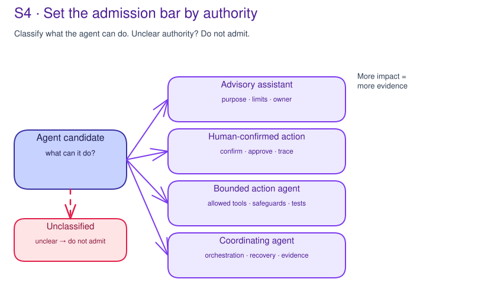

# S4 · Agent Build Path & Admission

**Facilitator deck**

Microsoft default: **Copilot Studio, Microsoft Foundry Agent Service, Microsoft
365 Copilot extensibility, workflow automation, or a custom Azure app path**.

Concrete decision: **Can this candidate enter the next controlled engineering
stage on a named Microsoft build path with a complete agent package?**

---

## Start with what the agent can do

- Pick one bounded candidate, not a portfolio category.
- Classify authority before tooling: inform, draft, recommend,
  act-with-approval, autonomous, coordinating, or blocked.
- Inventory allowed actions, denied actions, approval points, fallback,
  rollback, and stop conditions.

Note:
The first question is not "Foundry or Copilot Studio?" It is "what can this
thing cause?"

---

## Authority drives admission

- Advisory and drafting agents need purpose, audience, data boundaries, quality,
  and owner.
- Action agents need tool/API inventory, human control, denial behavior,
  traceability, and negative tests.
- Autonomous and coordinating agents need least privilege, dependency maps,
  recovery, escalation, runtime assurance, and catalog ownership.

Note:
Unclear authority is a blocker. Do not downgrade an action agent because it also
explains itself.

---

## Compare Microsoft build paths

| Path | Fits when |
|---|---|
| Copilot Studio | Low-code business process, governed connectors, maker/admin model. |
| Foundry Agent Service | Foundry-managed prompt/hosted agent, model/tools, traces, evaluation. |
| Microsoft 365 Copilot extensibility | M365 user experience, declarative instructions, knowledge, actions. |
| Custom Azure app | Custom UX/backend, bespoke orchestration, SDLC, gateway, telemetry. |
| Workflow automation | Deterministic workflow or approval path is enough. |
| Prototype-only | Exploration is isolated and explicitly blocked from promotion. |

Note:
Record rejected alternatives. A route decision without alternatives is often
just product preference.

---

## The selected-path package

The package must name:

- instruction, workflow, hosted package, or declarative manifest reference;
- model route, region/residency, quota/capacity owner, fallback;
- tools/actions/APIs/connectors and prohibited actions;
- data sources and data owner;
- identity mode and authority owner;
- runtime controls, human-control point, and denial behavior;
- evaluation, telemetry/correlation, release/rollback, lifecycle, and support.

Note:
No raw prompts, code, endpoints, telemetry, or live configuration go in the
curriculum repo.

---

## Foundry Agent Service package example

- Foundry project and resource boundary.
- Agent type: prompt agent, hosted agent, or existing external agent via
  Responses API.
- Model deployment and model-operation owner.
- Instructions or hosted package reference.
- Tools, connected data, identity/RBAC, tracing, safety settings, evaluation,
  red-team readiness, catalog/lifecycle, and change process.

Note:
The output is a backlog, not a Foundry deployment.

---

## Other path package differences

- **Copilot Studio:** environment zone, Managed Environment, DLP, connectors,
  solutions/ALM, publication, audit, retirement owner.
- **M365 declarative agent:** instructions, knowledge, actions/plugins, Graph
  permissions, metadata, admin distribution, tenant governance.
- **Custom Azure app:** repository/release, model backend, APIM/gateway, managed
  identity/federation, telemetry, IaC, rollback, support.
- **Workflow:** trigger, deterministic steps, approval, connector policy, run
  history, exception route.

Note:
Every path has a different control package. Do not reuse one checklist for all.

---

## DEV / PRE / PRO gates

- **DEV:** candidate card, authority, selected route, package owner, data
  boundary, non-production label.
- **PRE:** platform route, tool/API dependencies, identity boundary, runtime
  proof plan, evaluation plan, rollback owner, support owner.
- **PRO:** customer production decision outside S4 with change authority,
  accepted evidence, support, monitoring, and release records.

Note:
S4 can define gate readiness. It cannot approve production.

---

## Failure modes and hard stops

- Product selected before authority/action inventory.
- Deterministic workflow treated as an agent.
- Foundry selected without tool, data, identity, telemetry, or evaluation owners.
- Copilot Studio selected without environment, DLP, connector, ALM, or
  publication owner.
- Custom app selected without platform, gateway, telemetry, rollback, or support.
- Model choice has no cost, latency, quota, fallback, or version owner.
- Prototype-only starts using real users, data, or actions.

Note:
Defer when fixable with an owner and accepted-when condition. Block when
authority or promotion path is unreviewable.

---

## Workshop artifact and decision

The record must capture:

- agent candidate card;
- authority/action inventory;
- build-path comparison and rejected alternatives;
- selected-path package;
- model/latency/cost/fine-tuning decision;
- DEV/PRE/PRO gates;
- downstream prerequisites and material-change triggers;
- decision: approve, defer, reject, route, blocked, or prototype-only.

Note:
Close with the package, not a meeting summary. S4 creates no code, deploys
nothing, changes no tenant settings, proves no runtime control, and approves no
production use.
