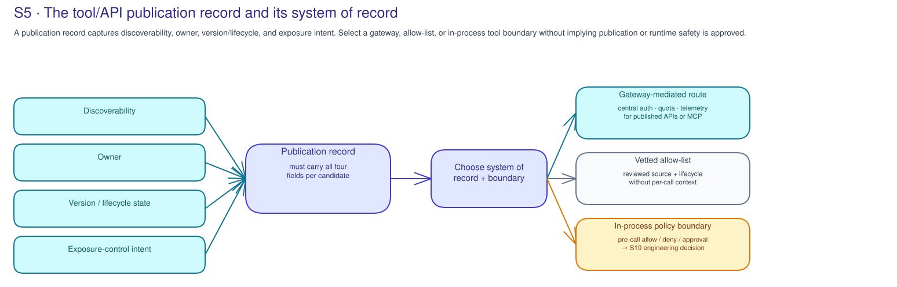

# S5 · API, Tool & MCP Governance — Technical decisions

!!! info "Freshness"
    Last reviewed: 2026-07-17 · Azure API Center, Azure API Management,
    managed identity, delegated OAuth flows, and Model Context Protocol (MCP)
    governance patterns change over time. Verify current status, tenant
    availability, and limitations before delivery. See the
    [Platform technical guide](../reference/platform-technical-guide.md).

S5 decides where the publication record lives, how MCP/tool access is governed,
and what authority the caller carries. The output is a recorded choice with
rationale and backlog, not a platform change.

## Decision 1 — Tool/API publication and registry system of record

Choose the system that can hold the candidate's **discoverability**, **owner**,
**version/lifecycle state**, and **exposure-control intent** without implying
that publication or runtime safety has already been approved.

| Option | When it fits | Trade-off / limitation | Governance implication |
|---|---|---|---|
| **Azure API Center registry + Azure API Management products** | The customer wants a Microsoft-centered publication record paired with product/consumer exposure boundaries | Product availability, feature coverage, and tenant fit must be verified; registry and gateway records still need owners | Strong fit when discovery, ownership, version, lifecycle, and exposure intent should reconcile across platform records |
| **Existing API-management estate or service catalog** | The customer already has an approved catalog/gateway process that can carry S5 fields | May need field mapping for owner, authority, lifecycle, MCP/tool type, and version evidence | Valid if the estate is the system of record; record required extensions and S9 reconciliation owner |
| **Ad-hoc list / no registry yet** | Early discovery, isolated prototype review, or no approved publication path exists | Weak discoverability, ownership drift, lifecycle gaps, and unclear exposure control | Record as a gap or hold state; backlog a controlled publication model before broad use |

## Decision 2 — MCP server and tool governance model

Choose the boundary based on **where the tool runs**, the **trust of the tool
source**, whether a **pre-call policy decision** is needed, and how the caller is
**authenticated**.

| Option | When it fits | Trade-off / limitation | Governance implication |
|---|---|---|---|
| **Gateway-mediated or brokered MCP through the governance hub** | Tool traffic can route through a controlled boundary that authenticates callers and applies publication policy | Does not decide inside the agent process before a local tool call; current MCP and gateway support must be verified | Centralizes exposure control and audit expectations; pair with S6 runtime evidence and S9 lifecycle reconciliation |
| **Allow-list of vetted MCP servers/tools** | A small set of sources is reviewed, named, versioned, and owned before use | Allow-lists age quickly and may miss per-call context or delegated authority | Good for source trust and lifecycle control; record vetting owner, review date, and suspension trigger |
| **In-process tool-call policy boundary** | The meaningful decision is immediately before the tool call, inside the agent or orchestrator | Requires engineering assessment and customer code ownership; see [S10 technical decisions](../s10-in-process-governance/technical.md) for the boundary menu | Backlog when pre-call allow/deny/approval semantics are required beyond gateway or allow-list controls |

### Azure implementation track — publication does not equal authority

**Control chain to decide.** Treat the catalog record, gateway-mediated API/MCP
route, reviewed allow-list, and in-process pre-call policy as separate controls.
Azure API Management can centralize authentication, quota, routing, and
telemetry for a selected published route. It cannot make an allow/deny/approval
decision immediately before a local in-process tool call; that belongs to an
application boundary such as the S10 applicability decision.

**Failure modes to test in the customer design.** A catalog entry can be
mistaken for a security approval; an MCP server can be published without a
named caller identity or withdrawal trigger; a broad OAuth scope can authorize
more than the documented tool action; a gateway policy can be assumed to cover
local calls; and an allow-list can age without review or suspension ownership.

**Evidence and record.** Capture the candidate/version, source trust, intended
consumers, classification, caller identity, allowed and prohibited actions,
resource boundary, selected policy boundary, lifecycle owner, review date,
suspension trigger, and evidence limits. Do not put endpoint values, secrets,
payloads, or live policy exports in the kit.

**Backlog sequence.** Establish the system of record and lifecycle path, then
select gateway, allow-list, or in-process enforcement and assign its owner.
Route identity prerequisites to S1, runtime-path evidence to S6, and material
change/withdrawal reconciliation to S9.

## Decision 3 — Tool authentication and least privilege

Choose the credential model by the **authority and blast radius** the tool
carries, the **data it can reach**, and whether activity can be **audited** back
to the correct workload or user. Prefer federated credentials over stored
secrets wherever the customer's platform supports them.

| Option | When it fits | Trade-off / limitation | Governance implication |
|---|---|---|---|
| **Per-tool OAuth scopes** | A tool needs explicit, narrow API permissions that can be reviewed per action or resource | Scope design and consent can sprawl; status and consent model must be verified | Record least-privilege scopes, owner, consent authority, and review trigger for material changes |
| **Managed identity** | The tool runs as an Azure workload calling Azure resources under workload identity | Identifies the workload, not always the individual tool purpose or human sponsor | Useful for secret hygiene and audit; still record sponsor, resource boundary, and lifecycle owner |
| **Delegated on-behalf-of (OBO)** | The tool must act as a signed-in user with user-context authorization | Blast radius follows user permissions and downstream consent; availability and app design must be verified | Record delegated authority, prohibited actions, audit route, and fallback when user context is unavailable |

## Decisions made & adoption progress

S5 advances the tool and API part of the **S0 maturity baseline** by creating a
lasting controlled-publication and lifecycle governance model, and sends the
portfolio-level implications to **S12**; **S9** owns catalog and lifecycle
reconciliation as records mature.

| Adoption stage | What "done" looks like at S5 |
|---|---|
| **Decided** | A registry/publication model, MCP/tool-governance boundary, and tool-authentication approach are chosen or explicitly deferred for each bounded candidate set |
| **Backlogged** | Registry field mapping, gateway/APIM route, MCP vetting, least-privilege scope, credential hygiene, and lifecycle gaps have customer owners and later-session routing |
| **In adoption** | The customer implements the controlled publication model outside S5; S6 reviews runtime evidence, S9 reconciles catalog/lifecycle state, and S12 tracks portfolio risk |

Record the choices, alternatives, rationale, and adoption stage in
`labs/s5-tool-api-governance/templates/technical-decision-record.template.md`.
The record remains offline unless the customer moves it through its approved
records process.

## Related references

- [S5 Concepts](concepts.md) — catalog decisions, publication backlog, identity/authority boundary, and lifecycle states.
- [Platform technical guide](../reference/platform-technical-guide.md) — governance hub, API gateway, and platform-boundary context.
- [Governance capability guide](../reference/governance-capability-guide.md) — capability availability and ownership considerations.
- [Microsoft AI governance reference map](../reference/ai-governance-reference-map.md) — API Management, Entra, and related governance references.
