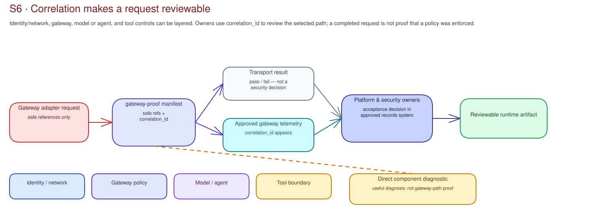

# S6 · Security Runtime Concepts

!!! info "Freshness"
    Last reviewed: 2026-07-15 · Confirm runtime-control availability in the [Governance capability guide](../reference/governance-capability-guide.md).

This page explains S6's evidence boundary. Use [S6 Prepare](index.md) for the
customer validation steps.

## Gateway evidence is different from a component diagnostic

A direct call to a Content Safety endpoint can diagnose that component. It cannot
prove the agent request used the customer gateway, access contract, backend, or
policy. S6 labels direct component testing as a diagnostic. It never treats it as
gateway enforcement evidence.

The S6 artifact is a
[`gateway-proof`](../../contracts/gateway-proof.schema.json) manifest from the
gateway adapter. It holds safe references and a correlation identifier, not raw
payloads or endpoints.

## Correlation makes a request reviewable

A completed adapter request is accepted only as adapter readiness. Platform and
security owners use `correlation_id` to review gateway telemetry and record an
acceptance decision, separate from the transport result (`pass` or `fail`).

## Runtime safety remains layered

Prompt injection and harmful-content detection are only part of a runtime
boundary.[^contentsafety] Gateway policy, identity, scoped tools, data controls,
telemetry, and human review may also apply. The adapter supplies evidence; it
does not configure these controls.

The review should separate the risk, the inspection point, and the action. A
guardrail can inspect user input, gateway traffic, model input, tool calls, tool
responses, final output, telemetry, or a sampled production record. The action
may be block, annotate, log, escalate, hold for review, or route to another
session. If the record says only "Content Safety is enabled," S6 should ask
where it runs, what it inspects, what it does, who owns the threshold, and how a
reviewer would find the correlated event.

Keep these distinctions visible:

- Azure AI Content Safety direct tests are diagnostics unless they are tied to
  the approved gateway or app route.
- Foundry content filtering or Prompt Shields can be model/agent controls, but
  they do not prove APIM policy execution.
- APIM policy can enforce a shared route, but it may not see local prompt
  assembly, streaming behavior, tool-response context, or in-process approval
  decisions.
- Tool-call and tool-response controls are separate from final-response safety.

For delivery, keep five questions separate:

1. Did the request complete?
2. Does the correlation appear in approved gateway telemetry?
3. Does the route match the approved path?
4. Does the observed path support the expected policy behavior?
5. Who accepted the interpretation?

A Prompt Shields result or component diagnostic may add runtime-safety context.
It is not gateway-path proof by itself.[^appinsights]

Microsoft Defender for Cloud and AI security posture capabilities can help the
customer review the security posture, findings, and security-owner routing where enabled. They
support the runtime security picture. They do not replace the S6 gateway proof
and correlation decision.

## Runtime evidence becomes a work list

S6 should recommend the next runtime path with confidence and assumptions. Typical
work-list rows include gateway or Azure API Management route remediation, Content
Safety or Prompt Shields policy review, telemetry correlation, SOC alert or
debrief route, identity or data-control dependency, S7 evaluation prerequisite,
S9 catalog lifecycle update, and S11 operating evidence coverage.

The recommendation routes work to the appropriate platform, security, SOC,
identity, data, change, or operating process; it does not change traffic or
prove production effectiveness.

[^contentsafety]: Microsoft Learn - [Prompt Shields](https://learn.microsoft.com/en-us/azure/ai-services/content-safety/concepts/jailbreak-detection).
[^appinsights]: Microsoft Learn - [Application Insights OpenTelemetry observability overview](https://learn.microsoft.com/en-us/azure/azure-monitor/app/app-insights-overview).

## Related official references

See the [Microsoft AI governance reference map](../reference/ai-governance-reference-map.md)
for the cross-cutting runtime-enforcement route and current Microsoft safety,
security, identity, gateway, and observability sources.
