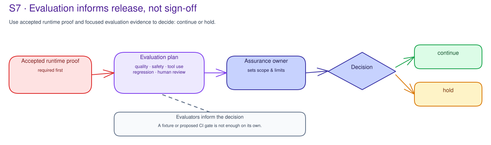

# S7 · Evaluation & Assurance Concepts

!!! info "Freshness"
    Last reviewed: 2026-07-24 · Review customer-owned evaluator availability separately from this release-readiness handoff.

This page explains the evidence boundary behind S7. [S7 Prepare](index.md)
starts the customer-owned review and handoff.

## Evaluation evidence is not release approval

Customer teams can use Microsoft Foundry evaluations and agent evaluators to
review quality, safety, groundedness, tool use, task completion, and regression.
Those results can inform a release decision.

They do not prove runtime enforcement, approve production, or decide risk
acceptance by themselves. A fixture result, local scorecard, aggregate pass
rate, or proposed CI gate is not enough.

S7 requires accepted runtime-path evidence before evaluation results are used
for release reliance. When that prerequisite is missing, the work can still
produce useful diagnostics and backlog, but the record must say
`diagnostic-only`.

## The scenario set is the unit of evidence

An evaluation package starts with a scenario set, not with a product score. The
record should name:

- scenario-set reference, source, owner, population, sampling method, included
  and excluded slices;
- data and tool boundary, environment assumption, reviewer role, time window,
  and material-change triggers;
- whether scenarios cover quality, groundedness, retrieval/context, safety,
  harmful content, prompt-injection resilience, PII/sensitive data, protected
  material, tool use, task adherence, regression, performance/cost, or
  human-review cases.

Keep completed records in the customer evidence system; do not store raw
prompts, outputs, telemetry, evaluator exports, datasets, credentials, or
customer records here.[^foundry-eval]

## Scores are inputs, not decisions

Evaluation dimensions should be chosen because they answer the release question,
not because a product exposes a score. A single aggregate score hides too much
to support an assurance decision.

| Evidence element | What it needs | Why it matters |
|---|---|---|
| Baseline | prior run, score, version, or accepted behavior reference | Without a baseline, a candidate result cannot prove improvement or regression. |
| Candidate | run/reference for the proposed change | The result must map to the exact model, prompt, retrieval, tool, or policy change. |
| Threshold | metric, pass/fail rule, regression tolerance, threshold owner | Thresholds are customer risk decisions, not evaluator defaults. |
| Exception | residual risk, owner, expiry, compensating review, re-entry criterion | Exceptions must be visible and time bounded. |
| Interpretation | decision owner and limitation statement | Scores need a human owner who accepts what they can and cannot support. |

## Evaluator routes are different packages

Agent evaluators do not produce one universal quality answer. The plan should
name the scenario, version, population, evaluator, limitation, interpretation
owner, and fallback for each question.

| Route | Use when | Limitation to record |
|---|---|---|
| Foundry evaluator | Supported evaluator covers the selected dimension and environment. | Unsupported slices, evaluator version, data boundary, and interpretation owner. |
| Agent evaluator | Tool use, task completion, intent resolution, or agent behavior needs agent-aware review. | Tasks, paths, tools, and failure modes outside the dataset remain excluded. |
| Manual rubric / SME scorer | Domain, policy, legal, or customer-specific judgment is material. | Rubric version, reviewer role, adjudication rule, and bias/coverage limits. |
| CI/CD cloud evaluation | The release process can consume evaluation results safely. | Pipeline identity, raw evidence handling, failure behavior, override owner, and audit trail. |
| Load/performance route | Latency, throughput, quota, saturation, or cost affects the release question. | Workload model, environment fidelity, quota/capacity ceiling, and production reconciliation owner. |
| Diagnostic-only route | Runtime/platform prerequisite or evaluator support is missing. | The result can create backlog but cannot be used as release reliance. |

Preview, tenant-limited, or unsupported evaluators need an explicit fallback. Do
not use a preview-only evaluator as the only automated production gate; pair it
with a generally available evaluator or customer-owned manual review when the
decision affects release.

## Performance and cost are release-readiness evidence

Performance is an assurance question too. Before release, a bounded synthetic
load test can show whether an interaction holds its first-token and end-to-end
targets at expected concurrency. Record the workload model, first-token
(TTFT/TTFB), inter-token, end-to-end p50/p95/p99, throughput,
error/saturation, quota/PTU/capacity, token cost, cache/fallback behavior, and
the owner who reconciles production drift.

The load engine, for example Azure Load Testing, k6, or JMeter, is customer-run
and referenced, not operated by this kit. Record environment-fidelity limits
because a synthetic result does not transfer to production without them. A
benchmark is not a service-level objective.

Use the shared `labs/templates/decision-record.template.md` required
considerations section, the S7 lab README's performance-evidence guidance, and
the [agent performance-testing guide](../reference/performance-testing-guide.md).

## Fine-tuning changes the baseline

When a fine-tuned model is in scope, record the base version, fine-tuned
version, training-data governance reference, capability goal, pre/post
comparison, unsupported slices, and owner who accepts regressions.

The customer model-deployment backlog owns the engineering decision. S7 records
whether the evaluation package covers the new version. A fine-tuned evaluation
still does not replace accepted runtime-path evidence.

## Findings must become actions

Every finding should become a named decision or backlog item:

- low groundedness becomes retrieval, data-source, or prompt backlog with a
  re-evaluation criterion;
- unsafe or blocked content becomes safety-threshold, runtime-control, or human
  review backlog with severity owner;
- tool-call inaccuracy becomes tool contract, parameter mapping, authority, or
  agent-engineering backlog;
- task failure becomes product or engineering hypothesis with validation path;
- regression becomes change-owner review, rollback option, and repeat
  evaluation;
- latency or cost miss becomes operating/capacity hypothesis with quota, budget,
  and monitoring owner.

The assurance owner selects `continue`, `hold`, `defer`, `reject`, `route`,
`block`, or `diagnostic-only` only after the evidence boundary is clear. The
customer still owns how it runs evaluators, stores evidence, enforces gates, and
makes release decisions.

[^foundry-eval]: Microsoft Learn - [Run evaluations from the Microsoft Foundry portal](https://learn.microsoft.com/en-us/azure/foundry/how-to/evaluate-generative-ai-app); [Agent Evaluators for Generative AI](https://learn.microsoft.com/en-us/azure/foundry/concepts/evaluation-evaluators/agent-evaluators); [Cloud Evaluation with the Microsoft Foundry SDK](https://learn.microsoft.com/en-us/azure/foundry/how-to/develop/cloud-evaluation).

## Related official references

| Reference | What it can inform |
|---|---|
| [Agent Evaluators for Generative AI](https://learn.microsoft.com/en-us/azure/foundry/concepts/evaluation-evaluators/agent-evaluators) | Evaluator categories and result interpretation. |
| [Run evaluations from the Microsoft Foundry portal](https://learn.microsoft.com/en-us/azure/foundry/how-to/evaluate-generative-ai-app) | Customer-owned evaluation workflow planning. |
| [Cloud Evaluation with the Microsoft Foundry SDK](https://learn.microsoft.com/en-us/azure/foundry/how-to/develop/cloud-evaluation) | CI/CD-integrated evaluation backlog planning. |
| [Fine-tune Microsoft Foundry models](https://learn.microsoft.com/en-us/azure/foundry/how-to/fine-tune-models) | Fine-tuning and pre/post comparison planning; verify availability. |

## Policy-specific evaluation needs a measured comparison

A policy-driven evaluation approach can help a customer express safety
requirements as targeted scenarios and compare results before and after a
mitigation. The customer owns the evaluator, dataset, thresholds, and
interpretation.

See the [Microsoft AI governance reference map](../reference/ai-governance-reference-map.md)
for Foundry observability and evaluation guidance.
