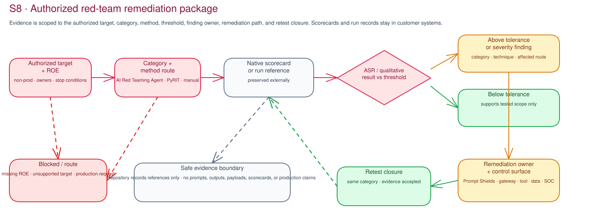

# S8 · Adversarial Testing

**Facilitator deck**

Security / SOC · AI developer / maker · 90-minute authorized non-production test review

## The safety-test question

> **"What did this authorized test show for this exact non-production target?"**

The customer retains native run evidence and a remediation, accepted-risk, blocked, or re-test decision.

Note:
S8 is an authorized misuse-test review. It neither approves release nor authorizes activity beyond written scope.

---

## The safety boundary

- Customer-owned **non-production** target only.
- Written rules of engagement, target ownership, categories, success criteria, and stop conditions.
- Notified SOC with contact and monitoring window.
- Customer provides and retains test data, credentials, endpoint access, and evidence.

> Missing authorization, a stoppable target, or SOC coverage means **stop**.

---

## Attack Success Rate is a decision aid

ASR requires the agreed category, sample, target version, success condition, and threshold. Below tolerance supports the tested scope only; above tolerance needs owned remediation.

---

## Keep evidence types distinct

- Preserve the Foundry native scorecard unchanged.
- A threshold-comparison sidecar may reference it; it is not a replacement scorecard.
- Managed AI Red Teaming Agent availability is Preview; PyRIT uses the same authorization and evidence rules.

---

## Entry and stop condition

- **Entry:** approved authorization and rules, notified SOC, customer-owned non-production target, endpoint owner with stop/reset path, categories, evidence location, and decision owner.
- **Stop:** any expired or changed condition, alert, instability, or scope drift.

---

## Step 1 — Pre-flight · 20 min

Confirm the target, operators, SOC window, stop conditions, evidence boundary, and the red-team approach, scope, and remediation-routing choices.

> **"Is this target customer-owned and non-production? Who can stop the run?"**

---

## Step 2 — Customer runs the authorized test · 30 min

- Endpoint owner runs the approved adapter only in the authorized window.
- Customer operates credentials, target access, categories, and test data.
- Preserve `airt-native-scorecard.json`; if the run cannot complete, review the completed native evidence later.

---

## Step 3 — Interpret findings · 15 min

> **"Was the run authorized and contained? What does each ASR mean for this category and sample?"**

- Compare native evidence with scope, target version, categories, and approved thresholds.
- Above threshold: assign remediation, owner, validation reference, and re-test date.
- Incomplete, alerted, unstable, or drifting runs: block, stop, or re-authorize before re-run.

---

## Step 4 — Decide and hand over · 25 min

Record remediation, accepted risk, blocked status, or re-test date. Reference authorization, SOC debrief, run metadata, native scorecard, optional sidecar, decision, and technical decision record. Customer owners perform cleanup and incident actions.

---

## Verification and handoff

- [ ] Native scorecard and metadata are referenced in approved records.
- [ ] Threshold sidecars remain with native evidence.
- [ ] Above-threshold categories have owners and dates.
- [ ] SOC debrief and decision are recorded.

S8 does not deploy a production control. Residual gaps route to S6, S7, and S11 as applicable.
