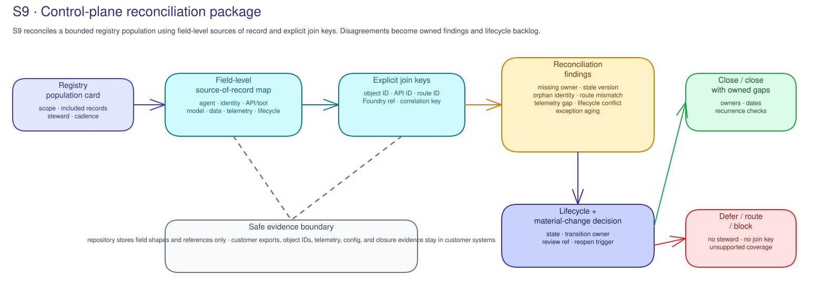

# S9 · Control Plane, Catalog & Lifecycle Concepts

!!! info "Freshness"
    Last reviewed: 2026-07-15

S9 is a read-only view of agent and tool records and decisions; it does not
query live data or change a catalog, identity, access setting, or lifecycle state.

## A catalog is an operating record

An agent or tool catalog is useful only when each entry names its purpose, accountable owner, technical steward, lifecycle state, and review references. Names, dashboards, and exports can support the record. They do not become truth by themselves.

Unknown fields stay unknown and become owned findings.

Agent and tool stewardship are related but different. An agent entry names the accountable service. A tool entry names the callable capability, its steward, its parent agent or approved shared-use relationship, and its lifecycle decision.

This matters because an approved agent can gain new reach through an unreviewed tool.

## Lifecycle is a decision trail, not a label

Proposed, active, exception, suspended, retired, and decommissioned states show the intended operating state. A transition needs an accountable decision, a review reference, and a permitted destination.

Material changes to authority, tool use, data handling, model behavior, operating scope, or ownership need a recorded review before the customer treats them as accepted.

Suspension stops use while review happens. Retirement ends intended use but keeps the record for accountability. Decommissioning also requires evidence that closure actions were reviewed. S9 records these distinctions. It never performs them.

## Reconciliation keeps gaps visible

S9 compares explicit identity identifiers in the catalog with the normalized identity inventory. It does not infer matches from names, aliases, or nearby fields.

Unmatched identities, catalog-only entries, missing owners, invalid lifecycle states, unreviewed material changes, and incomplete closure records are findings for accountable owners.

Records may come from an agent registry or Agent 365 view, Entra Agent ID, API
Center or gateway, telemetry, and lifecycle or change-review records. S9
preserves disagreement; it does not choose the customer's system of record.

## Reconciliation becomes lifecycle backlog

The S9 recommendation should say whether the bounded population can close, close with owned gaps, defer, or remain open. Typical backlog rows include Agent 365/Entra Agent ID/API Center reconciliation, steward assignment, parent-tool relationship, lifecycle-state fix, material-change review, suspension, withdrawal, retirement, recurrence check, exception escalation, S11 operating cadence, and S13 portfolio risk.

Where evaluation depends on versioned datasets or evaluator definitions, S9 should also name a steward, version record, and lifecycle decision. An unowned evaluation asset is a dependency. It is not proof that a future release decision remains valid.

S9 does not execute catalog, identity, access, policy, or retirement changes. It routes them to the customer-owned steward or change process.

## Closeout accepts accountability, not absence of findings

Closeout can happen with owned gaps only when the decision owner records the residual-risk disposition, accountable owner, due date, validation reference, recurrence check, exception route, and next review.

## Fleet governance and workflow controls have different jobs

A fleet control plane can show agents, ownership, lifecycle state, and gaps across systems. An in-process control can make a decision inside an agent workflow before a specific tool action.

S9 reconciles fleet-level records and dependencies. It does not infer that a workflow control is installed. It also does not treat a catalog entry as proof of runtime behavior.

## Related official references

See the [Microsoft AI governance reference map](../reference/ai-governance-reference-map.md) for Agent 365, Purview, identity, audit, and lifecycle sources that can inform customer-owned control-plane stewardship.
