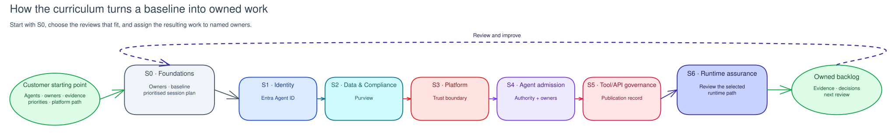

# About RVAS AI Governance

RVAS AI Governance is an offering in the Real Value Acceleration Solution (RVAS). It is a co-delivered programme and practical curriculum for AI-agent governance. A facilitator works with the customer's administrators in the customer's environment. Together they establish ownership, review controls, capture evidence, and assign the work that remains.

## Why AI-agent governance needs its own approach

An AI agent can retrieve enterprise information, call tools, take actions, and operate through a non-human or delegated identity. The customer therefore needs clear answers to practical questions:

- Who owns this agent and approves its use?
- What data, tools, and actions may it use?
- Which controls have been tested, and where is the evidence?
- Who investigates a failure or accepts the remaining risk?

Identity, data protection, security operations, quality evaluation, and lifecycle management are often managed separately. The AI Governance programme brings the relevant people and evidence together around each agent use case.

## What Citadel and RVAS AI Governance each do

Citadel is the recommended platform foundation for the integrated path. RVAS AI Governance is the programme that helps the customer govern the agents and controls around that foundation.

| Citadel's practical jobs | RVAS AI Governance's practical jobs |
|---|---|
| Route approved AI traffic through a managed path. | Establish sponsors, owners, and review decisions. |
| Record exposed models, tools, and platform activity. | Connect control evidence to the relevant agent and owner. |
| Apply shared runtime safeguards such as authentication, safety checks, and data masking. | Run the customer-facing identity, data, security, evaluation, and testing work. |
| Provide telemetry and platform records for the platform team. | Turn findings into an agreed backlog and operating cadence. |

The AI Governance programme does not deploy or duplicate Citadel's gateway, networking, telemetry plumbing, or platform pipelines. It uses the resulting platform records as evidence where they are available.

## The delivery shape

## The seven-session outcome map

Each session answers a customer question, brings the right people into the conversation, and leaves a usable record behind.

| Session | Customer question | People in the room | Decision and retained outcome |
|---|---|---|---|
| S0 · Foundations | Who owns AI governance, and where do we start? | Sponsor, governance lead, facilitator | Operating model, baseline assessment, and prioritised roadmap. |
| S1 · Identity | Which agents exist, and who sponsors them? | Identity admin, governance lead | Agent inventory, sponsor record, and report-only access posture. |
| S2 · Data | What enterprise data may agents access or expose? | Compliance/data admin, security lead | Data posture findings, DLP evidence, and review actions. |
| S3 · Security | How are unsafe requests and security signals handled? | Security/SOC, platform owner | Security posture evidence, safety-control review, and response ownership. |
| S4 · Evaluation | How do we review a change before it is released? | AI developer/maker, product owner | Evaluation dataset, scorecard, and release-review gate. |
| S5 · Adversarial testing | What happens under authorised misuse testing? | Security/SOC, AI developer | Test scope, findings, scorecard, and remediation owner. |
| S6 · Control plane | Do the agent, identity, and platform records agree? | Governance lead, platform and identity owners | Reconciliation findings, reassessment, and remaining-gap backlog. |

The sessions align with the governance intent of NIST AI RMF, ISO/IEC 42001, and the EU AI Act. They are not a legal conformity assessment.

## Optional S7 · In-Process Agent Governance

Teams considering the [Agent Governance Toolkit (AGT)](https://github.com/microsoft/agent-governance-toolkit)
can add S7 after the core curriculum. It illustrates application-process
tool-call policy decisions and hash-chain consistency using an offline
simulator. S7 does not deploy AGT, modify customer agent code, or replace
Citadel's gateway, identity, data, runtime-security, evaluation, or
control-plane responsibilities.

## Optional S8 · Operate & Measure

Teams that have completed S6 can add S8 to establish a customer-owned
operating-review cadence. It uses bounded questions about coverage,
reliability, safety, quality, cost, adoption, human review, business outcomes,
and remediation to connect approved evidence references with ownership and
follow-up decisions. S8 does not collect telemetry, build dashboards, set
thresholds, or make a customer change.

## Continue with delivery planning

Read [Plan the engagement](plan-engagement.md) for delivery roles, platform-readiness choices, the S0 baseline, safety rules, and the session sequence.

For implementation details, use the [Platform technical guide](../reference/platform-technical-guide.md). For the Microsoft products and capabilities used in each session, use the [Governance capability guide](../reference/governance-capability-guide.md).
