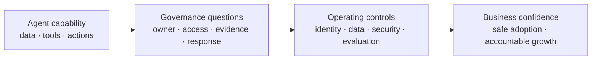

# Why AI-agent governance now

AI agents do more than answer questions. They can retrieve enterprise information, call tools, take actions, and operate through non-human or delegated identities. That creates a governance gap: the organisation may know the model is available, but not who owns each agent, what it may access, how it is tested, or what evidence proves it is operating safely.

## The problem is not one control

Traditional application governance often treats identity, data protection, security operations, quality assurance, and lifecycle management as separate disciplines. Agentic systems connect them in one runtime flow. A weak link can undermine the rest: an unowned agent can access sensitive data, an untested tool call can take an unsafe action, or an alert can go nowhere because nobody owns the response.

The goal is not to slow down useful AI adoption. It is to make adoption repeatable: a new use case has a sponsor, an allowed path to data and tools, proportionate checks before release, and a way to investigate or improve it afterwards.

## What good looks like

By the end of an integrated engagement, the customer should be able to answer practical questions:

| Question | Governance outcome |
|----------|--------------------|
| Which agents exist and who owns them? | An identity inventory, sponsor register, and lifecycle record. |
| What data can an agent use or expose? | Purview findings, test-mode DLP, and retained compliance evidence. |
| How do we detect and respond to unsafe behavior? | Security posture evidence, alert routing, runtime-safety tests, and named responders. |
| How do we know a change did not degrade the agent? | A representative evaluation dataset, scorecard, and controlled release gate. |
| How do we learn from failures? | Red-team findings, remediation ownership, an evidence trail, and a prioritised backlog. |

These outcomes give a sponsor something more useful than a product inventory: an accountable operating view of AI risk, investment, and progress.

## A practical, not theoretical, approach

RVAS is a co-delivered working curriculum. A facilitator guides the customer’s administrators through the work in the customer’s environment; the customer retains ownership of its systems, approvals, evidence, and production decisions. Controls start report-only, audit-first, or test-only where appropriate.

The sessions align with the governance intent of NIST AI RMF, ISO/IEC 42001, and the EU AI Act, but they are not a legal conformity assessment.[^nist] See the compact [framework alignment index](../reference/index.md#framework-alignment-at-a-glance) for the session-level view.

## The platform and the operating model

Governance needs both a controlled technical foundation and a way to operate it. **Citadel** supplies the recommended platform foundation for the integrated path; **RVAS** supplies the owners, evidence, operating cadence, and improvement loop around it.

Continue to [Citadel + RVAS together](../governance-on-citadel.md) to see how the platform works and what each part is responsible for.

[^nist]: NIST - [AI Risk Management Framework](https://www.nist.gov/itl/ai-risk-management-framework).
