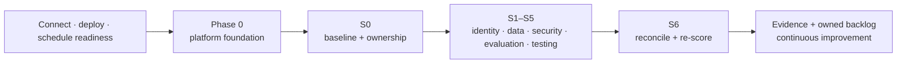

# Your journey

There is no single starting state. Some customers already operate a Citadel-aligned platform; others are ready to deploy the recommended foundation; others need to schedule platform readiness while they establish ownership and a baseline. The important decision is to make that state explicit, name an owner, and take the next safe step.

## Choose the right readiness path

| Starting point | What to do | What to bring into RVAS |
|----------------|------------|--------------------------|
| **Existing platform foundation** | Connect the existing Citadel or equivalent platform and capture its owner, gateway/registry evidence, safety configuration, and telemetry location. | Existing platform evidence feeds identity, data, security, and control-plane work. |
| **Ready to deploy Citadel** | Run a platform workstream to deploy the recommended Citadel foundation in the appropriate landing zone. | A named platform owner and a readiness checkpoint before integrated runtime validation. |
| **Readiness work still needed** | Schedule platform readiness and begin baseline/planning work; do not pretend a workshop kit is a replacement for the runtime platform. | A prioritised readiness backlog, sponsor, and target deployment or connection path. |

Citadel is the recommended foundation for the full integrated path. The baseline and operating-model work can still begin when a customer is connecting an equivalent foundation or preparing for deployment.

## From readiness to evidence

The sequence is deliberately cumulative. S0 makes the operating model and starting maturity visible. S1-S5 create and review evidence in the identity, data, security, evaluation, and adversarial-testing domains. S6 reconciles the control-plane record and compares the exit score to the baseline.

## What the customer keeps

The engagement should leave durable work products, not a slide deck:

- named sponsors, owners, and an operating-model record;
- assessment baseline, exit score, and prioritised backlog;
- exports, policy definitions, runbooks, and evidence retained in the customer’s governance record;
- evaluation and adversarial-test scorecards with remediation ownership;
- an agent registry reconciliation that surfaces missing owners, shadow agents, and lifecycle gaps.

The exact delivery order can follow the customer’s assessment priorities. The evidence model stays consistent: each decision has an owner, every control has a safe initial posture, and unresolved gaps become backlog items.

## Decide the next conversation

1. **Need to establish the platform path?** Read the [Citadel + RVAS Playbook](../reference/citadel-rvas-playbook.md) with the platform team.
2. **Need to understand the technical foundation?** Use [Reference Architectures](../reference/reference-architectures.md).
3. **Ready to baseline governance?** Start the [Readiness Assessment](../assessment/index.md).
4. **Ready to deliver the curriculum?** Use [How to Deliver](../how-to-deliver.md), then begin [S0 · Foundations & Operating Model](../s0-foundations/index.md).
