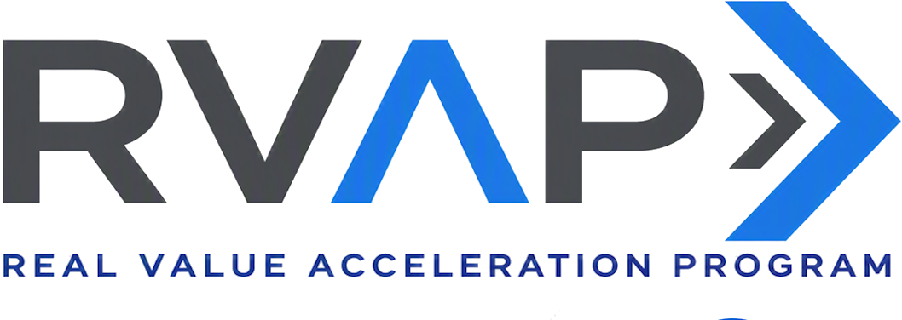

<!-- _class: cover -->



<p class="eyebrow">AI Governance Co-implementation · Optional module</p>

# A2A agent inventory in Microsoft Agent 365

**150 minutes - A live enterprise inventory record**

---

## Control objective

Onboard or confirm an approved A2A agent in Microsoft Agent 365 through a supported integration
route, then confirm its live inventory record, owner, and lifecycle state.


---

## Why it matters

**Problem.** A2A agents run on separate runtimes, so the enterprise has no single live view of who owns them or
their lifecycle state.

**Solution.** Registering the agent in Agent 365 gives the organization that view. The runtime owner keeps
maintaining the A2A definition, agent card, endpoint, and integration source.

---

## Architecture at a glance

```text
Runtime product repository
  A2A definition and agent card
             |
             v
Supported Agent 365 integration
             |
             v
Agent 365 Agent Registry
  enterprise inventory and lifecycle
```

The supported integration updates the Agent Registry from the runtime source.

---

## Choose a path the runtime supports

| Path | Operator action | Expected live state |
|---|---|
| Built-in integration | The platform operator enables or publishes the existing agent | The in-scope agent appears in Agent Registry through the platform integration |
| Registry sync | The administrator validates a supported connection and runs sync | The connection has a current result and the in-scope agent appears in Agent Registry |
| Agent 365 SDK | The runtime owner releases the SDK integration from the product repository | The released integration produces a live record for the in-scope agent |

**Stop if no path fits the runtime.** Choose a built-in or Registry sync route when either meets the
need.

---

## Implementation tradeoffs

| Choice | Route | Limit |
|---|---|---|
| Inventory | Agent 365 Agent Registry | A supported integration is required |
| Runtime source | Product repository or platform source | Runtime changes follow the owner’s approved release path |
| Technical discovery | Separate API Center add-on | It is used only when developers need it |

---

## Implementation boundary

The runtime owner makes and deploys SDK changes through the runtime product release path. The Agent
365 administrator configures supported connected platforms and reviews the registry.

---

## Preflight safety gates

- An approved A2A agent already runs in the nonproduction scope.
- `one-approved-a2a-agent` is the approved target scope.
- The route is `built-in`, `registry-sync`, or `sdk`; Registry sync also names a supported provider.
- The runtime owner controls the HTTP(S) source reference, and it has no embedded credentials.
- Agent owner, runtime owner, and retirement owner are available.
- Agent 365 licensing and administrator access are confirmed.

---

<!-- _class: implementation -->

## Run the supported path

1. Select built-in integration, Registry sync, or SDK.
2. Run preflight with the runtime-owned source reference.
3. Complete the platform or runtime-owned product change.
4. Open Agent Registry with the administrator.
5. Confirm the intended live record, owner, lifecycle state, and retirement path.

---

## Confirm the result

The module passes when the intended live Agent 365 record matches the selected path and the owners
can maintain and retire it through that path.

Stop for a missing, duplicate, stale, or wrongly owned record. Resolve it through the source
platform, then repeat the live review.

---

## Operating state

| Owner | Maintains |
|---|---|
| Runtime owner | A2A definition, agent card, endpoint, and integration source |
| Agent 365 administrator | Inventory visibility and connected-platform configuration |
| Agent owner | Lifecycle and retirement decision |

Remove a Registry sync connection only after checking every agent it can affect. SDK changes follow
the runtime release path. The runtime owner retires the runtime service through its approved path.

Use the separate API Center discovery add-on when developers need the A2A interface in a catalog.

---

<!-- _class: closing -->

# Thank you!
