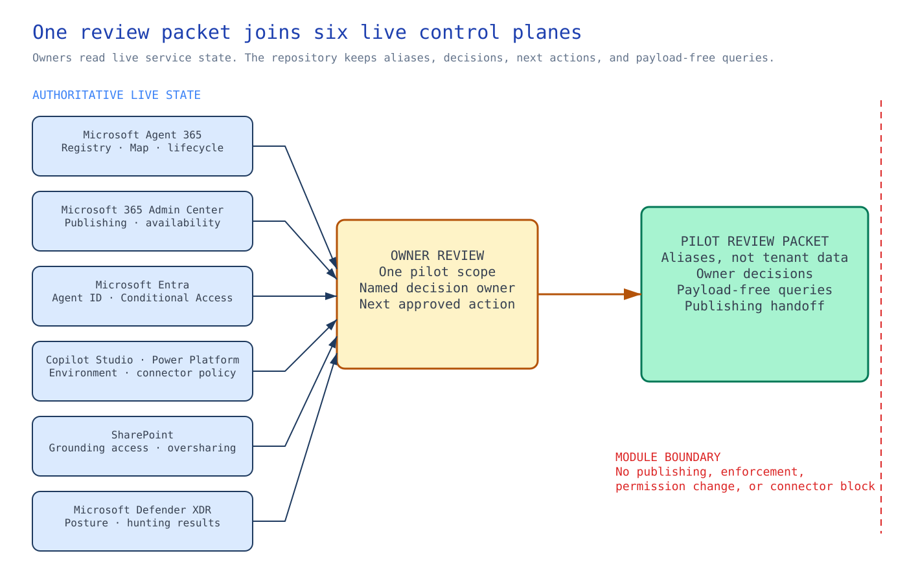

<!-- _class: cover -->

# Microsoft Agent 365 and Microsoft 365 agent governance

## Optional implementation module

Govern the Microsoft 365 control plane around an approved pilot agent.

<!-- Notes: This is a full optional module. It is not Session 16 and does not change the numbered sequence. -->

---

## Control objective

Create the files that each owner uses to review Agent 365 and Microsoft 365 controls without changing production access.

The result is a completed set of owner reviews for the approved nonproduction agent or agent family.

<!-- Notes: Keep this focused on one pilot scope. Do not turn it into tenant-wide rollout. -->

---

## Why it matters

Foundry controls the Azure implementation path.

Microsoft 365 adds publishing, app availability, user access, connector policy, SharePoint grounding, and Defender XDR status.

Both sides have to line up before wider rollout.

<!-- Notes: The missing piece is a review that connects the Foundry implementation to Microsoft 365 controls. -->

---

## Control boundary

**In scope:** Agent Registry, Agent Map, Entra Agent ID, publishing approval, Copilot Studio, connector policy, SharePoint oversharing, and Defender XDR checks.

**Outside this module:** production publishing, tenant-wide connector blocking, enforced Conditional Access, eDiscovery, Insider Risk, Communication Compliance, and capacity planning.

<!-- Notes: The module records owner decisions. It does not change production tenant state. -->

---

## Architecture and authoritative state

<!-- _class: diagram -->

<!-- Notes: Agent 365, Microsoft 365 Admin Center, Microsoft Entra, Copilot Studio, Power Platform, SharePoint, and Defender XDR remain authoritative. The files record aliases, decisions, and next owners. Preflight checks only that those files are complete. -->

---

## What this means

No single admin portal answers every governance question about an agent. Owners inspect one pilot
in the services they govern. The repository files collect their decisions without copying or
changing tenant state.

---

<!-- _class: decision -->

## Tradeoffs behind this review path

| Engineering choice | Route used here | What the team accepts |
| --- | --- | --- |
| Where owners check current settings | Owners inspect the live admin portals they manage | Preflight cannot detect tenant drift |
| Repository content | Aliases and owner decisions | The files cannot recreate live tenant settings |
| Conditional Access | Report-only in this module | Access is not blocked here |
| Connector actions | Default-deny where Advanced Connector Policies support it | Coverage varies by tenant and connector |

<!-- Notes: These choices keep the module read-only. A publishing, enforcement, sharing, or connector change follows its own approved path. -->

---

## Agent inventory first

The Agent 365 administrator records:

- agent alias and registry ID;
- Agent Map node;
- owner and sponsor;
- lifecycle state;
- publishing state; and
- retirement review date.

<!-- Notes: Ownerless agents do not move forward. -->

---

## Identity decision

The Entra owner reviews Agent ID, sponsor, expiry, and Conditional Access.

This module starts Conditional Access in report-only mode. Enforcement needs its own tenant change.

<!-- Notes: Do not silently enforce a new CA policy from this module. -->

---

## Publishing decision

The publishing approver checks Microsoft 365 Admin Center Integrated Apps and Agent Store readiness.

The agent must stay within the nonproduction group listed in the publishing checklist.

<!-- Notes: Publishing is a business availability decision, not just a technical checkbox. -->

---

## Copilot Studio decision

The environment owner reviews:

- environment routing;
- ALM state;
- security scan result; and
- restore path.

Stop on any open high-severity finding.

<!-- Notes: This applies when the pilot agent uses Copilot Studio. -->

---

## Connector and MCP decision

Every connector and MCP action needs a classification:

- authentication mode;
- allowed actions;
- blocked actions;
- data movement class; and
- DLP or Advanced Connector Policy.

<!-- Notes: Default-deny for action-level control where ACP is available. -->

---

## SharePoint grounding decision

The SharePoint owner checks broad sharing before the agent uses a grounding source.

No unresolved broad-link finding moves into a wider pilot.

<!-- Notes: Copilot and agents respect permissions, so oversharing becomes the risk. -->

---

## Defender XDR decision

The Defender owner reviews Security for AI status and hunting results.

The repository keeps query templates and references, not payload exports.

<!-- Notes: Keep Defender and SOC as the investigation records. -->

---

<!-- _class: implementation -->

## Implement the module

1. Complete the inventory and publishing checklist.
2. Record the Entra Agent ID policy decision.
3. Classify connectors and MCP actions.
4. Review SharePoint oversharing.
5. Run Defender hunting templates.
6. Run preflight after owner decisions are filled.

<!-- Notes: Preflight checks that required files and owner decisions are complete. It does not inspect live tenant state. -->

---

## Confirm the result

The module passes when every artifact has an owner decision and no unresolved placeholder.

The pilot agent remains nonproduction until the publishing approver makes a separate rollout decision.

<!-- Notes: Do not let the review record become a hidden production approval. -->

---

## Operating ownership

| Owner | Responsibility |
| --- | --- |
| Agent 365 admin | Inventory, map, lifecycle |
| Identity | Agent ID, sponsor, expiry, Conditional Access |
| Publishing | Integrated Apps and Agent Store state |
| Power Platform | Connector and MCP policy |
| SharePoint and data | Grounding access and oversharing |
| Defender | Security status and hunting |

<!-- Notes: Each owner checks and changes settings in the live service they manage. -->

---

<!-- _class: closing -->

# Thank you!
