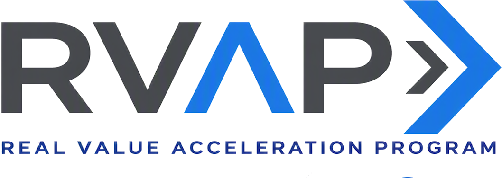

<!-- _class: cover -->

AI Governance Co-implementation · Optional module

# Azure Policy guardrails for Microsoft Foundry AI services

**240 minutes · Stage, review, then promote**

<!--
Frame this as a delta module. It adds one initiative. It does not replace the core sessions.
-->

---

## Control objective

Deploy one staged Azure Policy initiative for Microsoft Foundry and Azure AI services resources,
review current compliance, and promote approved effects on the same assignment.

<!--
The key point is one assignment with staged promotion, not a pile of separate assignments.
-->

---

## Why it matters

**Problem.** A resource can drift back to local keys, public access, missing diagnostics, weak
content-filter settings, or a deployment SKU that breaks the residency decision.

**Solution.** One version-controlled assignment audits first. The owner reviews live policy states
before any reference moves to `Deny` or `DeployIfNotExists`.

**EU AI Act.** Supports Articles 9, 12, and 15 for high-risk systems. Engineering mapping, not
legal advice.

<!--
Keep the focus on policy drift and safe promotion.
-->

---

## Architecture at a glance

| Layer | Repository artifact | Live Azure state |
|---|---|---|
| Definition | Custom SKU policy and Microsoft built-ins | Policy definitions in the subscription |
| Initiative | One policy set with reference IDs | Initiative definition |
| Assignment | Staged parameters and managed identity | Assignment at the approved scope |
| Review | Compliance check by reference ID | Azure Policy states |

<!--
Azure Policy owns live compliance state. The repo owns desired policy content.
-->

---

## What is in the initiative

- Disable local authentication.
- Restrict network access.
- Restrict disallowed Foundry deployment SKUs.
- Audit minimum content-filter settings across four harm categories.
- Audit diagnostic logs first, then deploy settings to Log Analytics when approved.

Model allow-lists, private endpoint deployment, gateway routing, and release gates stay with the
related sessions.

<!--
Call out exclusions early so this does not become a second model-governance session.
-->

---

<!-- _class: decision -->

## Tradeoffs

| Decision | Route used here | Limit |
|---|---|---|
| Rollout | `DoNotEnforce` plus audit effects first | Requires a policy-state review before promotion |
| Residency | Custom SKU policy | SKU list needs review as Foundry adds deployment types |
| Content filters | Preview audit-only built-in | It finds drift but does not block |
| Diagnostics | `AuditIfNotExists` to `DeployIfNotExists` | Remediation needs the approved workspace role path |

<!--
This is the module's judgment: block only after the current state is understood.
-->

---

## What preflight checks

Preflight rejects:

- unresolved `__REQUIRED_*__` decisions;
- a target scope that does not match the decision record;
- unsupported effects or unsafe promotion state;
- diagnostic remediation without the approved role status;
- Bicep or JSON syntax errors; and
- an Azure CLI subscription that does not match the approved scope.

It then runs subscription-scope what-if for the initiative and assignment.

<!--
The unresolved-decision failure happens before Azure calls.
-->

---

<!-- _class: implementation -->

## Run the module

1. Complete `guardrail-decisions.json`.
2. Run preflight and inspect both what-if previews.
3. Deploy the initiative.
4. Deploy the assignment in `DoNotEnforce`.
5. Review compliance by policy definition reference.
6. Promote approved effects on the same assignment.

<!--
Promotion uses the same assignment name. That preserves history.
-->

---

## Confirm the result

The module is ready to hand over when:

- the initiative and assignment exist at the approved scope;
- the assignment parameters match the decision record;
- the compliance owner can explain every non-compliant reference; and
- promotion has a named approval or remains in audit.

Stop on stale states, unexpected resources, or a request to create a second assignment.

<!--
Do not call the module complete just because the Bicep deployment succeeded.
-->

---

## Operating state

| Owner | Maintains |
|---|---|
| Platform policy owner | Initiative, assignment, and policy parameters |
| Compliance review owner | Current states and exceptions |
| Data-residency owner | Disallowed deployment SKU list |
| Observability owner | Diagnostic workspace and remediation role path |
| Promotion authority | Move from audit to enforcement and restore decisions |

Restore by changing assignment mode or effects first. Delete policy resources last.

<!--
Diagnostic remediation does not undo diagnostic settings automatically.
-->

---

<!-- _class: closing -->

# Thank you!
