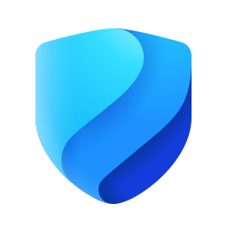

<!-- _class: cover -->

AI Governance Co-implementation · Optional module

# Defender for AI services, Sentinel detections, and shadow AI discovery

**270 minutes - AI threat signal and monitor-first shadow AI control**

<!--
Set the frame: one subscription, one Sentinel workspace, one shadow AI decision list.
-->

---

## Control objective

Enable Defender for Cloud threat protection for AI services, deploy one Sentinel Copilot jailbreak
detection and one hunting query, and record the monitor-first shadow AI sanction decisions.

<!--
Make clear this is a module, not another numbered session.
-->

---

## Why it matters

**Problem.** AI attacks and unmanaged AI app use can bypass normal SOC tuning. Prompt injection,
credential leakage, wallet attacks, and unsanctioned AI tools need named owners before alerts or
blocks start.

**Solution.** Turn on the AI services plan, deploy the first Copilot detection path, and record
shadow AI decisions before portal changes.

**EU AI Act.** Supports Articles 15 and 73 for high-risk systems, and Article 5 through shadow AI
discovery. Engineering mapping, not legal advice.

<!--
Keep the problem practical. The value is not more alerts. It is owned signal.
-->

---

## Architecture at a glance

| Control surface | Live authority | Module file |
|---|---|---|
| Defender AI services plan | Defender for Cloud | Bicep and decision JSON |
| Copilot jailbreak detection | Microsoft Sentinel | Bicep and KQL |
| External-IP hunt | Log Analytics saved search | Bicep and KQL |
| Shadow AI sanctions | Defender for Cloud Apps | Decision JSON |

<!--
Sentinel hunting queries are saved searches in the workspace API.
-->

---

## Implementation tradeoffs

| Choice | Route used here | Limit |
|---|---|---|
| Prompt evidence | Recorded on or off before deployment | Better triage, but a privacy decision |
| Purview sharing | Recorded on or off before deployment | Requires the right Purview capability |
| Sentinel content | Deploy as code | Depends on connector data |
| Shadow AI | Monitor first, then block by change | The portal remains authoritative |

---

## What preflight checks

Preflight rejects:

- unresolved `__REQUIRED_*__` decisions;
- a target scope that differs across artifacts;
- invalid JSON, Bicep, bicepparam, or KQL shape;
- a Sentinel workspace mismatch; and
- what-if output that cannot be produced for the two Bicep deployments.

Shadow AI has **no Bicep preview**. Use the portal review and monitor mode first.

---

<!-- _class: implementation -->

## Run the module

1. Complete the Defender, Sentinel, and shadow AI decision records.
2. Run preflight and review both what-if previews.
3. Deploy the Defender plan and Sentinel content.
4. Apply Defender for Cloud Apps tags in monitor mode.
5. Confirm plan state, rule state, and app tags with the owners.

<!--
The portal-led shadow AI step should not jump straight to blocking.
-->

---

## Sentinel content shipped

| Content | Table | Purpose |
|---|---|---|
| Copilot jailbreak analytics rule | `CopilotActivity` | Create incidents for reported jailbreak attempts |
| Copilot external-IP hunt | `CopilotActivity` | Tune suspicious access review to corporate egress ranges |
| Defender AI alert report | `SecurityAlert` | Summarize AI alert families for weekly SOC review |

---

## Confirm the result

The module is complete when:

- `Microsoft.Security/pricings/AI` shows `Standard`;
- extension states match the approved decision record;
- the Copilot jailbreak analytics rule is enabled;
- the hunting query exists in the approved workspace; and
- every recorded Unsanctioned app carries the Unsanctioned tag.

Stop on any scope, owner, or tag mismatch.

---

## Operating state

| Owner | Maintains |
|---|---|
| Defender for Cloud owner | AI services plan and extension choices |
| Privacy owner | Prompt evidence and Purview-sharing decisions |
| Sentinel owner | Rule, hunting query, and connector health |
| Defender for Cloud Apps owner | Generative AI tags and policies |
| SOC owner | Runbooks and triage queue |

Restore through each product owner. Do not delete incident history to undo the module.

---

<!-- _class: closing -->

# Thank you!
