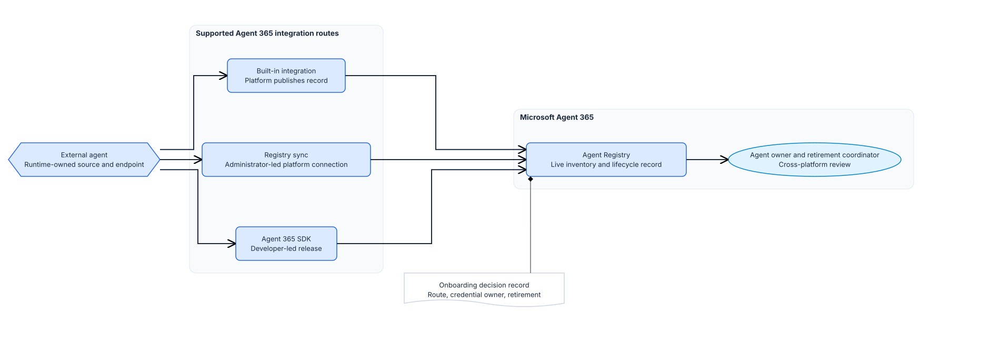

# Implementation - External agent inventory in Microsoft Agent 365

## Module scope

### What we will do

**Objective.** Give one existing external agent a live entry in the Microsoft Agent 365 agent
registry.

Record the onboarding decisions, connect the agent through the route its runtime supports, then
review the resulting record in Agent Registry with the agent owner.

### Why it matters

**Problem.** Agents built outside the Microsoft ecosystem run on their own platforms. Nobody in the
tenant can say which of them exist, who owns them, or how they get retired.

**Solution.** Onboarding the agent to Agent 365 puts it in the same registry as Microsoft-built
agents. The runtime owner keeps maintaining the agent itself through its existing source.

### Boundaries

This module sits outside the numbered session sequence.

It changes one thing: the agent's entry in Agent Registry. Microsoft Agent 365 owns that record;
the runtime owner owns the agent definition, endpoint, and source. Agents built with Microsoft
Foundry, Copilot Studio, or Agent Builder are integrated automatically and do not need this module.
Developer-facing API discovery stays in Azure API Center
([API Center and MCP inventory guide](../../../sessions/07-api-center-ai-mcp-inventory/implementation/README.md)).

Sequencing depends on the route. **Built-in integration** means the agent is already in Agent
Registry, so you can apply the
[Agent 365 access boundary guide](../../../sessions/05-agent-365-access-boundary/implementation/README.md) data controls
first. **Registry sync and the SDK create the registry record here**, so the Agent 365 access-boundary control follows this
module for those routes; its prerequisite of an agent with Available status is not met until the
registry record exists.

## Architecture

### Architecture at a glance

The agent already exists and keeps running where it is. The team picks the Agent 365 integration
that matches the runtime, records the decisions, and then reads the live record.



Registry sync is administrator-led: the Agent 365 administrator connects the external platform in
the Microsoft 365 admin center and runs the sync. The SDK route is developer-led: the runtime owner
adds the integration in code and releases it. Built-in integration covers agents whose platform is
already integrated with Agent 365, where an administrator may still need to enable them.

`onboarding-decision.json` holds what the registry does not: which route was chosen, who owns the
credential behind a platform connection, and how the agent gets retired across both systems.

### Design choices and tradeoffs

| Decision | Chosen approach | Benefit | Limit |
|---|---|---|---|
| Enterprise inventory | Agent 365 Agent Registry | One live record for inventory and lifecycle | The record only arrives through a supported route |
| Route preference | Try built-in and Registry sync before the SDK | No code change when a platform path already covers the need | Registry sync is in preview and its platform list changes |
| Credential handling | Record the issuer, scope, store, and revocation path; keep the secret in the platform's own store | The connection has a named owner who can revoke it | The record is only as good as the review behind it |
| Retirement | One coordinator and one cross-platform plan | Removing the agent covers both the runtime and the registry | Retirement stays a human process across two organizations |

### Architecture guidance

Use [Connect existing agents to Microsoft Agent 365](https://learn.microsoft.com/microsoft-agent-365/connect-existing-agents)
to see which onboarding paths apply to agents built outside the Microsoft ecosystem.

Use [Choose an Agent 365 integration option](https://learn.microsoft.com/microsoft-agent-365/developer/choose-integration-option)
to decide between built-in integration, Registry sync, and the Agent 365 SDK.

Use [Connected platforms in the Microsoft 365 agent registry](https://learn.microsoft.com/microsoft-agent-365/admin/connected-platforms)
for the supported platforms, the connection flow, and the credentials and permissions each platform
requires.

## Before you start

Confirm these prerequisites:

- One external agent runs in the approved nonproduction scope, and its runtime owner controls the
  source that defines it.
- The Agent 365 administrator has confirmed licensing, can operate the selected route, and can open
  Agent Registry.
- For Registry sync, the external platform administrator can issue and revoke a connection
  credential on that platform.
- The agent owner, runtime owner, and retirement coordinator can review the live record and name
  the approved update and removal path.

### Implementation files

| Type | File | Consumer |
|---|---|---|
| Record | [onboarding-decision.json](artifacts/onboarding-decision.json) | The Agent 365 administrator, the retirement coordinator, and the module preflight scripts |

Fill in the record before you run preflight. Every `__REQUIRED_...__` value is a decision the
platform cannot make for you.

A read-only deployment preview is unsupported. Agent 365 onboarding runs through the selected
platform or runtime change path, and neither offers a what-if.

## Decisions and stop conditions

### Select the route

| Runtime fact | Route | Who acts | Expected live state | Stop or switch route when |
|---|---|---|---|---|
| The agent's platform is already integrated with Agent 365 | `built-in` | The platform operator enables or publishes the agent through that platform's current path | The agent is visible in Agent Registry through the platform integration | The platform does not document the integration, or the scenario needs code-level capabilities it does not supply |
| The runtime is one of the supported connected platforms | `registry-sync` | The Agent 365 administrator creates or reviews the connection in the Microsoft 365 admin center, validates its credentials, and runs the sync | The connection names the provider and shows a current sync result; the agent is visible in Agent Registry | The platform is not supported, the credential decision is unresolved, or the agent is not returned by that platform |
| The runtime owner builds and deploys the agent and needs Agent 365 identity, observability, tooling, or notifications in code | `sdk` | The runtime owner adds the Agent 365 SDK integration and releases it through the product's approved path | The released integration produces a live Agent Registry record | A built-in or Registry sync route already meets the need, or the runtime owner cannot release the change |

Registry sync currently supports `Amazon Bedrock`, `Anthropic Claude Managed Agents`,
`Databricks Genie`, `Google Vertex AI`, `Oracle Generative AI Agents`, and `Salesforce Agentforce`.
It is a preview surface, so recheck the connected-platform guidance before you start.

**Stop** if the team proposes a manual registry entry, an unsupported sync platform, or an SDK
change with no approved release path.

### Decide the connected-platform credential

Registry sync authenticates to the external platform with a credential that platform issues. On
every supported platform that credential also carries delete permissions on agent resources, so
treat it as a privileged account.

Record these before anyone opens the connection dialog:

| Field in `onboarding-decision.json` | What to record |
|---|---|
| `issuingOwner` | The role on the external platform that creates the service identity and key |
| `grantedScope` | The approved permission set, named as the platform names it, plus the change reference that approved it |
| `deleteCapabilityDecision` | `accepted-by-retirement-coordinator` once that person has accepted the delete permissions the connection requires |
| `storageLocation` | The managed secret store that holds the credential, named, not a file path |
| `rotationAndRevocationOwner` | The role that rotates the credential and can revoke it on demand |
| `revocationPath` | The concrete revoke action, for example deleting the platform API key and then deleting the connection |

Grant the smallest permission set the platform documents for this connection. Oracle's least-
privilege policy option and Amazon Bedrock's list, get, and delete actions are the shape to aim
for; do not fall back to a full-management role because it is fewer steps.

**Stop before creating the connection** if the credential has no named issuing owner, no rotation
and revocation owner, no approved store outside this repository, or if the retirement coordinator
has not accepted the delete permissions. Never paste a key, secret, token, or the raw permission
policy into this repository.

For the `built-in` and `sdk` routes there is no platform connection. Set `registrySyncPlatform` and
every credential field to `N/A`; preflight rejects a stray value.

### Name the owners and the retirement path

Four roles go in the record: the Agent 365 administrator, the runtime owner, the agent owner, and
the retirement coordinator. Each must control the system they are named for.

The retirement coordinator links one cross-platform plan in `planReference`. That plan covers
blocking user access, revoking the connection credential, removing the Agent Registry record,
retiring the source runtime, and preserving the audit records the organization has to keep.
Preflight checks that all five actions stay in `requiredActions`.

**Stop** if one person claims a role without control of its live system, if a role has no owner, or
if the retirement plan is missing.

### Handle a mismatched record

If the expected record does not appear, check the route first: the platform publication, the
connection's latest sync result, or the released SDK integration. If a record describes the wrong
agent, is duplicated, or has a conflicting owner, **stop**. Do not overwrite the live record or
create a manual replacement. The Agent 365 administrator, runtime owner, and agent owner resolve it
in the source platform, then you repeat the review.

## Implement

### 1. Complete the decision record

Fill in every `__REQUIRED_...__` value in `artifacts/onboarding-decision.json` with the owners in
the room. Keep the credential itself out of the file.

### 2. Run preflight

```powershell
.\scripts\preflight.ps1 -TargetScope "one-approved-external-agent"
```

```bash
./scripts/preflight.sh --target-scope "one-approved-external-agent"
```

Preflight reads the record. It rejects unresolved decisions, a route it does not recognize, a
source reference that is not an absolute HTTP or HTTPS URL or that carries embedded credentials, a
credential decision that is incomplete or points into this repository, and a retirement plan that
drops a required action. It does not contact Agent 365 or the external platform, so it cannot tell
you that a live connection works.

### 3. Complete the selected route

| Route | Operator action | Observe before moving on |
|---|---|---|
| `built-in` | The platform operator follows that platform's current enablement or publication path. | The platform shows the agent enabled or published through its Agent 365 integration. |
| `registry-sync` | The Agent 365 administrator opens **Agents > All Agents**, selects **Manage** in **Connected platforms**, creates or reviews the connection, validates the credentials, and runs **Sync agents**. | The connection names the provider and shows a current sync result. Read the sync errors before expecting anything in Agent Registry. |
| `sdk` | The runtime owner changes the integration in the product repository and deploys it through the approved release path. | The released version is the one meant to register the agent. |

### 4. Read the live record

Open Agent Registry with the Agent 365 administrator. Confirm the record is the intended agent,
arrived through the selected route, and shows a known owner and lifecycle state.

## Confirm the result

The module is complete when the Agent 365 administrator and the agent owner see the intended live
record in Agent Registry, the runtime owner names its update path, and the retirement coordinator
names the approved removal decision. For Registry sync, the connection also shows the selected
provider and a current sync result.

**Stop the module** if the record is missing, the live state does not match the selected route, or
any owner cannot explain the retirement path.

## After implementation

The Agent 365 administrator keeps inventory visibility. The agent owner makes lifecycle decisions.
The retirement coordinator approves the change that removes the agent from use, and keeps the
cross-platform plan in `onboarding-decision.json` current when owners change.

Restore or remove the inventory state through the same route:

| Route | Removal action | Check first |
|---|---|---|
| `built-in` | The platform operator uses that platform's retirement, unpublish, or removal path. | The platform's own lifecycle effect. Agent Registry reflects the result. |
| `registry-sync` | Retire the agent on the connected platform, run or await the sync, then revoke the connection credential through the recorded revocation path. Delete a connection only in the Microsoft 365 admin center. | A connection change can affect every agent synchronized through it. The retirement coordinator and Agent 365 administrator review that blast radius before deleting anything. |
| `sdk` | The runtime owner removes the SDK integration and releases it through the product's approved path. | The live result in Agent Registry, and whether the runtime service itself should also be retired. |

After any of these, review the live record again. If the agent should no longer appear, confirm
that through the route you used.
