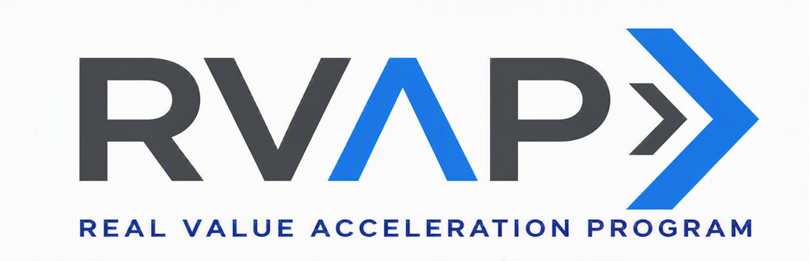

<!-- _class: cover -->



# API Center private tool catalog to Foundry Toolbox

## Optional implementation module · 180 minutes

An approved remote MCP server in Azure API Center, a dedicated Toolbox, and a read-only check.

<!-- Notes: This module extends Session 07 without changing the numbered sequence. -->

---

## Control objective

Connect an approved remote MCP server in Azure API Center to a dedicated versioned Toolbox in
Microsoft Foundry.

Reconcile the catalog record, project connection, allowed tool, and live Toolbox tool list.

<div class="cards">
  <div class="card"><strong>Azure API Center</strong></div>
  <div class="card"><strong>Microsoft Foundry</strong></div>
  <div class="card"><strong>Agent consumers</strong></div>
</div>

<!-- Notes: The catalog is the inventory source. Toolbox is the reusable runtime surface. -->

---

## Why it matters

Session 07 records the MCP server record in API Center. Session 08 defines its security boundary.

Agent teams still need a reusable connection path that does not copy the same endpoint, credentials,
and tool settings into every agent.

Toolbox supplies that stable MCP-compatible endpoint.

<!-- Notes: Keep this focused on the handoff from governed inventory to reusable consumption. -->

---

## Current product path

1. **Azure API Center** holds the MCP server record in API Center.
2. **Foundry Tools** discovers the private catalog under **Build > Tools**.
3. The operator configures the selected record as a project connection.
4. **Toolbox** exposes a versioned, MCP-compatible endpoint for agent reuse.

The private tool catalog is **public preview** and the catalog handoff is **portal-led**.

<!-- Notes: We do not invent an API for the API Center-to-Foundry catalog handoff. -->

---

<!-- _class: decision -->

## Preflight decision

Proceed only when the named owner records the accepted preview and discovery decisions, the
selected API Center asset, version, and deployment, the Foundry project connection, and the
approved MCP tool name.

Stop when the record is missing, access has not propagated, or authentication cannot be represented.

<!-- Notes: This is a real preview decision, not a footnote. -->

---

## Architecture and authority

<div class="cards">
  <div class="card"><strong>1. Catalog</strong><br>Approved MCP record and deployment</div>
  <div class="card"><strong>2. Foundry Tools</strong><br>Portal discovery and project connection</div>
  <div class="card"><strong>3. Toolbox</strong><br>Immutable version and stable consumer endpoint</div>
</div>

**Authoritative state:** API Center for inventory, the project connection for authentication, the
Toolbox version for tool exposure.

<!-- Notes: The repository carries desired state and the reconciliation join, not live credentials. -->

---

<!-- _class: decision -->

## Implementation tradeoffs

| Decision | Route | Limit |
|---|---|---|
| Catalog | API Center private tool catalog | Public preview; portal-led |
| Reuse | New dedicated Toolbox | Adds a managed object |
| Tool surface | One `allowed_tools` entry | Tool rename needs a new version |
| Approval | `always` | Agent runtime must enforce the prompt |
| Check | Version-specific `tools/list` | No remote tool call |

<!-- Notes: Standard mode fits because the change and check are both narrow. -->

---

## Retained implementation

- `catalog-toolbox-binding.json` links the approved catalog record to Foundry names and owners.
- `toolbox-version.json` defines the MCP server, allowed tool, and approval on every call.
- `check_toolbox.py` checks the immutable version without invoking the remote tool.
- Paired preflight scripts stop on unresolved decisions, scope drift, or a name collision.

No credential, token, tenant ID, endpoint, or tool result belongs in the repository.

<!-- Notes: Filled artifacts stay in the approved private configuration store. -->

---

<!-- _class: implementation -->

## Implementation path

1. Complete the catalog record and Toolbox payload.
2. Confirm the MCP server record in API Center under **Build > Tools**.
3. Configure the project connection through the catalog flow.
4. Run preflight.
5. Create the first Toolbox version through the Foundry `v1` data-plane API.
6. Run the version-specific `tools/list` check.

<!-- Notes: The first version of the new Toolbox becomes its default version. -->

---

## Safety gates

- Dedicated Toolbox name must be absent
- Endpoint digest must match the approved API Center deployment
- Project connection must exist in the intended Foundry project
- Payload must contain one MCP object and one allowed tool
- `require_approval` must be `always`
- No fallback to an unreviewed custom MCP entry

<!-- Notes: A failed gate returns ownership to the API catalog, identity, or Session 08 owner. -->

---

## Observable result

The version-specific Toolbox endpoint returns exactly:

```text
<server_label>.<allowed_tool_name>
```

Its tool metadata reports:

```text
require_approval = always
```

The check lists tools. It does not call the remote operation.

<!-- Notes: This confirms the intended connection without causing a business-side effect. -->

---

## What remains in operation

| Owner | Responsibility |
|---|---|
| API catalog owner | MCP server record in API Center, version, deployment, and access |
| Foundry tool owner | Project connection, Toolbox versions, and default |
| Agent release owner | Consumer endpoint and approval experience |
| MCP owner | Runtime contract and Session 08 controls |

<!-- Notes: Reconcile after endpoint, authentication, tool-name, connection, or default-version changes. -->

---

## Restore route

1. Move consuming agents away from the Toolbox endpoint.
2. Check the `implementationSession` marker.
3. Confirm the Toolbox still contains only this module's MCP connection.
4. Delete the exact dedicated Toolbox through the approved Foundry change path.
5. Remove the project connection only when no other consumer uses it.

Keep the MCP server record in API Center unless its owner separately retires the MCP server.

<!-- Notes: No automatic removal script is shipped because consumers must be coordinated first. -->

---

## Related numbered sessions

- **Session 05** owns agent release and endpoint consumption.
- **Session 07** owns the API Center inventory record.
- **Session 08** owns MCP authentication, tool safety, and runtime controls.

This module owns the narrow connection from the catalog to Toolbox.

<!-- Notes: The optional module adds no session number and changes no sequence dependency. -->

---

<!-- _class: closing -->

# Thank you!
