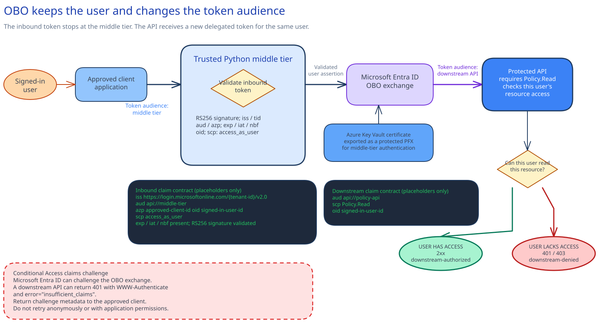

<!-- _class: cover -->

# Delegated API access with OAuth on-behalf-of

## Optional implementation module

Preserve signed-in user authority across a trusted middle tier.

<!-- Notes: This module is selected by architecture need. It is not Session 15. -->

---

## Control objective

A trusted Python middle tier exchanges the signed-in user's assertion for a delegated token for the
protected downstream API.

The check shows one allowed call and one denial caused by missing downstream user authority.

<!-- Notes: The exchange preserves user authority. The downstream API still makes the resource decision. -->

---

## Why it matters

**Problem.** A workload identity gives every request the same application authority. That does not
work when the downstream API must decide for the signed-in user.

**Solution.** OBO carries user context across the middle tier without forwarding the original
bearer token.

<!-- Notes: Use this module only for a real per-user authorization requirement. -->

---

## Control boundary

**In scope:** delegated permissions and consent, inbound token checks, the OBO exchange, protected certificate use, and payload-free checks.

Use the existing applications and downstream authorization model. The downstream API owner manages
resource assignments and any new user grants.

<!-- Notes: The existing client, middle tier, and downstream API are approved inputs. -->

---

## Architecture and authority

<!-- _class: diagram -->

<!-- Notes: The client gets a token for the middle tier. The middle tier validates it, then uses the user assertion and its certificate to request a downstream token from Microsoft Entra ID. Entra issues the token. The downstream API authorizes resource access for each user. -->

---

## What this means

In the OAuth on-behalf-of (OBO) flow, the inbound token stops at the middle tier. Microsoft Entra
ID issues a delegated token for the downstream API. The API can then allow one user and deny
another.

---

<!-- _class: decision -->

## Tradeoffs behind this design

| Engineering choice | Route used here | What the team accepts |
| --- | --- | --- |
| Authority at the API | OBO delegated token | Consent and separate token audiences |
| Middle-tier identity | Protected certificate PFX | Rotation; nonexportable HSM keys need another design |
| Existing registrations | Merge exact entries | Preflight compares live state because Graph has no what-if |
| Boundary check | Permitted and denied users | Two users with different downstream access |

<!-- Notes: OBO fits only when the API must decide for the signed-in user. Use workload identity for shared or background work. -->

---

<!-- _class: decision -->

## Decision gate 1 - Is user authority required?

Choose OBO only when:

- the downstream resource is user-owned or user-scoped;
- the downstream API evaluates the signed-in user; and
- application-only authority would be too broad or incorrect.

Otherwise, stop here and use a workload identity.

<!-- Notes: Do not add delegated consent to a shared background operation. -->

---

## The inbound token stops at the middle tier

The Python component validates:

1. issuer and tenant;
2. middle-tier audience;
3. approved calling client;
4. lifetime and signature;
5. signed-in user claim; and
6. delegated `access_as_user` scope.

The original bearer token never reaches the downstream API.

<!-- Notes: Token forwarding is not OBO. -->

---

## OBO creates a new delegated token

The middle tier uses MSAL with the protected PFX and sends:

- the validated user assertion;
- its own client identity; and
- certificate-based client authentication.

Microsoft Entra ID issues a token for the approved downstream delegated scope.

<!-- Notes: The certificate authenticates the middle tier. The assertion identifies the user. -->

---

<!-- _class: decision -->

## Decision gate 2 - Consent and scope

The identity owner approves:

- client to middle tier: `access_as_user`;
- middle tier to downstream API: `Policy.Read`; and
- the approved consent type.

**Stop if an existing grant is ambiguous or the requested scope is broader than the read operation.**

<!-- Notes: The configure scripts merge the module entries and preserve unrelated permissions. -->

---

## Downstream authorization still decides

A successful exchange shows that Microsoft Entra ID accepted the trust chain. The downstream API
must still check the delegated scope and that user's resource assignment.

<!-- Notes: This is why the module needs a denied-user check. -->

---

## Intended path and failure path

| Check | Expected result |
| --- | --- |
| Allowed user | 2xx plus `downstream-authorized` |
| User without downstream access | 401/403 plus `downstream-denied` |

No application-only retry. No token or payload logging.

<!-- Notes: The two users must differ at the downstream resource boundary. -->

---

<!-- _class: implementation -->

## Implement the operational control

1. Complete the application, permission, and token claim files.
2. Bind the exportable Key Vault certificate as a protected PFX.
3. Preview and apply the delegated permissions listed in the module record.
4. Deploy the Python middle tier through the normal pipeline.
5. Run the allowed and denied checks.

---

## Stop conditions

- Inbound token reaches the downstream API
- Application-only token enters the OBO path
- Permission or consent is broader than the approved scope
- Certificate leaves the approved runtime
- Assertion, token, or payload enters diagnostics
- Downstream denial is replaced with a workload-authorized retry

<!-- Notes: Any one of these changes the authority boundary. -->

---

## Operating ownership

| Owner | Operational responsibility |
| --- | --- |
| Identity | Delegated scopes, consent, certificate registration |
| Application | Inbound validation, OBO exchange, error handling |
| Downstream API | User-specific resource authorization |
| Operations | Payload-free logs and certificate expiry |

<!-- Notes: Restore removes exact module-owned permissions and grants, not the applications. -->

---

## Direct prerequisites and authority

- Existing Microsoft Entra registrations identify the client, confidential middle tier, and downstream API.
- The middle tier exposes its own audience and User `access_as_user` scope. The downstream API exposes a different audience and narrow delegated read scope.
- A named customer identity owner approves the exact delegated permissions and consent.
- **Choose signed-in user OBO** only when the downstream API must authorize each user. Shared or background work uses application-only managed identity and is outside this module.

<!-- Notes: The authority decision, registrations, API audiences, scopes, and identity owner are direct prerequisites. No numbered session is required. -->

---

<!-- _class: closing -->

# Thank you!
