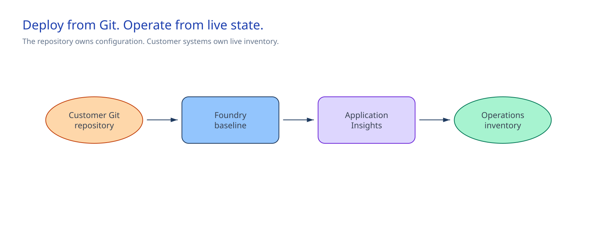
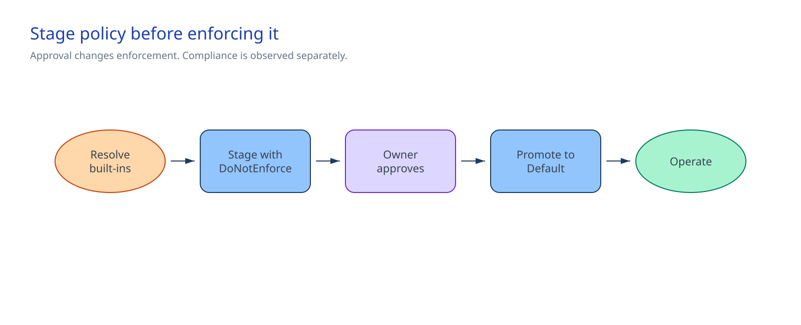

<!-- _class: cover -->

AI Governance Co-implementation · Session 01

# Microsoft Foundry platform baseline, inventory, and landing-zone guardrails

300 minutes · Deploy the baseline, stage the guardrails, then confirm the live result

---

## Why it matters

**Problem.** Later sessions have no shared, tagged Foundry resource to build on, and turning on
policy enforcement before checking its effect risks blocking changes the team did not anticipate.

**Solution.** Deploy an owned Microsoft Foundry baseline with workspace-based Application Insights,
then stage resource-group guardrails in `DoNotEnforce` before approved enforcement.

By the end of the session:

- Bicep can redeploy the Foundry resource, child project, and observability resources.
- Tags name the owners, classification, criticality, cost center, environment, and expiry.
- The customer inventory holds the live resource details.
- Azure Policy checks approved locations and required tags on the same resource group.
- The assignment reaches `Default` only after review and approval.

<!-- Notes: Keep the result concrete. The private-networking and DNS control adds private endpoints. Later sessions request their own scoped access. -->

---

<!-- _class: two-column -->

## Architecture

The repository owns the reusable configuration.

Azure owns the live resources and policy state.

Customer systems hold inventory, exemptions, and change approval.

The Application Insights connection uses the stable `ApiKey` path. A preview authentication change needs a later decision.

<!-- Notes: Explain the ownership boundary before discussing commands. -->

---

<!-- _class: decision -->

## Implementation tradeoffs

| Decision | Required answer |
|---|---|
| Scope | Approved subscription and exact sandbox resource group |
| Network | `public`, `public-private-inbound`, or `byo-vnet` |
| Governance | Approved regions, tags, owners, and expiry |
| Enforcement | Policy review owner and promotion authority |

For `byo-vnet`, approve the delegated subnet, private-endpoint subnet, route, firewall next hop, and network owner before creating the Foundry account.

The deployment operator receives time-bound **Contributor** on the exact sandbox resource group and
**Resource Policy Contributor** on the approved subscription. The cloud platform owner approves
access through the customer process and removes it after confirmation.

<!-- Notes: These four decisions change what the team deploys. Everything else follows from them. -->

---

## Stage before enforcing

`DoNotEnforce` shows likely impact without denying requests.

`Default` starts enforcement after Policy Insights is current, exemptions are understood, restore ownership is ready, and the change authority approves the change.

<!-- Notes: Enforcement mode and observed compliance are separate facts. -->

---

<!-- _class: implementation -->

## Implementation path

**Total session: 300 minutes. Guided implementation: about 240 minutes.**

1. Complete the parameters and mark the approved resource group.
2. Resolve the current policy built-ins and run preflight.
3. Deploy the optional BYO VNet foundation and the Foundry baseline.
4. Update the customer inventory.
5. Deploy the initiative and stage the assignment in `DoNotEnforce`.
6. Review current findings, promote to `Default`, and confirm the result.

The remaining time covers briefing, customer decisions, and the operating handoff.

<!-- Notes: The implementation guide contains the paired PowerShell and Bash commands. -->

---

## Stop before the change when

- Azure CLI targets the wrong subscription or resource group.
- A `__REQUIRED_*__` value remains.
- The resource group belongs to another implementation or lacks owner approval.
- A deployment preview changes unrelated resources.
- A built-in policy is unavailable, deprecated, or no longer matches the intended check.
- Policy findings are stale or unexplained.
- The cloud platform owner or change authority has not approved promotion.

<!-- Notes: These are the gates that protect scope and enforcement. -->

---

<!-- _class: two-column -->

## Confirm and operate

### Confirm once

- The baseline preview has no unintended change.
- The live assignment uses the approved scope.
- Enforcement mode is `Default`.
- Locations, required tags, and the session marker match the approved inputs.

### Keep in operation

- Platform owner: Foundry baseline
- Network owner: optional BYO VNet foundation
- Cloud platform owner: policy and exemptions
- Platform operations: live inventory
- Change authority: promotion and restore decisions

<!-- Notes: The AppInsights connection may show expected write-only what-if noise. Investigate any other change. -->

---

## Platform baseline access and handoff

This control leaves:

- a tagged Foundry resource and child project;
- a workspace-based Application Insights connection;
- reusable Bicep and parameter files;
- live inventory owned by operations; and
- enforced resource-group guardrails with a documented restore path.

The cloud platform owner removes the platform baseline deployment assignments after confirmation. Each
later session requests the scoped access needed for its own control.

<!-- Notes: End on the concrete dependency, not a recap of every implementation detail. -->

---

<!-- _class: closing -->

# Thank you!
