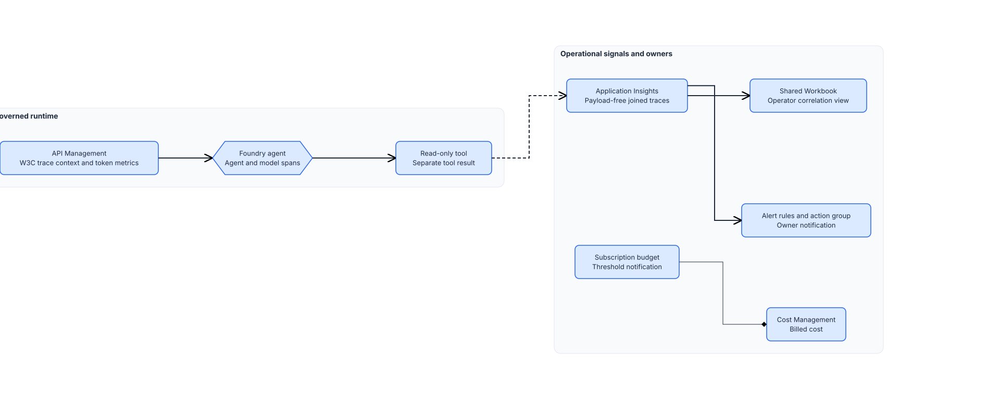

<!-- _class: cover -->

AI Governance Co-implementation · Session 11

# Observability, cost, and operational controls

210 minutes · Trace the service, route alerts, and assign cost

<!-- Notes: Threat-defense testing connected adversarial behavior to detection. The observability control adds operating controls for one service. -->

---

## The control and result

> Deploy privacy-safe operating controls for one governed service. Correlate supported runtime
> spans, route alerts, notify owners at budget thresholds, and follow incident paths with named
> owners.

By the end of the session:

- One non-sensitive correlation ID joins supported gateway, agent, model, and tool spans.
- A workbook and three alerts show operational, tool, and AI-quality failures.
- APIM token metrics provide a bounded estimate; Cost Management remains the billed source.
- Budget thresholds notify owners without stopping spend.
- The controlled promotion workflow can run the paired payload-free smoke check.

<!-- Notes: The objective is useful operating context, not maximum logging. -->

---

## Why it matters

**Problem.** A gateway, agent, model, or tool failure looks the same from outside the system, and a
cost or security signal can go unnoticed until it's already an incident.

**Solution.** Joined runtime spans separate where a request failed, alerts route the signal to an
owner, and the budget and runbook give the cost and incident owners a working signal, all without
capturing prompts or tool payloads.

<!-- Notes: Correlation supports diagnosis. It does not replace the source systems. -->

---

<!-- _class: two-column -->

## Architecture and data boundary

Application Insights stores supported runtime telemetry.

Cost Management stores billed cost, normally after an 8-24 hour delay.

Defender and the SOC system keep security and incident records.

The customer APIM repository owns gateway policy. The controlled promotion workflow consumes the temporary smoke result.

An external SIEM route is optional. It receives the same filtered contract through the
customer-owned export path.

<!-- Notes: Correlation connects records. It does not move every record into one store. -->

---

<!-- _class: decision -->

## Implementation tradeoffs

| Decision | Chosen approach | Limit |
|---|---|---|
| Runtime content | Exclude prompts, responses, tool payloads, credentials, query strings, and user data | A diagnostic exception needs bounded scope, retention, expiry, ownership, and data-protection approval |
| Trace volume | Sample at the source, preserve selected traces, and keep metrics unsampled | Rare failures may need an approved sampling exception |
| Cost signal | Use low-cardinality APIM token metrics for estimates and Cost Management for billing | Counts can be incomplete; budget notifications do not stop resources |
| External export | Keep disabled by default; use an owned, filtered Event Hubs or customer export path when required | Another destination adds retention and access decisions |

APIM allows five custom token-metric dimensions, 100 values per dimension, and 1,000 active time
series per namespace. It silently drops new values or series beyond those limits.

<!-- Notes: A tool failure keeps its own result. Do not relabel it as model failure. -->

---

<!-- _class: implementation -->

## Implementation path

**Total session: 210 minutes. Guided implementation: about 150 minutes.**

1. Confirm the prerequisite runtime, tracing, evaluation, and security controls.
2. Complete the telemetry, retention, logging, cost, alert, and incident decisions.
3. Confirm the deployed instrumentation and customer-owned APIM policy merge.
4. Run preflight and inspect the resource-group and subscription what-if previews.
5. Deploy the workbook, three alerts, and subscription budget.
6. Run the paired smoke check and hand the control to operations.

The remaining time covers briefing, owner decisions, and restore planning.

<!-- Notes: Instrumentation and the APIM merge are pre-work. The session verifies them before deployment. -->

---

## Safety gates and access

Stop before a change when:

- Azure CLI targets production, the wrong subscription, or the wrong resource.
- A `__REQUIRED_*__` value remains or telemetry can export sensitive content.
- W3C context breaks, results collapse across spans, or a dimension is unbounded.
- Alert thresholds lack baseline data or an owner.
- Either what-if changes unrelated resources or removes an action route.
- A budget is described as real-time spend enforcement.

The operator uses **Monitoring Contributor** on the deployment group, **Log Analytics Reader** on
the workspace, **Monitoring Reader** on monitored resources outside the group, and **Cost Management
Contributor** on the subscription. Human access expires after confirmation.

<!-- Notes: Preflight checks the artifacts, exact scope, resource binding, privacy rules, cardinality, and both previews. -->

---

## Confirm once

The GitHub promotion workflow runs `smoke.ps1` or `smoke.sh` with:

- `pipeline`, `nonproduction`, the release commit SHA, and a result path inside `RUNNER_TEMP`;
- different HTTPS normal and handled-failure routes;
- the Application Insights and Log Analytics resource IDs; and
- the bearer token held in memory.

The payload-free result must show:

- the live workspace binding and exact commit SHA on both request records;
- successful model and tool results on the normal route;
- a failed tool result and independent successful model result on the failure route;
- distinct correlation IDs and three stable telemetry queries; and
- no probe marker or prohibited payload property.

Default polling is 180 seconds with a 15-second retry.

<!-- Notes: Stop on a missing hop, commit mismatch, matching IDs, unstable ingestion, or sensitive content. -->

---

<!-- _class: two-column -->

## Operate and restore

### Keep in operation

- Observability: instrumentation, sampling, retention, workbook, alerts
- Gateway: APIM correlation and token metrics
- AI quality and security: evaluation signals and incident routing
- Cost: tags, budget thresholds, billed-cost reconciliation
- Service and incident owners: SLO, containment, recovery

### Restore through owning paths

1. Route to the last approved governed agent version.
2. Restore the previous APIM gateway policy.
3. Disable only noisy observability alert rules.
4. Remove only previewed, session-tagged resources.
5. Delete the exact budget with cost-owner approval.
6. Preserve records under incident or retention obligations.

Do not disable telemetry, Defender, or SOC routing to silence a real signal.

<!-- Notes: The controlled promotion workflow promotes these definitions and consumes the smoke result. -->

---

<!-- _class: closing -->

# Thank you!
