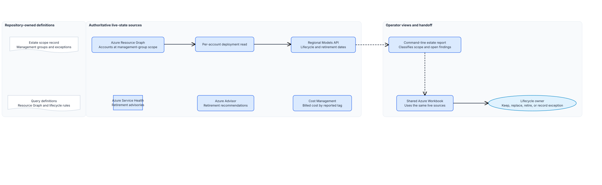

<!-- _class: cover -->


# Foundry estate and lifecycle operations

## Session 14

What AI do we run, where, and who owns it?

<!-- Notes: This inventory applies platform-tagging, model-lifecycle, and observability controls across the approved estate. -->

---

## Control objective

Read every Azure AI account across the approved management groups, check live model lifecycle data,
and report the findings that need an owner.


<!-- Notes: The Workbook is the only Azure resource this session deploys. -->

---

## Why it matters

**Problem.** Azure does not provide one governed, tenant-wide inventory of AI accounts, model
deployments, and retirement signals.

**Solution.** One report joins estate inventory, deployment lifecycle, Service Health, and Advisor
signals to the recorded scope.

<!-- Notes: Ask how they would find an account created outside the approved path today. -->

---

## Architecture overview

1. Resource Graph returns every Azure AI account per management group.
2. The report classifies each against the recorded scope.
3. A second read adds deployments and regional model lifecycle data.
4. Service Health and Advisor add service-retirement signals.
5. The shared Workbook gives operators a portal view.
6. Cost tag values hand off to Cost Management.

<!-- Notes: Resource Graph lags Resource Manager by a short interval. -->

---

<!-- _class: diagram -->

## Estate operations architecture



<!-- Notes: The report applies governance rules. The Workbook presents live state. -->

---

## What Resource Graph does and does not carry

**Carries:** the account, its kind, SKU, region, network setting, tags, and subscription.

**Does not carry:** projects and model deployments.

That gap is why the model layer is a second read per account rather than part of the query.

<!-- Notes: Anyone expecting one query for everything needs to hear this early. -->

---

## The adjacent list is the interesting one

In scope: `AIServices` and `OpenAI`.

Everything else is reported as adjacent, and becomes a finding unless someone recorded it.

Widening the kind list to silence the report says those accounts are governed too.

<!-- Notes: Unmanaged AI usually shows up here first. -->

---

<!-- _class: decision -->

## Decisions and tradeoffs

| Choice | Route used here | Limit |
|---|---|---|
| Scope | Management groups, not subscription lists | A new subscription is caught, a new tenant is not |
| Model layer | One CLI call per account | Run time grows with account count |
| Lifecycle | Models API, Service Health, and Advisor | Owner must assess a replacement |
| Operator view | Shared Workbook deployed by Bicep | Live state still needs report-based triage |
| Exceptions | Named owner and expiry | An expired exception is a finding again |
| Cost | Report tag values, read amounts in Cost Management | The report shows no spend |
| Output | Console, optional file outside the repository | Trends need the operator to keep files |

<!-- Notes: Reader at each management group is the only access needed. -->

---

<!-- _class: implementation -->

## Implement the session

1. Complete the estate scope record and run preflight.
2. Deploy the shared estate and lifecycle Workbook.
3. Run the estate report.
4. Give every estate and lifecycle finding an owner.
5. Filter Cost Management by the reported cost tag values.

<!-- Notes: Preflight confirms read access per management group with a counting query. -->

---

## Safety gates

- Stop when a listed management group cannot be read; that is a role gap, not an empty estate.
- Stop when the tag keys differ from the platform-baseline guardrail.
- Stop when an exception has no owner or expiry.
- Stop when a model is deprecated, retired, near retirement, or absent from the live catalog.
- Stop when Service Health or Advisor reports a retirement signal for the estate.
- Stop the review when a finding has no owner.

<!-- Notes: An unowned Azure AI account is the finding, not an inconvenience. -->

---

## Expected result

The Workbook shows accounts, posture, deployments, lifecycle, Foundry projects, Service Health,
Advisor recommendations, and resource health for the selected subscriptions.

```text
Read 41 Azure AI account(s): 34 in scope, 7 of another kind,
with 96 model deployment(s).
Found 1 Service Health retirement signal(s) and 2 Azure Advisor
retirement finding(s).
PASS: Every in-scope account has the required tags, an approved
region, a recorded kind, and no lifecycle finding.
```

<!-- Notes: The report exits with a failure while any finding is open. -->

---

## Operating state and restore

| Owner | Responsibility |
|---|---|
| Platform inventory owner | Scope record, query, and review cadence |
| Workbook operator | Workbook deployment and portal access |
| Account owners | Tags, region, and approved path |
| Lifecycle owner | Model and service-retirement review and replacement decisions |
| Cost owner | Cost Management view filtered by the cost tag |
| observability owner | Runtime telemetry and alerts |

The workbook is Azure state. Delete report files kept outside the
repository when they are no longer needed.

<!-- Notes: A rising adjacent count means teams are creating accounts outside the approved path. -->

---

<!-- _class: closing -->

# Thank you!
