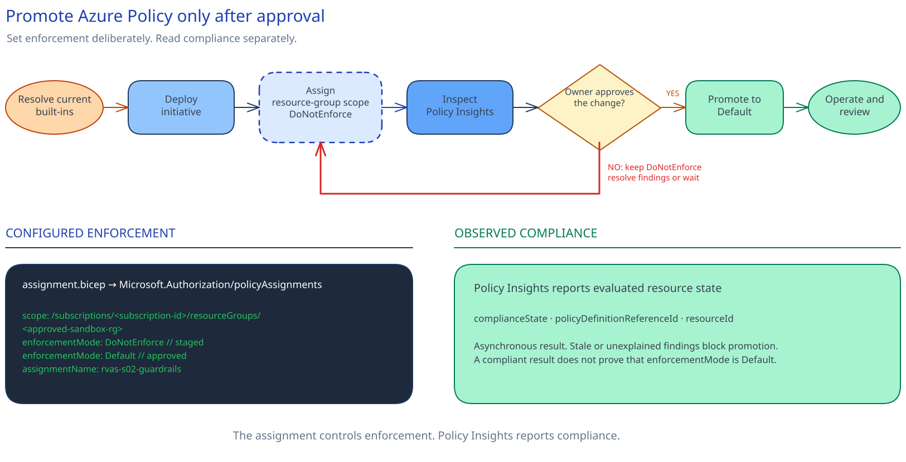

# Implement the Microsoft Foundry platform baseline and guardrails

## Session scope

### What we will do

Deploy an **owned Microsoft Foundry baseline with workspace-based Application Insights**, then
stage resource-group guardrails before approved enforcement.

The baseline contains one current `AIServices` Foundry resource, one child project, a Log Analytics
workspace, Application Insights, and the project connection. Bicep applies the approved ownership,
risk, cost, environment, and expiry tags.

The guardrails use current Microsoft built-ins for allowed locations and required tags. The
assignment starts in `DoNotEnforce`. The cloud platform owner reviews current Policy Insights
results before the change authority approves `Default` enforcement.

### Why it matters

Later sessions need a Foundry resource and project that the team can redeploy from source. The tags
name the owners. Application Insights provides the tracing destination used later in the series.

Staging the policy assignment shows its likely effect before Azure starts denying evaluated
resource changes.

### Boundaries

Use one approved sandbox or nonproduction resource group. This session owns the Foundry baseline,
its optional BYO VNet foundation, and the policy assignment on that resource group.

Azure holds live resource and policy state. The repository holds the Bicep definitions. Platform
operations keeps live inventory in the customer system, and the customer change system holds the
promotion decision and any exemptions.

The Application Insights connection uses the stable `ApiKey` configuration without placing its
connection string in parameters or outputs. A future approved change may adopt the preview
`ProjectManagedIdentity` trace-ingestion path.

For this session, the deployment operator uses time-bound **Contributor** on the approved sandbox
resource group and **Resource Policy Contributor** on the approved subscription. The cloud platform
owner approves that access through the customer access process and removes it after confirmation.
[Session 02](../../02-private-networking-dns/implementation/README.md) adds private endpoints and
DNS. Existing resources need separate policy remediation.

## Architecture

### Architecture at a glance

The customer repository deploys the Foundry resource, child project, and observability resources
into the approved resource group. Operations records the resulting live resources in the customer
inventory system.

Azure Policy evaluates resource changes in the same group. A subscription-level initiative groups
the allowed-location and required-tag built-ins. Its resource-group assignment moves from
`DoNotEnforce` to `Default` after review and approval.




### Design choices and tradeoffs

| Decision | Chosen approach | Tradeoff |
|---|---|---|
| Foundry resource model | Current `AIServices` resource with one child project | Confirmed classic assets need separate migration work |
| Network pattern | Select `public`, `public-private-inbound`, or `byo-vnet` before account creation | BYO VNet needs the approved subnet and route before the baseline deploys |
| Tracing authentication | Stable `ApiKey` project connection, resolved inside Bicep | The connection remains key-based until an approved preview upgrade |
| Policy rollout | Assign to the exact sandbox group in `DoNotEnforce`, then promote the same assignment | Evaluation takes time, so stale findings delay enforcement |

### Architecture guidance

- [What is Microsoft Foundry?](https://learn.microsoft.com/en-us/azure/foundry/what-is-foundry)
- [Deploy a Foundry resource by using Bicep](https://learn.microsoft.com/en-us/azure/foundry/how-to/create-resource-template)
- [Initiative definition structure](https://learn.microsoft.com/en-us/azure/governance/policy/concepts/initiative-definition-structure)

## Before you start

Confirm these requirements:

- The approved subscription, resource group, regions, network pattern, tags, owners, and change
  record are recorded. The cloud platform owner confirms that they name the same scope.
- The deployment operator has time-bound **Contributor** on the exact approved sandbox resource
  group and time-bound **Resource Policy Contributor** on the approved subscription.
- The operator can run deployment what-if at resource-group and subscription scope.
- The cloud platform owner has reviewed inherited policy assignments and exemptions.
- The required Azure resource providers are registered.

Use team aliases and synthetic classifications in tags. Do not place credentials, resource IDs,
endpoints, prompts, traces, responses, or customer data in parameters, tags, outputs, or source
control.

### Implementation files

| Type | File | Consumer |
|---|---|---|
| Deployment | [`artifacts/infra/foundry/main.bicep`](artifacts/infra/foundry/main.bicep) | The platform deployment pipeline |
| Deployment | [`artifacts/infra/network/main.bicep`](artifacts/infra/network/main.bicep) | The platform deployment pipeline |
| Deployment | [`artifacts/environments/sandbox.bicepparam`](artifacts/environments/sandbox.bicepparam) | The platform deployment pipeline |
| Deployment | [`artifacts/environments/network-foundation.bicepparam`](artifacts/environments/network-foundation.bicepparam) | The platform deployment pipeline |
| Deployment | [`artifacts/policy/initiative.bicep`](artifacts/policy/initiative.bicep) | The subscription policy deployment pipeline |
| Deployment | [`artifacts/policy/assignment.bicep`](artifacts/policy/assignment.bicep) | The sandbox policy deployment pipeline |
| Deployment | [`artifacts/policy/guardrail-settings.json`](artifacts/policy/guardrail-settings.json) | The initiative and assignment parameter builds |
| Deployment | [`artifacts/environments/initiative.bicepparam`](artifacts/environments/initiative.bicepparam) | The subscription policy deployment pipeline |
| Deployment | [`artifacts/environments/policy-assignment.bicepparam`](artifacts/environments/policy-assignment.bicepparam) | The sandbox policy deployment pipeline |

## Decisions and stop conditions

Decide four things before deployment:

1. **Scope, ownership, and access.** Name the approved subscription and exact resource group.
   The cloud platform owner approves the deployment operator's two time-bound assignments through
   the customer access process, then removes them after confirmation. Confirm who owns the
   baseline, policy assignment, inventory record, exemptions, and promotion decision.
2. **Network pattern.** Select `public`, `public-private-inbound`, or `byo-vnet`. The choice has no
   default. For `byo-vnet`, approve the delegated subnet, private-endpoint subnet, route, firewall
   next hop, and network owner.
3. **Governance values.** Set the approved regions and the required ownership, classification,
   criticality, cost, and expiry tags.
4. **Policy promotion.** Name the cloud platform owner who reviews Policy Insights and the change
   authority that may approve `Default`.

| Gate | Continue when | Stop when |
|---|---|---|
| Deployment scope | Azure CLI targets the approved subscription and resource group | The scope is wrong, shared without approval, or marked for another implementation |
| Deployment preview | The preview contains the documented baseline and optional network foundation | It changes unrelated resources or uses unresolved values |
| Policy definition | Both built-ins are current and still match the intended location and tag checks | A definition is unavailable, deprecated, or has changed behavior |
| Promotion | Policy Insights is current, exemptions are understood, restore ownership is ready, and enforcement is approved | Results are stale or either owner has not approved the change |

Keep the Application Insights connection on the stable `ApiKey` path. Stop if the selected network
pattern, approved region, policy behavior, or tracing authentication changes. Recheck the sources in
`session.yaml` before continuing.

## Implement

### 1. Complete the inputs and mark the resource group

Replace every `__REQUIRED_*__` value in the environment parameter files. Use an ISO `yyyy-MM-dd`
expiry date.

Inspect the group before changing it:

```powershell
$resourceGroup = "rg-rvas-s01-sandbox"
$location = "<approved-region>"
az group show --name $resourceGroup --query "{id:id,location:location,tags:tags}" --output jsonc
```
```bash
resource_group="rg-rvas-s01-sandbox"
location="<approved-region>"
az group show --name "$resource_group" --query '{id:id,location:location,tags:tags}' --output jsonc
```

If the group does not exist, create it through the approved change path. Merge the session marker
and governance tags without removing existing tags:

```powershell
$resourceGroupId = az group show --name $resourceGroup --query id --output tsv --only-show-errors
az tag update `
  --resource-id $resourceGroupId `
  --operation Merge `
  --tags `
    implementationSession=01-platform-baseline `
    environment=sandbox `
    businessOwner="<team-alias>" `
    technicalOwner="<team-alias>" `
    dataClassification="<synthetic-classification>" `
    criticality="<approved-value>" `
    costCenter="<sandbox-cost-code>" `
    expiryDate="<yyyy-MM-dd>" `
  --only-show-errors
```
```bash
resource_group_id="$(az group show --name "$resource_group" --query id --output tsv --only-show-errors)"
az tag update \
  --resource-id "$resource_group_id" \
  --operation Merge \
  --tags \
    implementationSession=01-platform-baseline \
    environment=sandbox \
    businessOwner="<team-alias>" \
    technicalOwner="<team-alias>" \
    dataClassification="<synthetic-classification>" \
    criticality="<approved-value>" \
    costCenter="<sandbox-cost-code>" \
    expiryDate="<yyyy-MM-dd>" \
  --only-show-errors
```

### 2. Resolve the built-ins and run preflight

Resolve the current allowed-location and required-tag policy definitions:

```powershell
$builtIns = .\scripts\resolve-builtins.ps1 | ConvertFrom-Json
$env:RVAS_ALLOWED_LOCATIONS_POLICY_ID = $builtIns.allowedLocations.id
$env:RVAS_REQUIRE_TAG_POLICY_ID = $builtIns.requireTag.id
```
```bash
built_ins="$(./scripts/resolve-builtins.sh)"
export RVAS_ALLOWED_LOCATIONS_POLICY_ID="$(
  python3 -c 'import json,sys; print(json.load(sys.stdin)["allowedLocations"]["id"])' <<<"$built_ins"
)"
export RVAS_REQUIRE_TAG_POLICY_ID="$(
  python3 -c 'import json,sys; print(json.load(sys.stdin)["requireTag"]["id"])' <<<"$built_ins"
)"
```

Run preflight:

```powershell
.\scripts\preflight.ps1 `
  -ResourceGroupName $resourceGroup `
  -DeploymentName "rvas-s01-baseline" `
  -DeploymentLocation $location `
  -ConfirmInheritedPolicyReview
```
```bash
./scripts/preflight.sh \
  --resource-group-name "$resource_group" \
  --deployment-name "rvas-s01-baseline" \
  --deployment-location "$location" \
  --confirm-inherited-policy-review
```

Preflight rejects unresolved values, wrong scopes, inconsistent tag settings, changed built-ins,
missing providers, Bicep errors, and unexpected deployment previews.

### 3. Deploy the optional network foundation and baseline

For `byo-vnet`, deploy the network foundation first. Set its
`agentSubnetResourceId` output in `sandbox.bicepparam`. Skip this deployment for the other network
patterns.

```powershell
az deployment group create `
  --resource-group $resourceGroup `
  --name "rvas-s01-network-foundation" `
  --parameters .\artifacts\environments\network-foundation.bicepparam `
  --only-show-errors

az deployment group create `
  --resource-group $resourceGroup `
  --name "rvas-s01-baseline" `
  --parameters .\artifacts\environments\sandbox.bicepparam `
  --only-show-errors
```
```bash
az deployment group create \
  --resource-group "$resource_group" \
  --name "rvas-s01-network-foundation" \
  --parameters ./artifacts/environments/network-foundation.bicepparam \
  --only-show-errors

az deployment group create \
  --resource-group "$resource_group" \
  --name "rvas-s01-baseline" \
  --parameters ./artifacts/environments/sandbox.bicepparam \
  --only-show-errors
```

For a non-BYO-VNet pattern, run only the baseline deployment command.

### 4. Update the customer inventory

List the deployed resources:

```powershell
az resource list `
  --resource-group $resourceGroup `
  --query "[].{name:name,type:type,location:location,id:id,tags:tags}" `
  --output json
```
```bash
az resource list \
  --resource-group "$resource_group" \
  --query "[].{name:name,type:type,location:location,id:id,tags:tags}" \
  --output json
```

Platform operations updates the customer inventory with the live details. When classic assets are
already known to be in scope, the platform owner records confirmed migration candidates in the
customer backlog. Classic discovery is not part of the normal deployment path.

### 5. Stage and promote the guardrails

Deploy the initiative and capture its ID:

```powershell
az deployment sub create `
  --location $location `
  --name "rvas-s01-guardrails-initiative" `
  --parameters .\artifacts\environments\initiative.bicepparam `
  --only-show-errors

$env:RVAS_INITIATIVE_DEFINITION_ID = az deployment sub show `
  --name "rvas-s01-guardrails-initiative" `
  --query properties.outputs.initiativeDefinitionId.value `
  --output tsv `
  --only-show-errors
```
```bash
az deployment sub create \
  --location "$location" \
  --name "rvas-s01-guardrails-initiative" \
  --parameters ./artifacts/environments/initiative.bicepparam \
  --only-show-errors

export RVAS_INITIATIVE_DEFINITION_ID="$(
  az deployment sub show \
    --name "rvas-s01-guardrails-initiative" \
    --query properties.outputs.initiativeDefinitionId.value \
    --output tsv \
    --only-show-errors
)"
```

Rerun preflight, then deploy the assignment with `enforcementMode = 'DoNotEnforce'`:

```powershell
az deployment group create `
  --resource-group $resourceGroup `
  --name "rvas-s01-guardrails-assignment" `
  --parameters .\artifacts\environments\policy-assignment.bicepparam `
  --only-show-errors
```
```bash
az deployment group create \
  --resource-group "$resource_group" \
  --name "rvas-s01-guardrails-assignment" \
  --parameters ./artifacts/environments/policy-assignment.bicepparam \
  --only-show-errors
```

Trigger a policy scan and review current findings:

```powershell
az policy state trigger-scan --resource-group $resourceGroup --no-wait --only-show-errors
az policy state list `
  --resource-group $resourceGroup `
  --query "[].{state:complianceState,reference:policyDefinitionReferenceId,resource:resourceId}" `
  --output table `
  --only-show-errors
```
```bash
az policy state trigger-scan --resource-group "$resource_group" --no-wait --only-show-errors
az policy state list \
  --resource-group "$resource_group" \
  --query '[].{state:complianceState,reference:policyDefinitionReferenceId,resource:resourceId}' \
  --output table \
  --only-show-errors
```

Policy evaluation is asynchronous. Keep `DoNotEnforce` while findings are stale or unexplained.
After the cloud platform owner completes the review and the change authority approves enforcement,
change the assignment parameter to `Default`, rerun preflight, and redeploy the same assignment.

Commit the approved Bicep, parameter files, and scripts. Keep live inventory, approvals, exemptions,
and command responses in the customer systems.

## Confirm the result

Rerun preflight once. The Foundry baseline preview must contain no unintended change. The
`AppInsights` project connection may appear as `Modify` or `Deploy` because its credential is
write-only; stop on any other unexplained change.

Inspect the live assignment:

```powershell
$scope = az group show --name $resourceGroup --query id --output tsv --only-show-errors
az policy assignment show `
  --name "rvas-s01-guardrails" `
  --scope $scope `
  --query "{scope:scope,enforcementMode:enforcementMode,initiative:policyDefinitionId,metadata:metadata,parameters:parameters}" `
  --output jsonc `
  --only-show-errors
```
```bash
scope="$(az group show --name "$resource_group" --query id --output tsv --only-show-errors)"
az policy assignment show \
  --name "rvas-s01-guardrails" \
  --scope "$scope" \
  --query '{scope:scope,enforcementMode:enforcementMode,initiative:policyDefinitionId,metadata:metadata,parameters:parameters}' \
  --output jsonc \
  --only-show-errors
```

The assignment must show the approved resource-group scope, `Default` enforcement, approved
locations and tags, and `implementationSession=01-platform-baseline`. A `DoNotEnforce` assignment
means the rollout is incomplete.

## After implementation

| What remains | Owner |
|---|---|
| Foundry resource, project, workspace, Application Insights, and connection | Platform owner |
| Optional BYO VNet foundation | Network owner |
| Policy initiative, assignment, findings, and exemptions | Cloud platform owner |
| Bicep, parameters, and scripts | Platform engineering |
| Live inventory and any classic migration backlog | Platform operations |
| Promotion, restore, or removal decision | Change authority |

The `expiryDate` tells the owner when to keep or remove the sandbox baseline. Production use needs a
separate approval and deployment path.

If enforcement causes an operational problem, redeploy the assignment with `DoNotEnforce` first.
That restores requests while keeping policy visibility.

### Remove the marked scope

Use the approved change path. Confirm
`implementationSession=01-platform-baseline` before removing anything.

Remove the marked policy assignment first. Remove the initiative only when no other assignment
uses it. Inventory the resource group and remove only resources owned by this deployment.

Deleted Foundry accounts remain recoverable for 48 hours. Reusing the same name during that window
requires an authorized irreversible purge, so prefer recovery or a new approved name.
