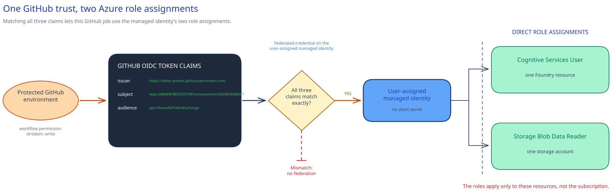

<!-- _class: cover -->

AI Governance Co-implementation · Session 02

# Entra identity, RBAC, PIM, and workload identities

210 minutes · Group access, PIM elevation, and GitHub OIDC trust

---

## Why it matters

> Configure four group-based human role assignments, PIM eligibility for Foundry administration, and a GitHub workload identity without a client secret at the approved nonproduction scopes.

By the end of the session:

- Three customer-owned groups have standing roles at the Foundry resource or project.
- The platform-administrator group is PIM-eligible for Foundry Account Owner.
- One managed identity trusts one protected GitHub environment.
- Its roles apply to one Foundry resource and one storage account.

<!-- Notes: Keep production and shared production resources out of scope. -->

---

<!-- _class: two-column -->

## Architecture and authority

**Human path**

Customer-owned groups → Azure RBAC

Platform administrators → PIM activation → Foundry Account Owner

**Workload path**

Protected GitHub environment → OIDC token → user-assigned managed identity → two scoped Azure roles

Azure RBAC, PIM, and the managed identity hold live state. The repository owns the Bicep definitions and stable role IDs.

<!-- Notes: The workload token is application-only. It carries no signed-in user's authority. -->

---

<!-- _class: decision -->

## Roles and identity boundary

| Access | Role | Scope | Mode |
|---|---|---|---|
| Platform administration | Foundry Account Owner | Foundry resource | PIM eligible |
| Project management | Foundry Project Manager | Foundry resource | Group |
| Project work | Foundry User | One project | Group |
| Inspection | Reader | Foundry resource | Group |
| GitHub workload | Cognitive Services User + Storage Blob Data Reader | Foundry resource + storage account | Managed identity |

Foundry Agent Consumer waits for [Session 05](../05-governed-agent-baseline/). Use the [delegated OBO module](../../modules/obo-delegated-access/) when downstream authorization must follow the signed-in user.

<!-- Notes: Foundry Owner is too broad for this separation of duties. -->

---

## Implementation tradeoffs

| Decision | Required answer |
|---|---|
| Scope | Approved nonproduction subscription, resource group, Foundry resource, project, and storage account |
| Human access | Four customer-owned group object IDs |
| PIM | Owner, approver group, expiry, two-hour activation, MFA, and justification |
| GitHub trust | Owner, repository, and one protected environment |

The GitHub credential matches this subject exactly:

`repo:OWNER/REPOSITORY:environment:ENVIRONMENT`

Issuer: `https://token.actions.githubusercontent.com` 
Audience: `api://AzureADTokenExchange`

<!-- Notes: The subject has no wildcard support. Azure DevOps uses a separate service-connection path. -->

---

<!-- _class: implementation -->

## Implementation path

**Total session: 210 minutes. Guided implementation: about 150 minutes.**

1. Record scopes, group IDs, PIM decisions, and the GitHub environment.
2. Run preflight to check scope, sentinels, role IDs, and Bicep builds.
3. Preview and deploy the three standing group assignments.
4. Configure Foundry Account Owner eligibility in PIM.
5. Preview and deploy the managed identity, exact GitHub trust, and two workload roles.
6. Confirm live RBAC, PIM, and workload state once.

The remaining time covers the briefing, decisions, and restore handoff.

<!-- Notes: Review each preview before deployment. The guide provides paired PowerShell and Bash commands. -->

---

## Stop before changing identity state

- The target is production, shared with production, or not approved.
- A role ID, accepted name, or `BuiltInRole` type does not resolve.
- A preview assigns a role above the documented resource, project, or storage account.
- PIM lacks a named owner, approver group, licence, expiry, or protected emergency path.
- Someone proposes permanent active Foundry Account Owner.
- The GitHub trust covers multiple repositories, all branches, or an unprotected environment.
- A check would read model responses, blobs, secrets, or other customer content.

<!-- Notes: Subscription-level role-definition lookup is expected. Subscription-level role assignment is not. -->

---

<!-- _class: two-column -->

## Confirm and operate

### Confirm once

- Three standing group assignments match the approved scopes.
- Foundry Account Owner is eligible, not standing.
- PIM settings match the approved activation controls.
- The marker is `02-identity-privileged-access`.
- One credential has the exact GitHub claims.
- Two workload roles use the approved resources.

### Keep in operation

- Identity owner: groups, PIM, and access reviews
- Foundry owners: human role need
- Workload and platform owners: managed identity and roles
- Repository owner: Bicep, role IDs, and preflight scripts

<!-- Notes: Read live service state. Keep command output out of the repository. -->

---

## Restore the prior state

Use the approved identity change path.

1. Remove PIM eligibility, then restore any role settings changed by Session 02.
2. Remove a group assignment only after its owner confirms that Session 02 created it and no task needs it.
3. Confirm no workflow uses the protected GitHub environment.
4. Check the workload identity marker and its two documented assignments.
5. Remove those assignments, then remove the managed identity and its child credential.

Do not alter emergency access. Production needs a separate change.

<!-- Notes: There is no removal script. Owners perform the guarded manual sequence. -->

---

<!-- _class: closing -->

# Thank you!
