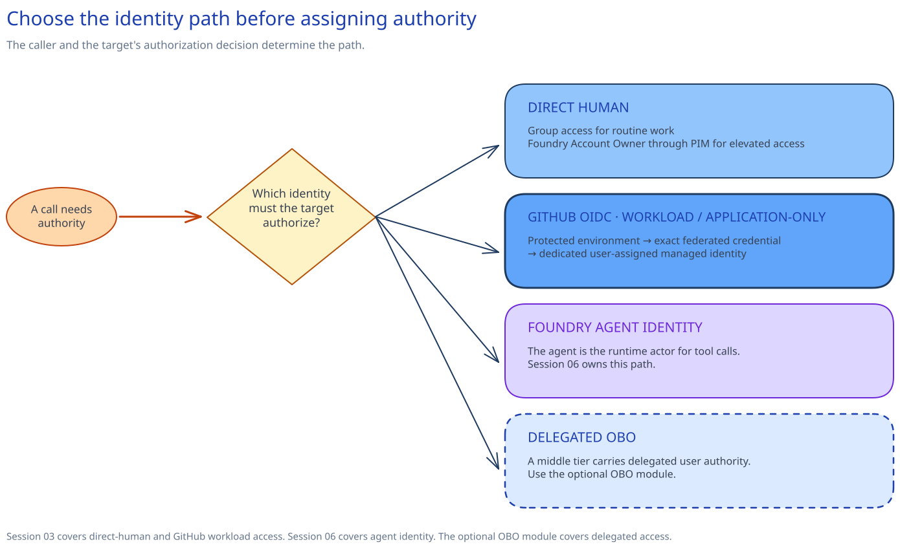

<!-- _class: cover -->


<p class="eyebrow">AI Governance Co-implementation · Session 02</p>

# Entra identity, RBAC, PIM, and workload identities

**240 minutes · Group access, PIM elevation, and workload OIDC trust**

---

## Control objective

> Configure four group-based human access paths, PIM-eligible Foundry administration, and one secretless GitHub workload identity for the approved nonproduction scopes.

### Session result

- Normal human access is group based.
- Elevated Foundry administration is PIM eligible.
- One managed identity accepts OIDC tokens only from one protected GitHub environment.
- The roles stop at the Foundry resource, project, and storage account recorded for this session.

<!-- Notes: Set the boundary first. Change identity state only in the approved nonproduction scope. -->

---

## Implementation outcomes

1. Assign four functional groups to current Foundry roles at the smallest practical scopes.
2. Assign normal human access through groups and move platform elevation into PIM.
3. Deploy a dedicated managed identity whose credential trusts tokens from one protected GitHub environment.
4. Confirm the live identity, credential, and role scopes without saving command output.

---

<!-- _class: section-divider -->

## Why it matters

Human administration needs a time boundary. Workloads need narrow authority without a stored Azure client secret.

---

## Choose the identity flow

| Situation | Use |
|---|---|
| A signed-in person works directly in Foundry or Azure | Human group access, with PIM only for elevation |
| A workflow or application should keep the same authority for every run | Workload or application-only managed identity |
| A Foundry agent needs its own runtime actor | Agent identity in [Session 05](../05-governed-agent-baseline/) |
| A middle tier must call a downstream API and authorization must vary by signed-in user | [Delegated API access with OAuth on-behalf-of](../../modules/obo-delegated-access/) |

> Select OBO only when the downstream API must authorize the signed-in user.

<!-- Notes: Do not call the Session 02 managed identity an Agent ID object or an OBO path. -->

---

## Architecture overview

<!-- _class: diagram -->



---

## What this means

People receive access through customer-owned groups. Platform administrators activate the
time-limited role through PIM. GitHub uses a separate, application-only OIDC trust with no stored
Azure client secret.

Azure RBAC and PIM hold live human access. The managed identity and federated credential hold
workload trust. Session 03 adds private connectivity; Session 05 owns the Agent ID.

---

<!-- _class: decision -->

## Boundaries

| Group | Role | Scope | Mode |
|---|---|---|---|
| Platform administrators | Foundry Account Owner | Foundry resource | PIM eligible |
| Project managers | Foundry Project Manager | Foundry resource | Group |
| Developers/users | Foundry User | One project | Group |
| Auditors | Reader | Foundry resource | Group |
| Agent endpoint callers | Foundry Agent Consumer | Project or individual agent | Deferred to Session 05 |

**No subscription-level assignment. No permanent platform elevation.**

`Foundry Owner` is omitted because it combines account administration with project development,
publishing, and endpoint use.

---

## Resolve stable IDs in preflight

`role-definitions.json` is the only source of truth for stable IDs.

Preflight:

1. parses that source;
2. checks each semantic key against its expected stable ID, accepted rollout name, and built-in type;
3. resolves every role against live Azure role definitions and stops on a mismatch; and
4. compiles both Bicep files from the same source.

Display names can lag across tools. Do not copy role IDs into slides or decision records.

---

## Configure time-bound PIM elevation

The PIM-eligible principal is the approved platform-administrator group.

1. The operator is **eligible**, not active.
2. Activation requires MFA and justification.
3. A customer-owned approver group decides.
4. Each activation lasts no more than two hours.
5. Group eligibility ends on the date approved through the customer identity change process.

> PIM settings belong to one role on one resource. They do not inherit from a higher scope.

After delivery, the identity owner schedules a recurring PIM access review for eligible and active
privileged assignments.

<!-- Notes: Stop if the change touches a shared policy or emergency-access path. -->

---

<!-- _class: two-column -->

## Implementation tradeoffs

<div class="columns">
<div>

### Chosen boundaries

- Groups for normal human access
- PIM for elevated administration
- Exact GitHub environment OIDC trust

</div>
<div>

### Costs and limits

- Membership and approvers need owners
- Activation adds a deliberate step
- Workload authority cannot vary by signed-in user
- Azure DevOps workload identity federation needs a separate service connection and trust

</div>
</div>

Revisit the design when task scopes change, the protected environment moves, or downstream authorization must follow the signed-in user.

---

## The managed identity trusts specific GitHub claims

```text
issuer
https://token.actions.githubusercontent.com

subject
repo:OWNER/REPOSITORY:environment:ENVIRONMENT

audience
api://AzureADTokenExchange
```

The federated credential is stored on the managed identity.

It accepts a token only when GitHub issues the matching issuer, subject, and audience above. The workflow needs `id-token: write`; the subject does not support wildcards.

This is not an OBO path. The credential carries workload authority only.

Sources: [Microsoft Entra workload identity federation](https://learn.microsoft.com/en-us/entra/workload-id/workload-identity-federation-create-trust-user-assigned-managed-identity) and [GitHub OIDC for Azure](https://learn.microsoft.com/en-us/azure/developer/github/connect-from-azure-openid-connect).

---

## Safety gates

- **Production:** stop if the subscription, resource group, Foundry resource, Foundry project, or storage account is production or shared with production.
- **Role scope:** stop if a preview shows a subscription-level assignment.
- **PIM:** stop without recorded owners, customer approvers, licensing, and a safe emergency path.
- **OIDC:** stop if the managed identity would accept tokens from more than one protected environment.
- **Customer data:** inspect configuration only; do not read model, blob, or secret content.

<!-- Notes: A read-only role-definition lookup at subscription scope is not a role assignment. -->

---

## Implementation path

1. **Decide** owners, approvers, operating dates, and the GitHub environment.
2. **Run preflight** to check the approved nonproduction subscription and resource group, resolve roles from one stable-ID source, reject sentinels, and compile Bicep.
3. **Preview and deploy** the three standing group assignments.
4. **Configure** Foundry Account Owner eligibility through PIM.
5. **Preview and deploy** the managed identity, credential, and two roles.
6. **Confirm** the live configuration once.

---

<!-- _class: implementation -->

## Apply the identity assignments

**Timebox:** 270 minutes

Configure human access and one workload identity in the approved nonproduction scope.

- Human access uses groups and PIM.
- GitHub OIDC trust uses one specific environment subject.
- The workload identity has two narrow assignments.
- Deployment previews protect the Foundry resource, Foundry project, and storage account recorded for this session.
- The result check reads configuration and saves nothing.

<!-- Notes: Pause after each preview. The change owner decides whether deployment proceeds. -->

---

## Confirm the result

Use one confirmation: live Azure RBAC assignments, Entra PIM eligibility and role settings, then the workload identity and its approved scopes.

Inspect one marked workload identity:

1. The tag reads `implementationSession: 02-identity-privileged-access`.
2. One credential has the expected issuer, environment subject, and audience.
3. Cognitive Services User ends at the Foundry resource.
4. Storage Blob Data Reader ends at one storage account.
5. No direct assignment appears at subscription scope.
6. No unexpected portal-created direct-user assignment remains on the Foundry resource or project.

**Read the console. Do not redirect, export, or save the command output.**

---

## Live state

| State | Operating owner |
|---|---|
| Three group-based human assignments | Customer identity and Foundry owners |
| PIM eligibility and per-activation settings | Microsoft Entra PIM; customer identity owner |
| Recurring privileged-access review | Microsoft Entra PIM access reviews; customer identity owner |
| Managed identity, GitHub credential, and two direct roles | Workload and platform owners |
| Bicep, role source, and support scripts | Customer repository owner |

Moving the identity, roles, groups, or GitHub environment trust into production requires a separate customer change.

---

## Restore scope

The guarded script:

- requires `SupportsShouldProcess` and high-impact confirmation;
- checks the `implementationSession` marker;
- refuses assignments outside the documented Foundry and storage scopes; and
- removes only the two workload assignments and the marked identity.

The identity owner removes PIM eligibility before restoring prior settings.

The workload script removes the two role assignments before it removes the managed identity.

<!-- Notes: Use the approved identity change path before any removal. -->

---

## Recap and next dependency

- **Humans:** groups for normal work; PIM for elevated work.
- **Workload:** one identity, one specific trust, two scoped roles.
- **Next step:** use the [delegated OBO module](../../modules/obo-delegated-access/) when a downstream API must authorize the signed-in user.
- **Safety:** no production scope, subscription assignments, broad OIDC subject, or customer-data access.
- **Result:** inspect the live configuration once and save nothing.
- **Next:** [Session 03](../03-private-networking-dns/) gives these identities private service connectivity and firewall-controlled Agent Service traffic.

---

<!-- _class: closing -->

# Thank you!
