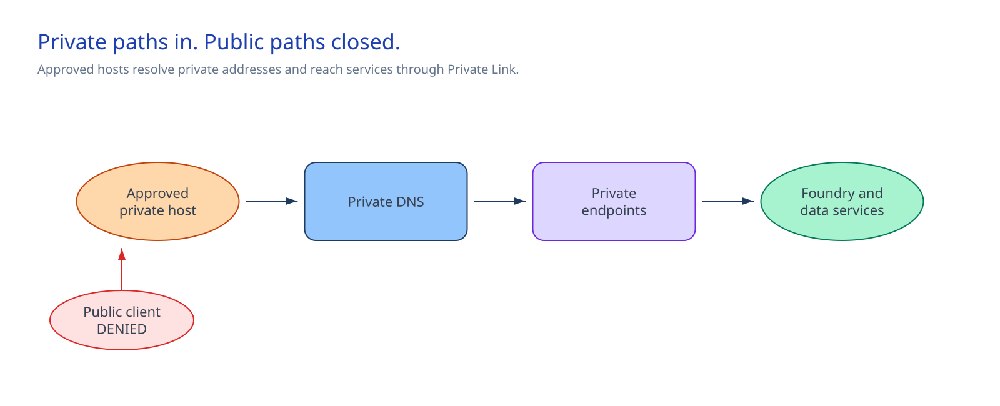
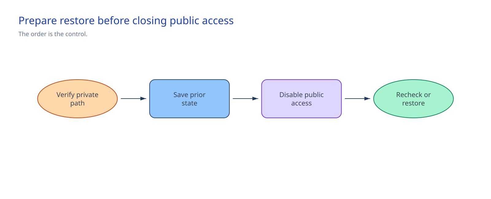

<!-- _class: cover -->

AI Governance Co-implementation · Session 02

# Private networking, DNS, and controlled egress

180 minutes · Build, cut over, and check the private client path

<!-- Notes: Keep the briefing focused on the control and the lockout gates. -->

---

## Why it matters

> Connect the existing Foundry account and four dependencies through private endpoints, then disable public access after private DNS and TCP 443 checks succeed.

By the end of the session:

- Seven private DNS zones and links serve five private endpoints.
- Three Foundry endpoint families and four dependency FQDNs resolve to RFC 1918 addresses.
- The approved execution host reaches every configured endpoint on TCP 443.
- The approved change system holds all five prior public-access states.
- Public access is disabled and the connectivity check still passes.

<!-- Notes: The result covers the approved client path. Session 04 checks agent-runtime traffic. -->

---

<!-- _class: two-column -->

## Architecture

Applications keep their normal service FQDNs.

Private DNS follows the CNAME chain and returns the private endpoint address.

The delegated Agent Service subnet keeps its default route to the customer firewall. Firewall administrators own the rules.

Azure holds live state. The approved change system holds restore settings.

<!-- Notes: A route does not prove firewall permission or agent-runtime connectivity. -->

---

<!-- _class: decision -->

## Implementation tradeoffs

| Decision | Required answer |
|---|---|
| Network pattern | Session 01 customer-managed BYO VNet |
| Foundry account | Created with the approved delegated subnet |
| DNS ownership | Authoritative central zones or approved local zones |
| Egress | Named customer firewall source and approved destinations |
| Cutover | Five prior states, cutover owner, and restore owner recorded |

Stop if the design uses Microsoft-managed networking, the account uses another subnet, DNS
ownership is unclear, or the firewall needs a blanket internet rule.

<!-- Notes: These are owner decisions, not choices for the deployment operator to improvise. -->

---

<!-- _class: implementation -->

## Implementation path

**Total session: 180 minutes**

| Time | Work |
|---:|---|
| 30 min | Confirm scope, roles, owner decisions, and the `what-if` preview |
| 45 min | Deploy seven DNS zones and links plus five private endpoints |
| 30 min | Complete DNS forwarding, endpoint approvals, and firewall integration |
| 45 min | Check connectivity, record prior states, and disable public access |
| 30 min | Repeat the check and hand off operation and restore |

The guide pairs every PowerShell command with Bash. The scripts enforce the detailed checks.

<!-- Notes: Approval waits and unrelated provisioning are prerequisites, not session time. -->

---

## Safety gates

Preflight stops on:

- unresolved `__REQUIRED_*__` values;
- the wrong subscription, resource group, role, or DNS assignment scope;
- missing, duplicate, wrong-type, or out-of-scope service IDs;
- provider, Bicep, or `what-if` failure;
- a preview that changes the Session 01 VNet, route, subnets, Foundry account, or public access.

Cutover stops when a private endpoint is pending, DNS or TCP 443 fails, the five prior states are
not recorded, or no restore owner is available.

<!-- Notes: Stop on deletes, replacements, hub changes, and unexpected resource groups. -->

---

<!-- _class: decision -->

## Guarded public-access cutover

The script validates five unique service IDs, displays their current public-access states, and
requires the approved change reference before it changes anything.

It adds `networkControlSession=02-private-networking-dns`, preserves existing tags, and requests
`Disabled` for Foundry, Storage, Azure AI Search, Cosmos DB, and Key Vault.

<!-- Notes: If one update fails, inspect the record and start restore. Do not rerun blindly. -->

---

<!-- _class: two-column -->

## Confirm and operate

### Confirm once

From the approved execution host:

- every configured alias resolves only to RFC 1918 IPv4 addresses;
- TCP 443 succeeds for every endpoint;
- the script prints the result and saves no file.

### Keep in operation

- Network owner: VNet, subnets, route, private endpoints
- DNS owner: zones, links, forwarding
- Firewall owner: rules and policy source
- Service owners: endpoint approvals and public-access settings
- Restore owner: five prior states in the approved change system

<!-- Notes: Session 04 checks an agent through the delegated subnet. -->

---

## Restore without removing the foundation

1. Review the approved cutover record with the change authority and affected owners.
2. Restore every service to its recorded public-access state.
3. Rerun the private DNS and TCP 443 check.
4. Keep the Agent subnet, route, and VNet while the Foundry account uses network injection.

Restoring public access does not detach the injected subnet. Retiring that network requires a
separate Foundry account retirement and purge.

Production needs its own address, DNS, firewall, service-owner, and change-window decisions.

<!-- Notes: Keep private connectivity when a service was already private-only or has no other approved path. -->

---

<!-- _class: closing -->

# Thank you!
