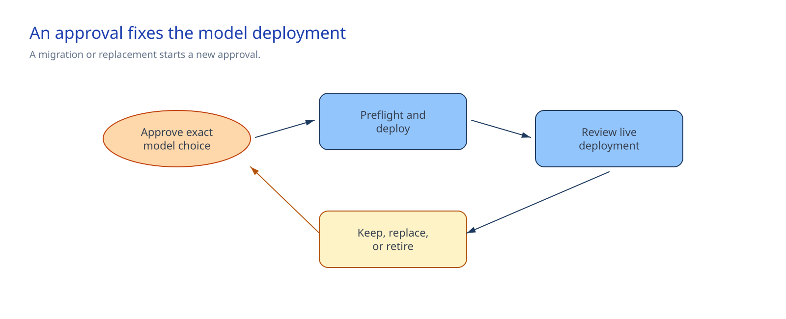

<!-- _class: cover -->

AI Governance Co-implementation · Session 04

# Model governance, data residency, quota, and lifecycle

150 minutes · Check the approved model profile, deploy it, and confirm the live result

---

## Why it matters

> Deploy exact approved serverless API model versions through version-controlled profiles, preflight checks, and Bicep. Meet the workload's processing-location requirement.

By the end of the session:

- Git records the approval reference and exact deployment settings.
- Preflight checks scope, access, lifecycle, processing location, quota, and what-if.
- Bicep deploys the listed child resources.
- The live model coordinates, SKU, capacity, and approval tag match the profile.

<!-- Notes: The decision system keeps the full approval and review history. -->

---

<!-- _class: two-column -->

## Architecture and control boundary

The decision system authorizes the model.

The repository owns the deployment profile and Bicep.

Azure owns live availability, quota, lifecycle, and deployment state.

Other templates, the portal, CLI, and APIs can bypass this path. They need a separate control.

<!-- Notes: Do not describe these files as a platform-wide allowlist. -->

---

<!-- _class: decision -->

## Implementation tradeoffs

| Decision | Required answer |
|---|---|
| Model | Exact name, version, format, deployment name, and approval ID |
| Deployment | SKU, capacity, Responsible AI policy, and `NoAutoUpgrade` |
| Processing | `global`, a US/EU/APAC data zone, or `region:<azure-region>` |
| Operation | Review date, lifecycle owner, change route, and quota headroom |

`DeveloperTier` is outside this path. A model version change needs a new external decision and profile update.

<!-- Notes: These values must be settled before the team starts preflight. -->

---

## Processing location follows the SKU

| Requirement | Supported SKU family |
|---|---|
| Global | `GlobalStandard`, `GlobalProvisionedManaged`, `GlobalBatch` |
| US, EU, or APAC data zone | `DataZoneStandard`, `DataZoneProvisionedManaged`, `DataZoneBatch` |
| Regional | `Standard`, `ProvisionedManaged`, where supported |

The Foundry resource location alone does not define the inference processing boundary.

<!-- Notes: Preflight checks regional matches. Data-zone membership needs a manual check because Azure CLI lacks a stable mapping. -->

---

<!-- _class: implementation -->

## Implementation path

**Total session: 150 minutes. Guided implementation: about 105 minutes.**

1. Complete `deployment-profiles.json` and `sandbox.bicepparam`.
2. Run preflight against the exact Foundry resource and operator.
3. Complete any named lifecycle, quota, or data-zone manual check.
4. Inspect the scoped `FullResourcePayloads` what-if.
5. Deploy the listed child models.
6. Confirm the live result and hand off lifecycle ownership.

The remaining time covers the briefing, required decisions, and restore guidance.

<!-- Notes: The implementation guide contains paired PowerShell and Bash commands. -->

---

## Stop before the change when

- A `__REQUIRED_*__` value remains or a JSON integer is still quoted.
- The subscription, resource group, Foundry resource, or operator role is wrong.
- The review date has passed or the model or SKU is deprecated.
- Processing location, capacity, or quota headroom fails.
- The named Responsible AI policy is missing.
- Azure omits required lifecycle, quota, or data-zone facts and the operator has not completed the named manual check.
- What-if contains another resource, a deletion, or an unsupported change.

<!-- Notes: A manual switch records a completed check. It does not claim Azure supplied missing data. -->

---

<!-- _class: two-column -->

## Confirm and operate

### Confirm once

- Provisioning state is `Succeeded`.
- Model name, version, and format match.
- SKU and capacity match.
- `modelApprovalId` matches the profile.

### Keep in operation

- Platform team: live capacity and deployments
- Lifecycle owner: review and replacement
- Decision authority: approval history
- Platform engineering: profiles, Bicep, and preflight

<!-- Notes: Session 05 consumes the approved deployment name and model coordinates. -->

---

## Restore or remove safely

To restore an earlier approved version:

1. Restore its profile through the approved change process.
2. Rerun preflight and inspect what-if.
3. Redeploy the child resource.

Remove one deployment only after the workload and platform owners confirm that no consumer uses it.
Check for `implementationSession=04-model-governance-lifecycle`. Leave the parent Foundry resource
and every other deployment in place.

<!-- Notes: Other deployment methods still need a policy, permission, inventory, or change-control design. -->

---

<!-- _class: closing -->

# Thank you!
