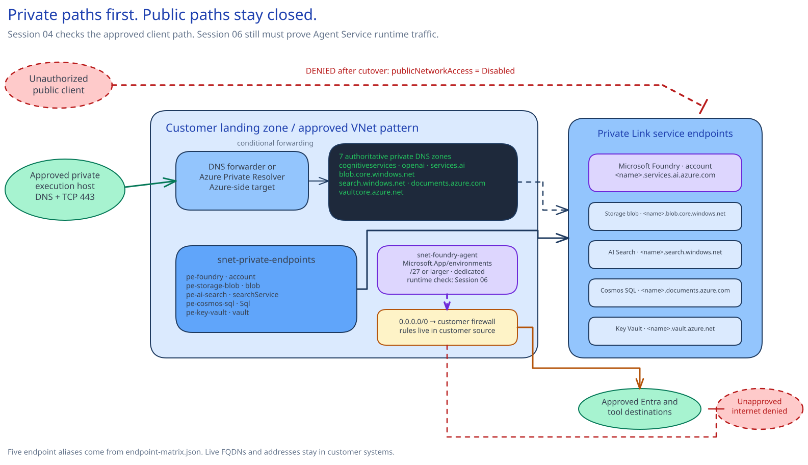
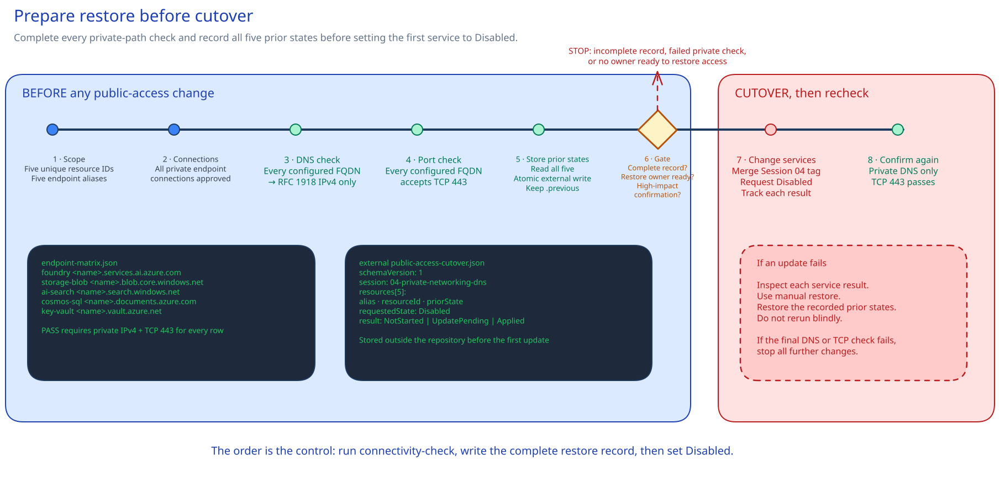

<!-- _class: cover -->


<p class="eyebrow">AI Governance Co-implementation · Session 03</p>

# Private networking, DNS, and controlled egress

**270 minutes · Build and check the private client path**

<!-- Notes: Frame this as a network control implementation, not a general Azure networking lecture. -->

---

## Control objective

> Connect Foundry and four dependencies over private networking. Disable public access after private DNS and TCP 443 checks pass from the approved nonproduction host.

### Session result

- Resolve the current service endpoints to private addresses from approved clients.
- Confirm TCP 443 connectivity from the approved private execution host.
- Route the Agent Service subnet to the customer firewall. Firewall administrators maintain its rules in the customer firewall source.
- Record five prior service states in the approved change system. Disable public access after the
  three Foundry endpoint families and four dependency FQDNs resolve privately and accept TCP 443.

<!-- Notes: Identity decides who can call a service. Networking decides where the call can come from. -->

---

## Implementation outcomes

1. Deploy a landing-zone-aligned spoke with separate private-endpoint and Agent Service subnets.
2. Connect Foundry, Storage, AI Search, Cosmos DB, and Key Vault through private endpoints and DNS.
3. Route the delegated Agent Service subnet through the approved firewall and record where the customer firewall policy is maintained.
4. Disable public access only after checking private connectivity and recording every prior public-access setting.
5. Confirm the current endpoints still resolve privately and accept TCP 443.

---

<!-- _class: section-divider -->

## Why it matters

Check private DNS and endpoints before disabling public access. This reduces lockout risk.

The separate Agent subnet prepares a later runtime path. It does not claim that an agent has used it yet.

<!-- Notes: One private endpoint does not create end-to-end isolation. -->

---

## Architecture overview

<!-- _class: diagram -->



<!-- Notes: Walk left to right. Call out the separate subnets and the Session 05 runtime handoff. -->

---

## What this means

Clients use each service's normal name. Private DNS returns the private endpoint address. The
client connects on TCP 443. The separate Agent subnet sends its default route to the customer
firewall.

Azure holds the current network and service state. The customer firewall source holds egress
rules. Store the five-service cutover record in the approved change system.

---

<!-- _class: decision -->

## Implementation tradeoffs

| Decision | Chosen approach | Tradeoff |
|---|---|---|
| Network architecture | Customer-managed BYO VNet in these deployment files | Microsoft-managed networking needs a separate design choice |
| Foundry account | Keep it when it already uses the exact delegated subnet | Replacement and configuration replay need separate approval |
| DNS ownership | Reuse authoritative central zones or create approved local zones | Hybrid and central designs need forwarding and Bicep changes |
| Agent egress | Route the dedicated subnet to the customer firewall | The route does not prove firewall rules or runtime traffic |

<!-- Notes: Resolve these choices before network deployment. Session 05 checks the agent runtime path. -->

---

<!-- _class: decision -->

## Decision 1 · Keep or replace the existing Foundry account

Foundry, Storage, Azure AI Search, Cosmos DB, and Key Vault must already exist.

If the Foundry account was not created with the configured subnet, pause here.

The AI platform owner and change authority complete the approved replacement first. Session 03 then updates the Foundry endpoint.

Configure BYO VNet injection when the Foundry account is created.

| [Session 01](../01-platform-baseline/) account state | Required action before [Session 05](../05-governed-agent-baseline/) |
|---|---|
| References this Agent subnet | Keep the account and recorded subnet decision |
| Has no `networkInjections` setting | Approve replacement and replay of approved configuration |
| References another subnet | Approve a new account and replay into it |

**Do not attempt an in-place retrofit or claim that Session 05 agent traffic uses this route before Session 05 runs its agent check.**

<!-- Notes: This product constraint must have an owner before deployment. -->

---

## Subnet requirements

| Agent Service subnet | Private-endpoint subnet |
|---|---|
| Dedicated to one Foundry resource | Separate from injected compute |
| Delegated to `Microsoft.App/environments` | Private endpoint policies disabled |
| `/27` minimum; `/24` recommended | Sized for five endpoints plus growth |
| RFC 1918 and nonoverlapping | Connected to the DNS zones that contain these records |
| Default route to customer firewall | No route that bypasses the firewall |

Foundry and the virtual network must be in the same region.

<!-- Notes: Address overlap and subnet reuse are stop conditions. -->

---

## Resolve service FQDNs to private endpoints

```text
service FQDN
    ↓ public CNAME chain
privatelink service zone
    ↓ linked private DNS zone
private endpoint IPv4
```

- Applications keep the normal service FQDN.
- Private DNS supplies the private address inside the approved network.
- Authorization and the public-access setting remain separate controls.

<!-- Notes: A private DNS answer tells us where the client will connect. -->

---

## Seven zones · five private endpoints

<div class="cards">
<div class="card">


### Foundry

`account` · three endpoint families and three zones

</div>
<div class="card">


### AI Search

`searchService` · one zone

</div>
<div class="card">


### Key Vault

`vault` · one zone

</div>
</div>

Storage `blob` and Cosmos DB `Sql` complete the required dependency set.

<!-- Notes: Centralized customers should reference the zones that already own these records. -->

---

<!-- _class: decision -->

## Decision 2 · DNS ownership

1. **Azure-only client:** link the private DNS zone that contains the record to the client VNet.
2. **Peered spokes:** link the same zone to each approved client or resolver VNet.
3. **Hybrid:** forward the public service zone to an Azure-side forwarder or Private Resolver.
4. **Central DNS:** update the existing Bicep deployment to reference existing zone IDs. Keep links and forwarding in the central DNS deployment.

> On-premises DNS cannot query Azure's `168.63.129.16` virtual IP directly.

If a shared private zone also serves public resources of the same type, the DNS owner records the
fallback-to-Internet setting or another resolution path before linking the zone.

<!-- Notes: Ask the DNS owner to name the record-owning zones, resolver, forwarding rules, and mixed public/private resolution path. -->

---

## Where egress routing and rules are configured

**Configured in this session:** `0.0.0.0/0 → customer firewall`

**Maintained in the customer firewall source:** destinations, ports, review history, and deployment.

Session 03 records the external firewall repository or policy reference. Its deployment files do
not include firewall rules.

The firewall owner confirms the Microsoft Entra access rule required by Agent Service,
feature-specific destinations in scope, and that TLS inspection does not inject an untrusted
certificate.

Session 05 checks agent-runtime traffic through the prepared path.

Bing Grounding, Websearch, and SharePoint Grounding still use public endpoints. Exclude them when
the approved agent design requires every tool call to stay private.

<!-- Notes: Do not claim that a route proves the firewall rule or the agent-runtime path. -->

---

<!-- _class: compact -->

## Implementation sequence

These deployment files do not create missing dependency services.

1. **Decide and approve** whether to keep or replace the Foundry account.
2. **Deploy** the network, DNS links, and initial private endpoints.
3. **Pause for replacement and replay** through a separate approved change when required.
4. **Reconcile** the Foundry endpoint and all five current resource IDs.
5. **Check** private DNS and TCP 443 from the approved execution host.
6. **Record and disable** all prior public-access settings, then request `Disabled`.
7. **Confirm** private DNS and TCP 443 again.

<!-- Notes: The cutover script checks private DNS and TCP 443 before the first public-access change. -->

---

<!-- _class: implementation -->

## Build and test private connectivity

**Timebox:** 270 minutes

| Time | Work |
|---:|---|
| 70 min | Scope decisions, implementation files, preflight, and `what-if` |
| 90 min | Network deployment and private endpoint approvals |
| 45 min | DNS and firewall integration |
| 35 min | Guarded public-access cutover and result check |
| 30 min | Ownership, scope limits, and restore procedure |

<!-- Notes: Confirm the delivery owner before the first state change. -->

---

## Preflight checks

Preflight stops when it finds:

- an unresolved `__REQUIRED_*__` decision;
- the wrong Azure subscription or resource group;
- a missing, duplicate, wrong-type, or out-of-scope service resource ID;
- missing Network Contributor on the approved network resource group, or missing Private DNS Zone Contributor on the reused or deployed zone scope;
- a missing provider, file, or invalid JSON document;
- a Bicep build failure; or
- a failed resource-group `what-if`.

The plan should contain the approved VNet, two subnets, a route table, seven zones and links, and
five private endpoints.

<!-- Notes: Stop on any delete, replacement, hub change, Foundry deployment, or public-access change. -->

---

## Stop conditions

- Address space overlaps a connected or reserved range.
- The deployment would duplicate a central private DNS zone.
- A private endpoint connection remains pending.
- A configured endpoint fails private DNS or TCP 443.
- The network architecture is still undecided between this BYO VNet path and Microsoft-managed networking.
- The firewall needs a blanket internet rule.
- The cutover owner cannot save the complete cutover record in the approved change system outside this repository.
- A service update fails during cutover.
- The AI platform owner has not decided on replacement or the change authority has not approved required replay.

<!-- Notes: These stops protect scope and prevent lockout. -->

---

<!-- _class: decision -->

## Store restore settings before cutover



<!-- Notes: Read the timeline from left to right. Stop at the gate unless every check passed and the complete external record exists. -->

---

## Confirm the result

From the approved private execution host:

```powershell
.\scripts\connectivity-check.ps1 `
  -ParameterPath .\artifacts\environments\sandbox.bicepparam
```

**Expected:** each configured alias resolves only to RFC 1918 IPv4 addresses and accepts TCP 443.
The script prints the result and saves no file.

Foundry portal and Agent Playground users follow the same private route and DNS path, from that
host or through the customer-approved VPN, ExpressRoute, or Bastion pattern.

<!-- Notes: This is the one standard-mode result check. -->

---

## Boundaries

<div class="cards">
<div class="card">

### Configured now

Private client connectivity, dependency endpoints, DNS links, and the Agent subnet route.

</div>
<div class="card">

### Pending runtime check

Session 05 must run an agent through the delegated subnet and call a tool it configures.

</div>
<div class="card">

### Next decision

Confirm the existing account uses the delegated subnet, or complete the approved replacement, before [Session 05](../05-governed-agent-baseline/).

</div>
</div>

<!-- Notes: The nonproduction implementation does not authorize production connectivity. -->

---

## Live state and ownership

| Operational control | Owner |
|---|---|
| VNet, subnets, route table, and private endpoints | Network platform owner |
| Private DNS zones, links, and hybrid forwarding | DNS owner |
| Customer firewall policy and source reference | Firewall policy owner |
| Public-access settings and service private endpoints | Affected service owners |
| Public-access cutover record | The cutover owner stores it in the system named in the network design record; the restore owner retrieves it |

The cutover record stays outside the repository. Connectivity check output is not retained.

<!-- Notes: Production needs separate address, DNS, firewall, and change-window decisions. -->

---

## Guarded restore

1. Review the cutover record against the five approved service IDs and the resource group.
2. Restore each state from the cutover record.
3. Confirm the approved execution host can reach each service.
4. Keep the Agent subnet, route, and VNet while the Foundry account still uses network injection.
   To retire that network, use a separately approved Foundry account retirement and purge before
   removing the injected network resources.

Restoring public access does not detach the injected subnet.

When a service was already private-only, its owner must confirm another approved way to reach it first.

<!-- Notes: Keep the operational control in place by default. Restore needs cross-owner approval. -->

---

## Recap and next dependency

- **Connectivity:** three Foundry endpoint families and four dependency FQDNs resolve through approved private endpoints.
- **Egress:** a dedicated Agent subnet routes through the customer firewall.
- **Cutover:** check private connectivity and record prior settings before disabling public access.
- **Next:** [Session 05](../05-governed-agent-baseline/) runs an agent through the delegated subnet.

Next: **[Session 04 · Models, residency, quota, and lifecycle](../04-model-governance-lifecycle/)**

<!-- Notes: Close on the operational control and the account-level dependency. -->

---

<!-- _class: closing -->

# Thank you!

<!-- Notes: End after naming the operational-control and restore owners. -->
