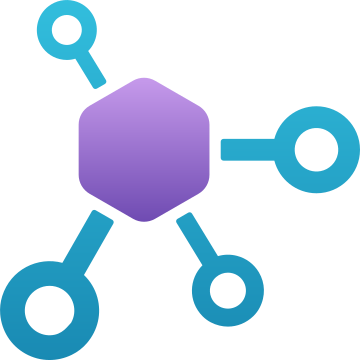

<!-- _class: cover -->


<p class="eyebrow">AI Governance Co-implementation · Session 04</p>

# Govern Citadel backends, access, tools, and agents

330 minutes · Onboard one workload through reviewable contracts

---

## Why it matters

Manual gateway configuration does not scale across workloads.

Citadel contracts separate **model supply**, **asset publishing**, and **workload access** so each owner changes only their boundary.

---

## Architecture overview



```text
backend contract ----\
                      -> APIM -> access contract -> workload
publish contract ----/    |
                      API Center
```

Publishing an asset does not grant access to it.

---

<!-- _class: decision -->

## Implementation tradeoffs

| Contract | Scope |
| --- | --- |
| Backend | One approved model and managed identity |
| Publish | One read-only MCP tool, when preview is accepted |
| Access | One use case, environment, product, and Key Vault |

The prohibited write is absent or denied by backend authorization.

---

<!-- _class: implementation -->

## Working path

1. Complete the three customer overlays.
2. Review the tool threat model.
3. Run preflight against the pinned Citadel source.
4. Deploy backend, optional publish, then access.
5. Check the intended path and prohibited action.

---

## Safety gates

- Preview each contract before deployment.
- Stop on changes outside the approved backend, publish, and access scope.
- Treat publishing and access as separate approvals.

---

## Expected result

The workload reaches its approved model and read-only tool through one Citadel access contract. Runtime telemetry identifies the use case without copying prompts or tool payloads.

---

## Operating state

Platform, tool, security, and workload owners update their own contract boundary. The approved deployment path reconciles those overlays with the pinned hub release.

---

<!-- _class: closing -->

# Thank you!
