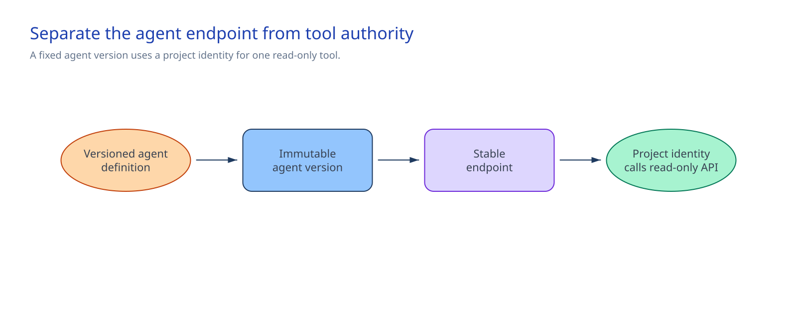

<!-- _class: cover -->

AI Governance Co-implementation · Session 04

# Governed Microsoft Foundry agent baseline

150 minutes · Pin one version, expose one read tool, and keep the write path absent

<!-- Notes: Establish identity, version, tool, safety, and tracing controls before adding APIM and MCP. -->

---

## Why it matters

> Create and pin a versioned prompt agent. Its unique Entra Agent Identity identifies the agent and secures the endpoint. The Foundry project managed identity authorizes the approved read-only OpenAPI tool.

By the end of the session:

- One immutable version contains the approved model, instructions, RAI policy, and OpenAPI tool.
- The Entra-authorized stable endpoint sends all traffic to that version.
- `get_policy` is the only tool operation. No write operation is registered.
- Server-side traces go to the connected Application Insights resource.
- One synthetic read returns approved fields and invokes no other tool.

<!-- Notes: The absent write operation and downstream authorization enforce the boundary. Prompt wording does not. -->

---

<!-- _class: two-column -->

## Architecture and ownership

A caller reaches the stable Responses endpoint. Foundry uses the agent identity at that boundary,
routes the request to the pinned version, and uses the project managed identity for the OpenAPI
GET call.

Foundry owns live state. The repository owns the version definition.

<!-- Notes: The endpoint identity and project identity do different jobs. The control ends at the direct read API. -->

---

<!-- _class: decision -->

## Implementation tradeoffs

| Decision | Required answer |
|---|---|
| Release | Immutable agent name, accountable owner, approved Session 03 model, named RAI policy, and fixed-version routing |
| Tool authority | Genuine read-only path, Entra audience, exact role definition ID, downstream API scope, and authorization owner |
| Prohibited action | Write action kept out of the tool and the human route for requesting it |
| Tracing | Approved readers, retention, regional handling, sampling, sensitive-content rules, and cost owner |

Use time-bound **Foundry User**, role ID `53ca6127-db72-4b80-b1b0-d745d6d5456d`, on the exact Foundry project.

<!-- Notes: The direct tool is application-only. Delegated user authorization needs a separate implementation. -->

---

## Stop before deployment

- A `__REQUIRED_*__` value remains, or the runtime API URL appears in source.
- The model differs from Session 03 or lacks regional OpenAPI support.
- The agent name collides with an unmarked agent or a legacy agent has no unique identity.
- `get_policy` can change state, another operation is registered, or the assigned role can write.
- Preflight does not find exactly one approved project-identity assignment at the downstream scope.
- The RAI policy or tracing decisions are unresolved.
- The REST response differs from the defined protocol, authorization, agent card, or routing.

<!-- Notes: Instructions reinforce refusal. Tool absence and downstream authorization enforce the write boundary. -->

---

<!-- _class: implementation -->

## Implementation path

**Total session: 150 minutes. Guided implementation: about 90 minutes.**

1. Complete `agent.json`, `instructions.md`, and `tool-manifest.json`.
2. Set the approved runtime scope and API URL in the shell.
3. Run preflight and inspect its read-only lookup and change summary.
4. Create the immutable version and pin 100% of endpoint traffic to it.
5. Send one synthetic `POL-001` request through `get_policy`.

The remaining time covers briefing, owner decisions, and the operating and restore handoff.

<!-- Notes: The implementation guide carries paired PowerShell and Bash commands. -->

---

<!-- _class: two-column -->

## Confirm and operate

### Confirm once

- The endpoint routes to the new version.
- The agent has a unique Entra Agent Identity.
- `get_policy` returns only approved fields.
- The project managed identity authorizes the API call.
- No other tool runs.

Do not retain the response or export the trace.

### Keep in operation

- AI product owner: behavior and release
- Platform and identity owner: endpoint and API authorization
- Safety owner: RAI policy
- API and policy owner: OpenAPI definition and human write route
- Operations owner: trace access, retention, and cost

<!-- Notes: One observable standard-mode check is enough. -->

---

## Restore and handoff

Keep the marked agent, stable endpoint, identity, and Application Insights connection in place.

If removal is approved, remove only the agent whose name matches `agent.json` and whose agent card
contains `implementationSession=04-governed-agent-baseline`. Its versions, identity, and endpoint
are removed. The Foundry project, model, read API, RAI policy, Application Insights resource, and
repository definitions remain.

[Session 06](../06-apim-ai-gateway/) adds APIM ingress.
[Session 08](../08-mcp-tool-security/) replaces the direct tool path with MCP controls.

<!-- Notes: Product, platform, identity, and operations owners confirm that no consumer uses the endpoint before removal. -->

---

<!-- _class: closing -->

# Thank you!
